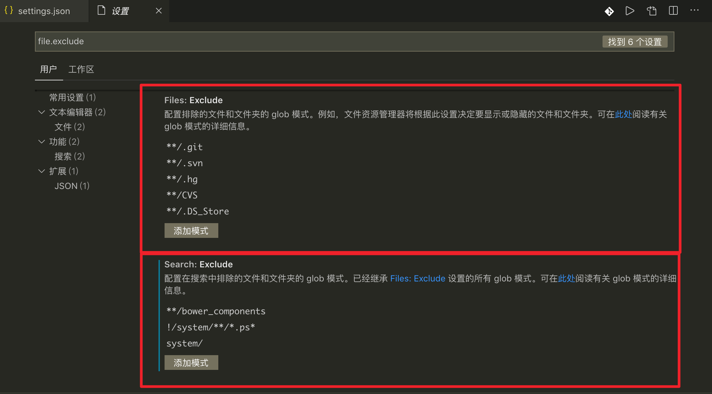
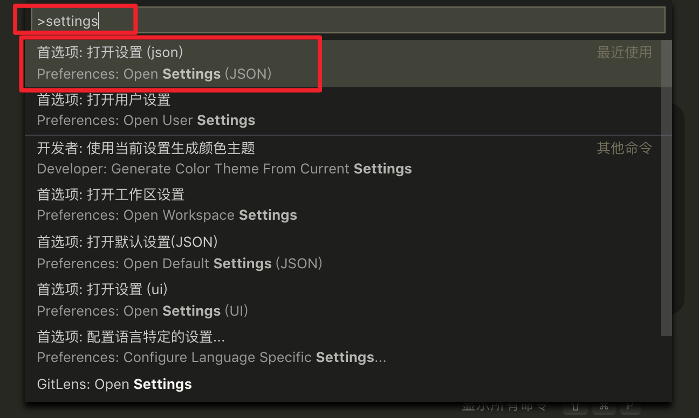
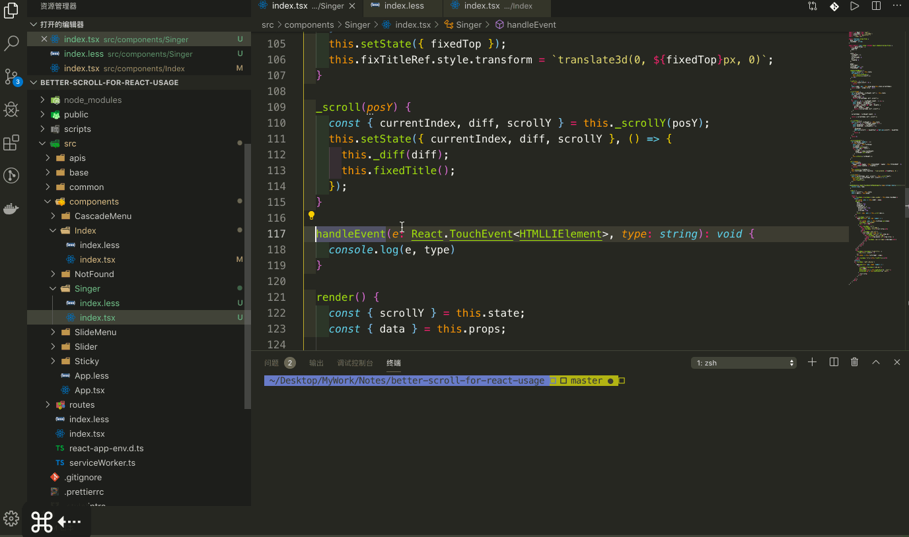
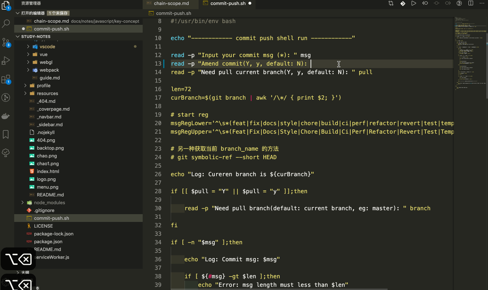
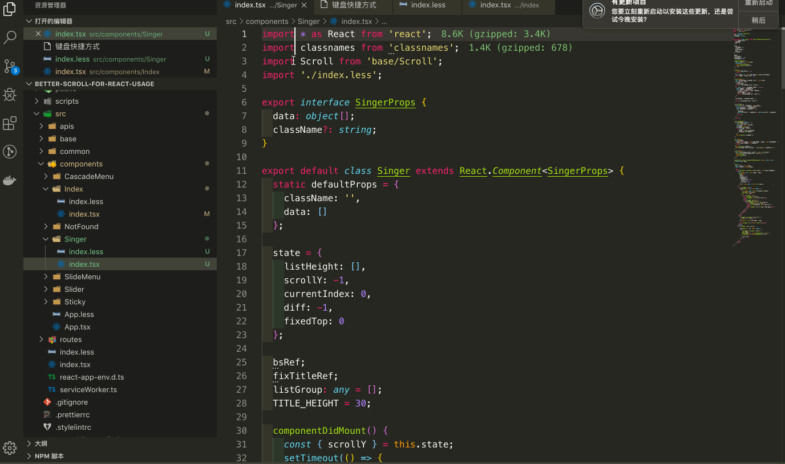
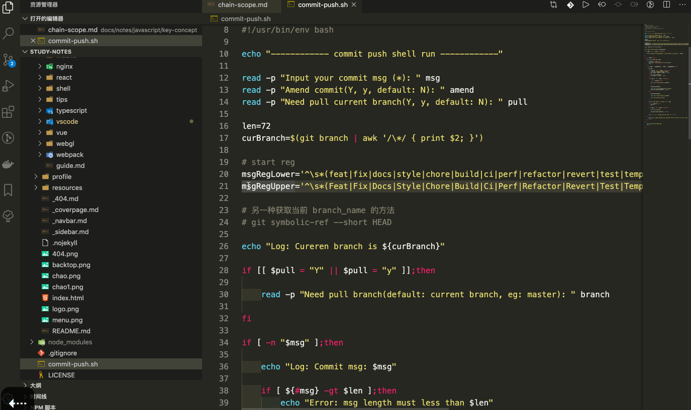
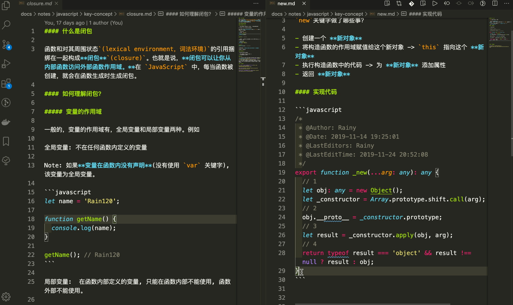
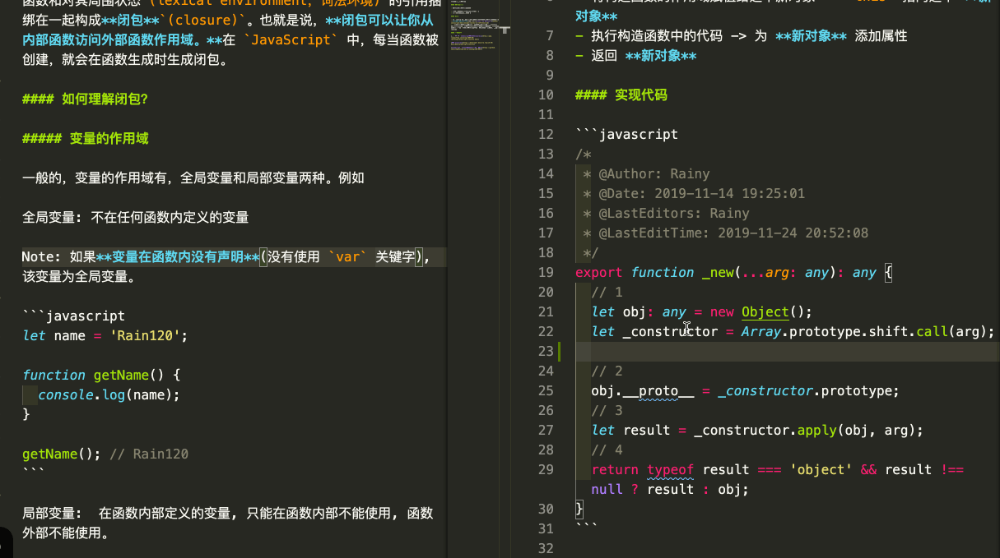
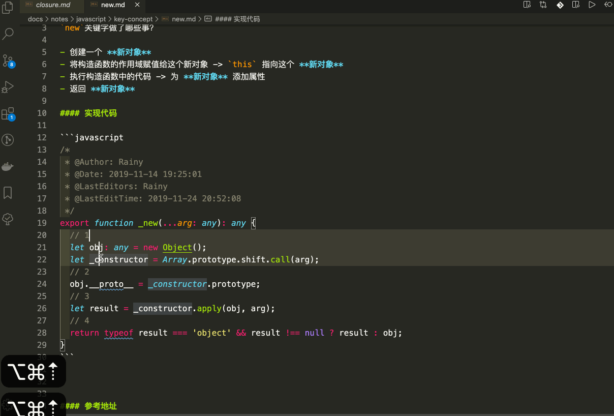
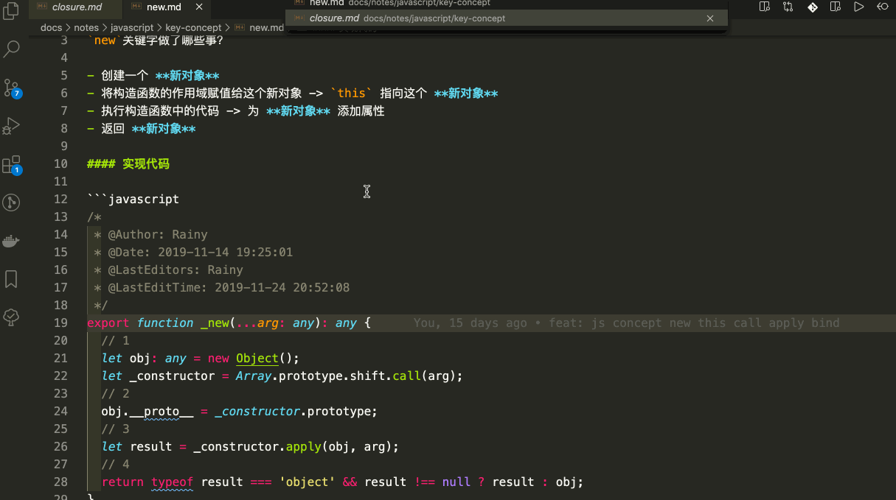

### 设置

#### 系统设置

[快捷键](#快捷键)进入

```sh
// Mac
$ command + ，

// window
$ ctrl + ,
```



#### 用户设置

```sh
// Mac
$ shift + command + p
// or
$ command + p 
$ > settings

// window
$ shift + ctrl + p
// or
$ ctrl + p
$ > settings
```




```json
{
    "editor.fontSize": 16,
    "workbench.colorTheme": "Monokai",
    "terminal.integrated.fontSize": 14,
    "files.autoSave": "onWindowChange",
    "fileheader.customMade": {
        "Author": "Rainy",
        "Date": "Do not edit",
        "LastEditors": "Rainy",
        "LastEditTime": "Do not edit",
    },
    "fileheader.configObj": {
        "autoAdd": false,
    },
    "workbench.iconTheme": "vscode-icons",
    "javascript.updateImportsOnFileMove.enabled": "always",
    "[javascript]": {
        "editor.defaultFormatter": "esbenp.prettier-vscode"
    },
    "javascript.implicitProjectConfig.experimentalDecorators": true,
    "window.zoomLevel": 0,
    "search.exclude": {
        "!/system/**/*.ps*": true,
        "node_modules": false,
        "system/": true
    },
    "typescript.updateImportsOnFileMove.enabled": "always",
    "tslint.autoFixOnSave": true
}
```

##### Prettier 配置

```json
{
  /*  prettier的配置 */
    // "prettier.jsxSingleQuote": true,
     "prettier.useEditorConfig": false, // 忽略.editorconfig
     "prettier.printWidth": 100, // 超过最大值换行
     "prettier.tabWidth": 4, // 缩进字节数
     "prettier.useTabs": false, // 缩进不使用tab，使用空格
     "prettier.semi": true, // 句尾添加分号
     "prettier.singleQuote": true, // 使用单引号代替双引号
     "prettier.proseWrap": "preserve", // 默认值。因为使用了一些折行敏感型的渲染器（如GitHub comment）而按照markdown文本样式进行折行
     "prettier.arrowParens": "avoid", //  (x) => {} 箭头函数参数只有一个时是否要有小括号。avoid：省略括号
     "prettier.bracketSpacing": false, // 在对象，数组括号与文字之间加空格 "{ foo: bar }"
     "prettier.disableLanguages": [
         "vue"
     ], // 不格式化vue文件，vue文件的格式化单独设置
     "prettier.endOfLine": "auto", // 结尾是 \n \r \n\r auto
     // "prettier.eslintIntegration": false, //不让prettier使用eslint的代码格式进行校验
     "prettier.htmlWhitespaceSensitivity": "ignore",
     "prettier.ignorePath": ".prettierignore", // 不使用prettier格式化的文件填写在项目的.prettierignore文件中
     "prettier.jsxBracketSameLine": false, // 在jsx中把'>' 是否单独放一行
     "prettier.jsxSingleQuote": true, // 在jsx中使用单引号代替双引号
     // "prettier.parser": "babylon", // 格式化的解析器，默认是babylon
     "prettier.requireConfig": false, // Require a 'prettierconfig' to format prettier
     // "prettier.stylelintIntegration": false, //不让prettier使用stylelint的代码格式进行校验
     "prettier.trailingComma": "none", // 在对象或数组最后一个元素后面是否加逗号（在ES5中加尾逗号）
     "[json]": {
         "editor.defaultFormatter": "esbenp.prettier-vscode"
     },
     "window.zoomLevel": 0,
     "diffEditor.ignoreTrimWhitespace": false,
     "[jsonc]": {
         "editor.defaultFormatter": "esbenp.prettier-vscode"
     },
}
```


### 快捷键

#### 搜索相关

- **搜索如何排除`node_modules`**

  用户设置配置

  ```json
  {
      "search.exclude": {
          "!/system/**/*.ps*": true,
          "node_modules": false,
          "system/": true
      }
  }
  ```

- 隐藏文件夹

  ```json
  {
    "file.exclude": {
          "node_modules": true
      }
  }
  ```

  

- **搜索如何排除多个文件**

  ```
  以 , 分隔多个筛选条件
  ```


#### 编辑相关技巧

**Note:** `Mac`展示，`window`待总结

```
command ⌘
option ⌥ (alt)
ctrl ⌃
```

- 光标移动

  ```
  // 单词移动
  option(⌥) + ➡️
  option(⌥) + ⬅️
  
  // 行首行尾移动
  command(⌘)+ ➡️
  command(⌘) + ⬅️
  
  // 单词分解移动
  ctrl(⌃) + option(⌥) + ➡️
  ctrl(⌃) + option(⌥) + ⬅️
  ```

  

- 删除一个单词

  
  
- **行** - 复制、移动、删除、合并、插入、缩进

  ```
  1. 单行
      复制
      command + c
      shift(⇧) + option + ⬆️
      shift(⇧) + option + ⬇️
  
      移动
      option + ⬆️
      option + ⬇️
  
      删除
      command + x
  
      合并
      ctrl + j
  
      插入
      在上面插入: shift(⇧) + command + enter
      在下面插入: command + enter
  
      缩进
      向左缩进: command + [
      向右缩进: command + ]
  2. 多行
    选择: option + 鼠标选择
  
  ```

  **单行**

  

  **多行**

  
  
  **批量选择多行**
  
  
  
  **跳转到匹配的括号**
  
  ```
  command(⌘) + option(⌥) + 👆 / 👇
  ```
  
  
  
  **上插, 下插**
  
  ```
  // 上
  shift(⇧) + command(⌘) + Enter
  // 下
  command(⌘) + Enter
  ```
  
  
  
  **撤消上一个光标操作**
  
  ```
  command(⌘) + U
  ```
  
  
  
  切换`tab`
  
  ```
  ctrl(⌃) + Tab
  ```
  
  
  
  

#### 参考资料

[VS Code中文文档](https://jeasonstudio.gitbooks.io/vscode-cn-doc/)

[VScode官网 快捷键 Mac 版](https://code.visualstudio.com/shortcuts/keyboard-shortcuts-macos.pdf)

