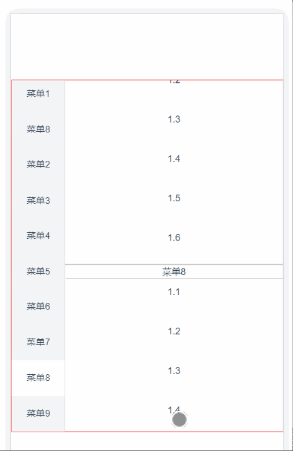
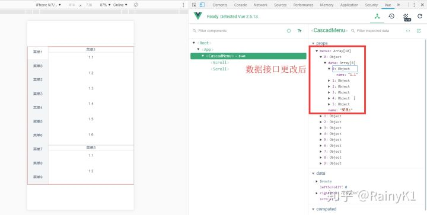
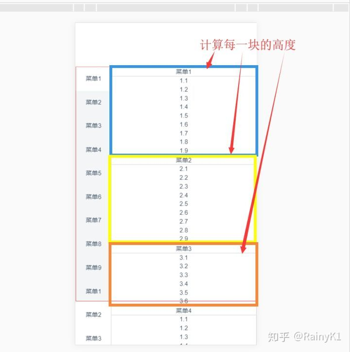
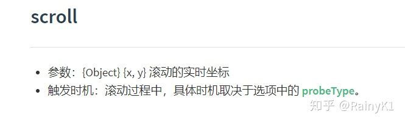
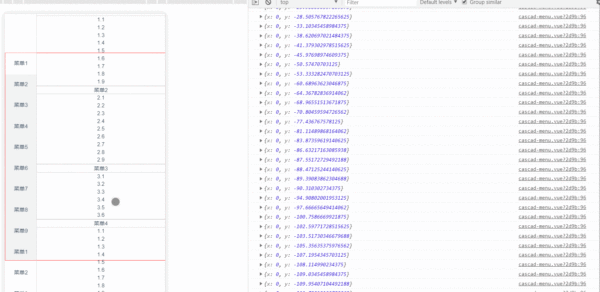
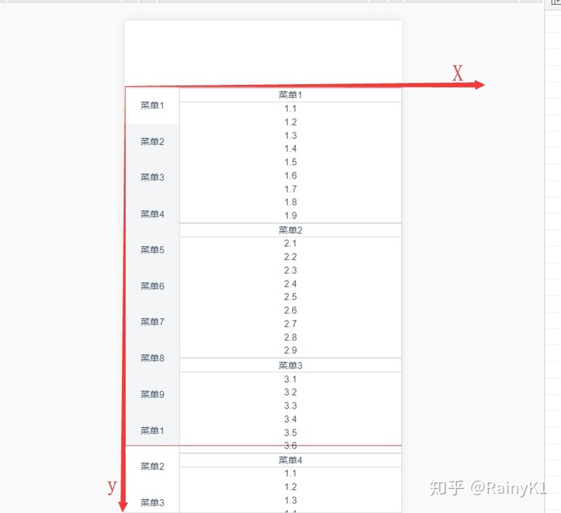
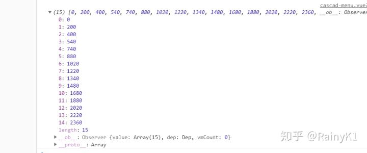
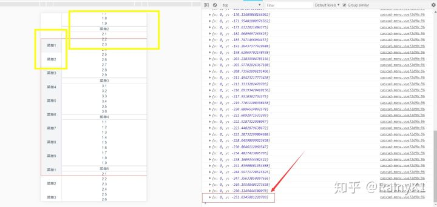
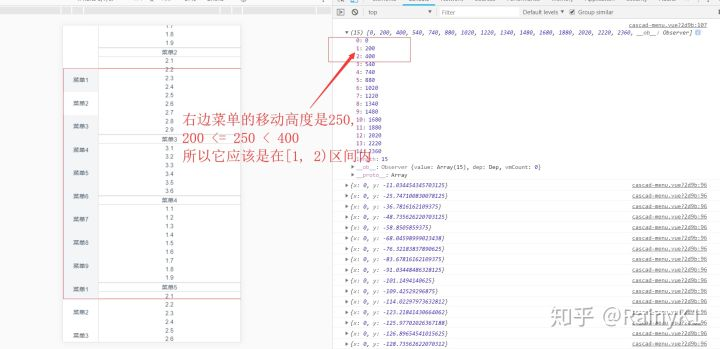

<!--
 * @Author: Rainy
 * @Github: https://github.com/Rain120
 * @Date: 2019-01-20 16:30:53
 * @LastEditTime: 2019-01-20 16:37:28
 -->
<!-- 
[知乎](https://www.zhihu.com/people/yan-yang-nian-hua-120/activities)

[个人博客](https://rain120.github.io/)

[Github](https://github.com/Rain120)
-->
源码传送门：[Rain120/vue-study](https://github.com/Rain120/vue-study/blob/master/my-project/src/components/cascad-menu.vue)

### 根据[掘金评论](https://juejin.im/post/5b6ea54cf265da0f6436f77a#comment)需求，更新了数据接口并修复了一些问题

之前在外卖软件上看到这个左右联动的效果，觉得很有意思，所以就尝试使用`Vue`来实现，将这个联动抽离成为一个单独的组件，废话少说，先来一张效果图。



这个组件分为两个部分，1、左菜单；2、右菜单。

动态数据结构


```
menus: [
  {
    name: '菜单1',
    data: [
      {
        name: '1.1'
      },
      {
        name: '1.2'
      },
      {
        name: '1.3'
      },
      {
        name: '1.4'
      },
      {
        name: '1.5'
      },
      {
        name: '1.6'
      }
    ]
  }
]
```

data数据是用户自定义增加一些内容，并渲染`DOM`

左菜单的`DOM`结构
```
<scroll
  class="left-menu"
  :data="menus"
  ref="leftMenu">
  <div class="left-menu-container">
    <ul>
      <li
        class="left-item"
        ref="leftItem"
        :class="{'current': currentIndex === index}"
        @click="selectLeft(index, $event)"
        v-for="(menu, index) in menus"
        :key="index">
        <p class="text">{{menu.name}}</p>
      </li>
    </ul>
  </div>
</scroll>
```

右菜单的`DOM`结构

```
<scroll
  class="right-menu"
  :data="menus" 
  ref="rightMenu"
  @scroll="scrollHeight"
  :listenScroll="true"
  :probeType="3">
  <div class="right-menu-container">
    <ul>
      <li class="right-item" ref="rightItem" v-for="(menu, i) in menus" :key="i">
        <div class="title">{{menu.name}}</div>
        <ul>
          <li v-for="(item, j) in menu.data" :key="j">
            <div class="data-wrapper">
              <div class="data">{{item.name}}</div>
            </div>
          </li>
        </ul>
      </li>
    </ul>
  </div>
</scroll>
```

这里是为了做`demo`，所以在数据上只是单纯捏造。

当然因为这是个子组件，我们将通过父组件传递`props`，所以定义`props`
```
props: {
    menus: {
      required: true,
      type: Array,
      default () {
        return []
      }
    }
  },
```



在这个业务场景中，我们的实现方式是根据右边菜单滚动的高度来计算左边菜单的位置，当然左边菜单也可以通过点击来确定右边菜单需要滚动多高的距离，那么我们如何获得该容器滚动的距离呢？
之前一直在使用[better-scroll](https://ustbhuangyi.github.io/better-scroll/doc/zh-hans/)，通过阅读文档，我们知道它有有`scroll`事件，我们可以通过监听这个事件来获取滚动的`pos`


```
if (this.listenScroll) {
  let me = this
  this.scroll.on('scroll', (pos) => {
    me.$emit('scroll', pos)
  })
}
```

所以我们在右边菜单的`scroll`组件上监听[scroll](https://ustbhuangyi.github.io/better-scroll/doc/zh-hans/events.html#scroll)事件
```
@scroll="scrollHeight"
```

method
```
scrollHeight (pos) {
  console.log(pos);
  this.scrollY = Math.abs(Math.round(pos.y))
},
```

我们将监听得到的pos打出来看看


我们可以看到控制台打出了当前滚动的pos信息，因为在移动端开发时，坐标轴和我们数学中的坐标轴相反，所以上滑时y轴的值是负数



所以我们要得到每一块`li`的高度,我们可以通过拿到他们的`DOM `
```
 _calculateHeight() {
  let lis = this.$refs.rightItem;
  let height = 0
  this.rightHeight.push(height)
  Array.prototype.slice.call(lis).forEach(li => {
    height += li.clientHeight
    this.rightHeight.push(height)
  })
console.log(this.rightHeight)
}
```

我们在`created`这个`hook`之后调用这个计算高度的函数
```
 _calculateHeight() {
  let lis = this.$refs.rightItem;
  let height = 0
  this.rightHeight.push(height)
  Array.prototype.slice.call(lis).forEach(li => {
    height += li.clientHeight
    this.rightHeight.push(height)
  })
  console.log(this.rightHeight)
}
```



当用户在滚动时，我们需要计算当前滚动距离实在那个区间内，并拿到他的`index`





```
computed: {
  currentIndex () {
    const { scrollY, rightHeight } = this
    const index = rightHeight.findIndex((height, index) => {
      return scrollY >= rightHeight[index] && scrollY < rightHeight[index + 1]
    })
    return index > 0 ? index : 0
  }
}
```

所以当前应该是左边菜单`index = 1`的菜单项`active`
以上是左边菜单根据右边菜单的滑动联动的实现，用户也可以通过点击左边菜单来实现右边菜单的联动，此时，我们给菜单项加上`click事件`
```
@click="selectLeft(index, $event)"
```

这里加上`$event`是为了区分原生点击事件还是[better-scroll](https://ustbhuangyi.github.io/better-scroll/doc/zh-hans/)派发的事件
```
selectLeft (index, event) {
  if (!event._constructed) {
    return
  }
  let rightItem = this.$refs.rightItem
  let el = rightItem[index]
  this.$refs.rightMenu.scrollToElement(el, 300)
},
```

使用
```
<cascad-menu :menus="menus"></cascad-menu>
```

到这里我们就基本上完成了这些需求了


