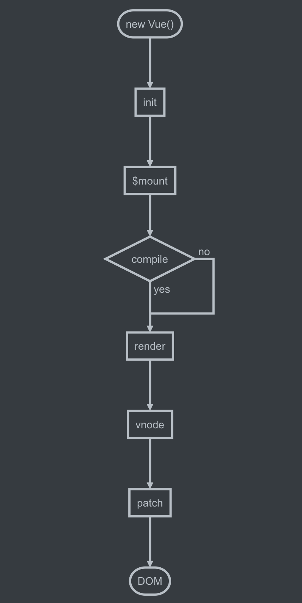

[回到上层Vue源码学习菜单](notes/vue/code-review/code-review.md)

1. **VDom** 

   为什么需要使用虚拟`DOM`？

   > 浏览器是解析HTML先生成一个DOM树，后面生成CSSOM树，合并成Render树，然后进行布局，回流重绘操作，如果频繁的DOM操作，会不断的带来浏览器的回流与重绘，当然，浏览器会通过JS来操作对象，因为JS的性能比较好，性能上面优于真实DOM。

   

```
create -> diff -> patch
```

#### createEmptyVNode

#### createTextVNode

#### createComponent

#### createElement

参考: 

[snabbdom](https://github.com/snabbdom/snabbdom)

[节点、树、虚拟DOM](https://cn.vuejs.org/v2/guide/render-function.html)

[网上都说操作真实 DOM 慢，但测试结果却比 React 更快，为什么？ - 尤雨溪的回答 - 知乎](https://www.zhihu.com/question/31809713/answer/53544875)

Vue初始化流程

```flow
st=>start: new Vue()

init=>operation: init
mount=>operation: $mount
render=>operation: render
vnode=>operation: vnode
patch=>operation: patch

cond=>condition: compile

e=>end: DOM

st->init->mount->cond
cond(yes)->render->vnode->patch->e
cond(no)->render
```



2. `init`

执行操作: 合并配置，初始化生命周期，初始化事件中心，初始化渲染，初始化 data、props、computed、watcher 等等。

```
initLifecycle(vm)

initEvents(vm)

initRender(vm)

callHook(vm, 'beforeCreate')

initInjections(vm) // resolve injections before data/props

initState(vm)

initProvide(vm) // resolve provide after data/props

callHook(vm, 'created')
```

