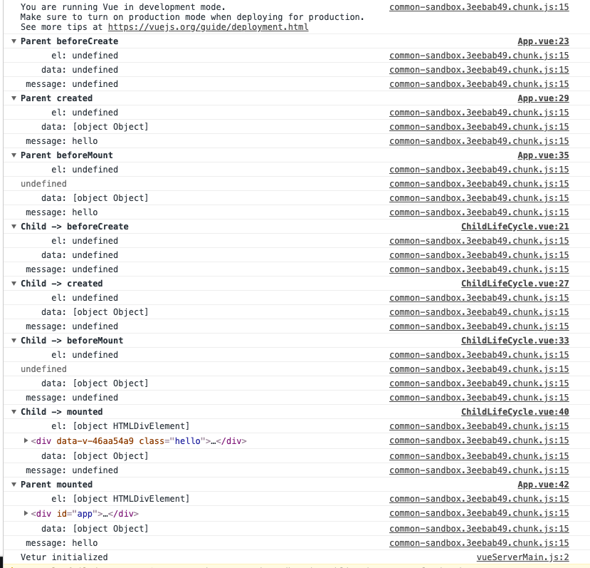

[回到上层Vue源码学习菜单](notes/vue/code-review/code-review.md)

#### **前置知识**

- [Vue生命周期笔记](notes/vue/vue-lifecycle/vue-lifecycle.md)
- [测试代码](https://codesandbox.io/s/y0117q1y41)

#### 1. 如何调用生命周期钩子函数`callHook`

路径: `src/core/instance/init.js -> src/core/instance/lifecycle.js`

```
export function callHook (vm: Component, hook: string) {
  // #7573 disable dep collection when invoking lifecycle hooks
  pushTarget()
  const handlers = vm.$options[hook]
  if (handlers) {
    for (let i = 0, j = handlers.length; i < j; i++) {
      try {
        handlers[i].call(vm)
      } catch (e) {
        handleError(e, vm, `${hook} hook`)
      }
    }
  }
  if (vm._hasHookEvent) {
    vm.$emit('hook:' + hook)
  }
  popTarget()
}
```

在`Vue init`的时候我们会看到👇代码:

```
vm.$options = mergeOptions(
  resolveConstructorOptions(vm.constructor),
  options || {},
  vm
)
```

这串代码是为了将`Vue`实例对象中的`options`合入到构造函数中

`vm.$options[hook]`是取到合入`options`得`hook`钩子函数。

`callHook` 函数，根据传入的字符串 `hook`，去拿到 `vm.$options[hook]` 对应的回调函数数组，然后遍历执行，执行的时候把 `vm` 作为函数执行的上下文。

#### 2. `beforeCreate & created`

`Vue.protoype._init`

```
initLifecycle(vm)
initEvents(vm)
initRender(vm)
callHook(vm, 'beforeCreate')
initInjections(vm) // resolve injections before data/props
initState(vm)
initProvide(vm) // resolve provide after data/props
callHook(vm, 'created')
```

我们知道，`beforeCreate`和`created`,在这两个`hook`之间，`Vue`实例会进行事件初始化, 配置`Event`和`watch`,对`data`, `props`,`computed`进行数据观测(`data observer`)。此时，`$el`还不存在，但在`create`时`data`属性已经存在，所以，如果我们的数据不依赖`dom`，我们可以在这个`hook`中进行`API`数据获取。

在`create`时`this.$el`还是`undefined`，所以此处会等待`Vue`实例调用`vm.mounted($el)`，接着判断是否有`template`配置，有就使用`template`作为`render`函数，没有就通过编辑`outHTML`作为`template`，`render`函数选项 > `template`选项 > `outer HTML`。此时`mounted`中`el`,`data`都已经初始化了，当我们的数据对`DOM`有相对应的依赖时，我们可以在这个`hook`下进行数据请求。

#### 4. `beforeMount & mounted`



从测试代码我们知道，在`beforeMount`和`mounted`中，我们发现`boforeMount`钩子函数的执行顺序是先父后子，而`mounted`钩子函数的执行顺序是先子后父，这是为什么呢？我们来从代码一探究竟吧。


#### 5. `beforeUpdate & updated`


#### 6. `beforeDestroy & destroyed`