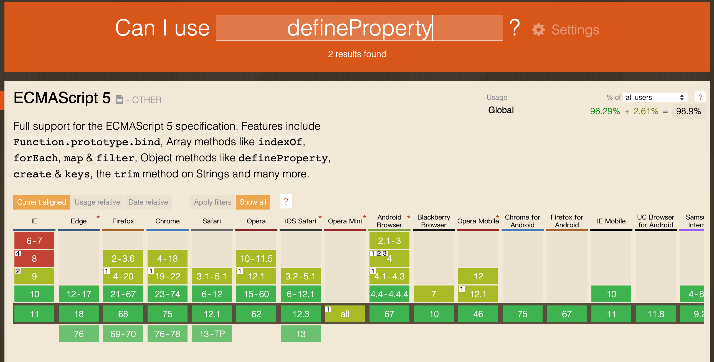

使用过`Vue`的盆友都知道`Vue`是数据驱动视图的，而且`Vue`响应式的实现原理是通过`ES5`的[Object.defineProperty](https://developer.mozilla.org/zh-CN/docs/Web/JavaScript/Reference/Global_Objects/Object/defineProperty),从[Can I Use](https://caniuse.com/)上查询得知，为什么`Vue`不支持`IE9`以下的浏览器了。

