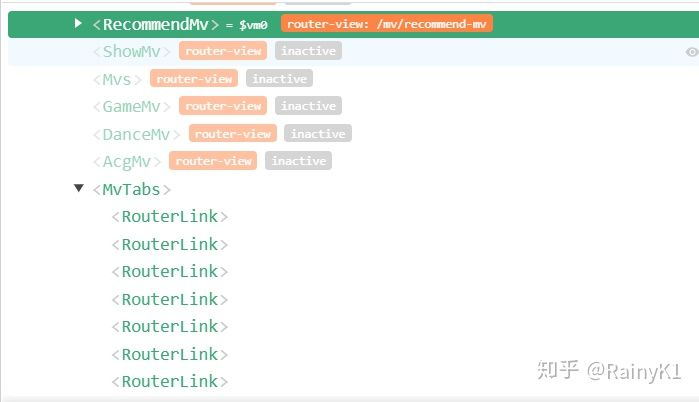
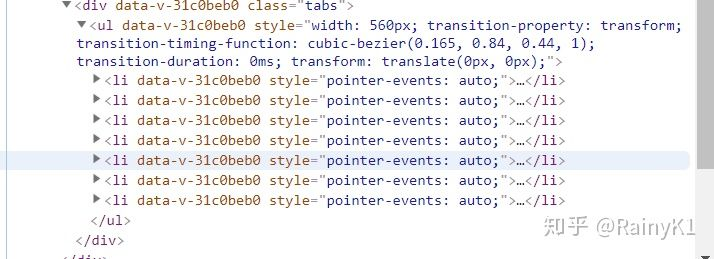

[目录 -> 学习笔记](notes/guide.md)

[目录 -> 上一级](notes/vue/guide.md)

之前在学习的时候有稍微捣鼓一下网易云音乐，主要是为了学习Vue，巩固基础知识，然后看到这个横向菜单，当然个人也喜欢看球，所以每次看腾讯NBA的时候总是会想这个是这样实现的，于是借助之前还没写完的demo，完成这个横向菜单的实现，废话不多说，先上效果图


从使用虎牙直播横向菜单的体验得到，我们的横向菜单的业务逻辑如下：

1. 滑动菜单，并选择菜单项；
2. 选择某个菜单项，该菜单项居中（去除边界菜单项）

我们的使用的better-scroll这个插件来实现，具体安装请参考[BetterScroll](https://ustbhuangyi.github.io/better-scroll/#/)

前端DOM结构
```
<template>
  <div class="mv-tabs">
    <div class="tabs" ref="tabsWrapper">
      <ul ref="tab">
        <li v-for="(item, index) in tabs" :key="index" @click="selectItem(index)">
          <router-link tag="div" :to="item.to" class="tab-item">
            <span class="tab-link">{{item.title}}</span>
          </router-link>
        </li>
      </ul>
    </div>
  </div>
</template>
```

通过使用插件Vue来调试项目


其中tabs包括菜单项名和它的路由
```
data () {
    return {
      tabs: [
        {
          to: '/mv/recommend-mv',
          title: '推荐'
        },
        {
          to: '/mv/music-mv',
          title: '音乐'
        },
        {
          to: 'show-mv',
          title: 'Show'
        },
        {
          to: '/mv/acg-mv',
          title: '二次元'
        },
        {
          to: '/mv/dance-mv',
          title: '舞蹈'
        },
        {
          to: '/mv/game-mv',
          title: '游戏'
        },
        {
          to: '/mv/mvs',
          title: 'mv'
        }
      ],
      mX: 0, // tab移动的距离
      tabWidth: 80 // 每个tab的宽度
    }
```

样式
```
.mv-tabs
    position relative
    top -5.5rem
    bottom 0
    width 100%
    .tabs
      margin-top 3rem
      height 2.5rem
      width 100%
      line-height 2.5rem
      box-sizing border-box
      overflow hidden
      white-space nowrap
      .tab-item
        float left
        width 80px
        height 40px
        text-align center
        .tab-link
          padding-bottom 5px
          color #333333
        &.router-link-active
          color #d33a31
          border-bottom 2px solid #d33a31
          box-sizing border-box
```

样式和DOM结构就不详细讲了，具体讲实现吧
首先需要计算出这个菜单中所有内容的width，也就是包裹这个菜单的容器；接着初始化better-scroll，并忽略该实例对象的垂直方向的滑动.
```
methods: {
    _initMenu () {
      let tabsWidth = this.tabWidth
      let width = this.tabs.length * tabsWidth
      this.$refs.tab.style.width = `${width}px`
      this.$nextTick(() => {
        if (!this.scroll) {
          this.scroll = new BScroll(this.$refs.tabsWrapper, {
            scrollX: true,
            eventPassthrough: 'vertical' // 忽略这个实例对象的垂直滑动事件
          })
        } else {
          this.scroll.refresh()
        }
      })
    }
  }
```

这里是第二个业务逻辑的思路（应该会有更好的思路，求大佬指点）

我的思路是这样的：每一个菜单项都会有各自的点击移动操作，所以我是根据当前tabs的位置，通过点击事件将tabs移动到它相应的位置，例如，中间菜单项在点击时会移动到居中的位置。
```
methods: {
    selectItem (index) {
      let tabs = this.$refs.tab
      let moveX = +tabs.style.transform.replace(/[^0-9\-,]/g, '').split(',')[0]
      switch (index) {
        case 0:
          if (moveX <= 0 && moveX > -this.tabWidth) {
            this.mX = 0
          }
          break
        case 1:
          if (moveX <= 0 && moveX > -this.tabWidth * 2) {
            this.mX = 0
          }
          break
        case 2:
          if (moveX < 0 && moveX >= -this.tabWidth * 2) {
            this.mX = 0
          }
          break
        case 3:
          if (moveX <= 0 && moveX >= -this.tabWidth * 2) {
            this.mX = -this.tabWidth
          }
          break
        case 4:
          if (moveX <= 0 && moveX >= -this.tabWidth * 2) {
            this.mX = -this.tabWidth * 2
          } else if (moveX === 0) {
            this.mX = -this.tabWidth * 2
          }
          break
        case 5:
          if (moveX < 0 && moveX > -this.tabWidth * 2) {
            this.mX = -this.tabWidth * 2
          }
          break
        case 6:
          if (moveX > -this.tabWidth * 2 && moveX < -this.tabWidth * 3 / 2) {
            this.mX = -this.tabWidth * 2 + 10
          }
          break
        default:
          break
      }
      tabs.style.transform = `translate(${this.mX}px, 0)`
    }
  }
```



很多时候我们在使用better-scroll的时候，发现这个实例对象已经初始化，但是不能滑动，是因为，Vue是异步更新数据的，所以我们需要异步计算它实际内容的宽度或者高度，Vue提供一个了this.$nextTick()这个hock来实现，这个API是在下次 DOM 更新循环结束之后执行延迟回调。在修改数据之后立即使用这个方法，获取更新后的 DOM。

官方解释：[$nextTick](https://cn.vuejs.org/v2/api/#Vue-nextTick)

当生命钩子mounted触发时，初始化better-scroll
```
mounted () {
    this.$nextTick(() => {
      this._initMenu()
    })
}
```

全部代码
```
<template>
  <div class="mv-tabs">
    <div class="tabs" ref="tabsWrapper">
      <ul ref="tab">
        <li v-for="(item, index) in tabs" :key="index" @click="selectItem(index)">
          <router-link tag="div" :to="item.to" class="tab-item">
            <span class="tab-link">{{item.title}}</span>
          </router-link>
        </li>
      </ul>
    </div>
  </div>
</template>

<script>
import BScroll from 'better-scroll'

export default {
  data () {
    return {
      tabs: [
        {
          to: '/mv/recommend-mv',
          title: '推荐'
        },
        {
          to: '/mv/music-mv',
          title: '音乐'
        },
        {
          to: 'show-mv',
          title: 'Show'
        },
        {
          to: '/mv/acg-mv',
          title: '二次元'
        },
        {
          to: '/mv/dance-mv',
          title: '舞蹈'
        },
        {
          to: '/mv/game-mv',
          title: '游戏'
        },
        {
          to: '/mv/mvs',
          title: 'mv'
        }
      ],
      mX: 0,
      tabWidth: 80
    }
  },
  mounted () {
    this.$nextTick(() => {
      this._initMenu()
    })
  },
  methods: {
    selectItem (index) {
      let tabs = this.$refs.tab
      let moveX = +tabs.style.transform.replace(/[^0-9\-,]/g, '').split(',')[0]
      switch (index) {
        case 0:
          if (moveX <= 0 && moveX > -this.tabWidth) {
            this.mX = 0
          }
          break
        case 1:
          if (moveX <= 0 && moveX > -this.tabWidth * 2) {
            this.mX = 0
          }
          break
        case 2:
          if (moveX < 0 && moveX >= -this.tabWidth * 2) {
            this.mX = 0
          }
          break
        case 3:
          if (moveX <= 0 && moveX >= -this.tabWidth * 2) {
            this.mX = -this.tabWidth
          }
          break
        case 4:
          if (moveX <= 0 && moveX >= -this.tabWidth * 2) {
            this.mX = -this.tabWidth * 2
          } else if (moveX === 0) {
            this.mX = -this.tabWidth * 2
          }
          break
        case 5:
          if (moveX < 0 && moveX > -this.tabWidth * 2) {
            this.mX = -this.tabWidth * 2
          }
          break
        case 6:
          if (moveX > -this.tabWidth * 2 && moveX < -this.tabWidth * 3 / 2) {
            this.mX = -this.tabWidth * 2 + 10
          }
          break
        default:
          break
      }
      tabs.style.transform = `translate(${this.mX}px, 0)`
    },
    _initMenu () {
      let tabsWidth = this.tabWidth
      let width = this.tabs.length * tabsWidth
      this.$refs.tab.style.width = `${width}px`
      this.$nextTick(() => {
        if (!this.scroll) {
          this.scroll = new BScroll(this.$refs.tabsWrapper, {
            scrollX: true,
            eventPassthrough: 'vertical'
          })
        } else {
          this.scroll.refresh()
        }
      })
    }
  }
}
</script>

<style lang="stylus" scoped>
  .mv-tabs
    position relative
    top -5.5rem
    bottom 0
    width 100%
    .tabs
      margin-top 3rem
      height 2.5rem
      width 100%
      line-height 2.5rem
      box-sizing border-box
      overflow hidden
      white-space nowrap
      .tab-item
        float left
        width 80px
        height 40px
        text-align center
        .tab-link
          padding-bottom 5px
          color #333333
        &.router-link-active
          color #d33a31
          border-bottom 2px solid #d33a31
          box-sizing border-box
</style>
```

[知乎](https://www.zhihu.com/people/yan-yang-nian-hua-120/activities)

[个人博客](https://rain120.github.io/)

[Github](https://github.com/Rain120)

