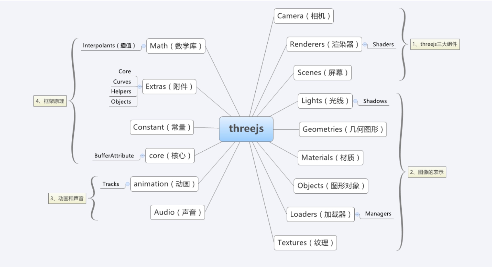
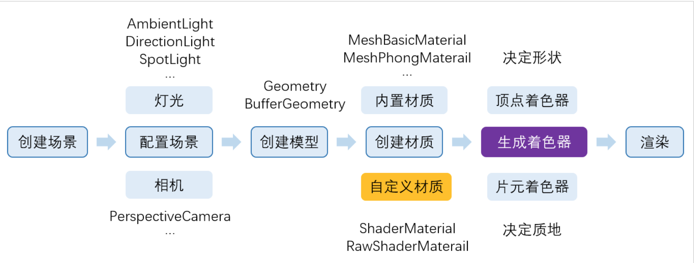

#### 什么是Threejs?

`Three.js`是一个`3D JavaScript`库。

#### 作用

使用`JavaScript`函数库或`API`来在网页浏览器中创建和展示动画的三维计算机图形。

#### 常用APIs

#### Three.js 核心对象结构和基本的渲染流程

##### **准备阶段**

1. **设置展平列表**：对于每个场景图对象
   1. 初始化矩阵
   2. 创建与面材料相对应的几何图形组
   3. **设置缓冲区**: 对于每个几何图形组对象
      1. 创建WebGL缓冲区
      2. 创建非WebGL缓冲区
      3. 将项目添加到拼合列表
2. 更新缓冲区(顶点缓冲区，索引缓冲区）

##### **渲染阶段**

1. 更新场景所有后代的矩阵
2. 设置相机矩阵
3. **设置循环**: 对于每个拼合的列表项
   1. 设置矩阵
   2. 选择材料
4. **绘制循环**: 对于每个展平的列表项
   1. 设置着色器程序(和纹理)
   2. 准备缓冲区
   3. 绘制图元

#### Three.js 常见概念

渲染器(`Renderer`)

场景(`Scene`)

照相机(`Camera`)

---

[回到目录](#目录)

### 参考资料

[Github: Three.js](https://github.com/mrdoob/three.js) -> [Documentation](https://threejs.org/)

[Threejs 官网文档](https://threejs.org/docs/)

[Three.js 入门指南 - 张雯莉](https://read.douban.com/reader/ebook/7412854/)

[《Three.js 入门指南》书例代码 ](https://github.com/Ovilia/ThreeExample.js)

[Threejs 教程](https://teakki.com/p/58a3ef1bf0d40775548c908f)

[Three.js Walking Map](http://ushiroad.com/3j/)

