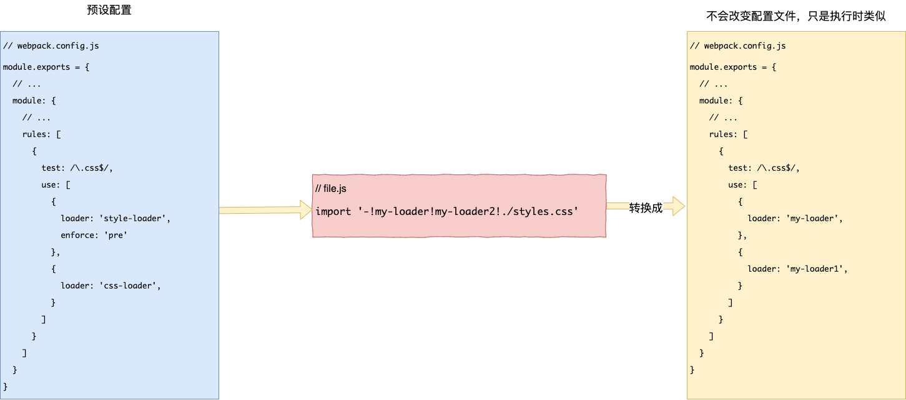
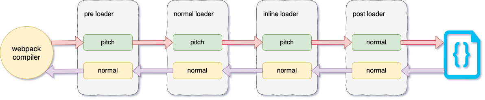
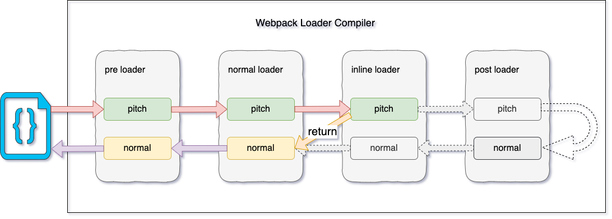

#### 前言

使用过`webpack`的童鞋都应该知道`loader`这个概念，那么，不知道你有没有兴趣和我一起来了解他呢？

Emmm，那是什么？

对，你没看错，他来了，他来了，他正朝向我们走来，然后当面就给我们来了一个


灵魂连环问, `Loader` 是什么？有什么用？有什么特点？有哪些`Loader` ? 怎么用？怎么写一个自己的`Loader` ？

#### Loader 是什么？

`Loader` 又称**加载器**, 它是类似其他构建工具中的 **任务(task)**, 提供了处理前端构建步骤的强大方法。

#### Loader 有什么用？

`loader` 让 `webpack` 能够去处理那些非 `JavaScript` 文件(`webpack` 自身只理解 `JavaScript`)。`loader` 可以将所有类型的文件转换为 `webpack` 能够处理的有效模块,然后你就可以利用 `webpack` 的打包能力,对它们进行处理。

本质上, `webpack loader` 将所有类型的文件,转换为应用程序的 [**依赖图 (dependency graph)**](https://webpack.js.org/concepts/dependency-graph/) (和最终的 `bundle`)可以直接引用的模块。

#### Loader 特性

- `loader` 支持链式传递。能够对资源使用流水线`(pipeline)`。一组链式的 `loader` 将按照相反的顺序执行。`loader` 链中的第一个 `loader` 返回值给下一个 `loader`。在最后一个 `loader`，返回 `webpack` 所预期的 `JavaScript。`当链式调用多个 `loader` 的时候，请记住它们会以相反的顺序执行。取决于数组写法格式，**从右向左或者从下向上**执行。
- `loader` 可以是同步的，也可以是异步的。
- `loader` 运行在 `Node.js` 中，并且能够执行任何可能的操作。
- `loader` 接收查询参数。用于对 `loader` 传递配置。
- `loader` 也能够使用 `options` 对象进行配置。
- 除了使用 `package.json` 常见的 `main` 属性，还可以将普通的 npm 模块导出为 `loader`，做法是在 `package.json` 里定义一个 `loader` 字段。
- 插件`(plugin)`可以为 `loader` 带来更多特性。
- `loader` 能够产生额外的任意文件。

#### Loader 配置

##### 配置

`webpack.config.js`中 `loader`的配置如下

```javascript
// webpack.config.js
module.exports = {
  module: {
    rules: [
      {
        test: /\.css$/,
        use: [
          {
            loader: 'style-loader',
          },
          {
            laoder: 'css-loader',
          },
        ],
      },
    ],
  },
};
```

##### 内联配置 Loader

```javascript
import '!style-loader!css-loader!less-loader?name=Rain120!./styles.less';
```

上面内联引入模块相当于如下配置 **(内部执行转换过的rule配置)**:

```javascript
module.exports = {
  // ...
  module: {
    // ...
    rules: [
      {
        test: /\.less$/,
        use: [
          {
            loader: 'style-loader',
            options: {},
          },
          {
            laoder: 'css-loader',
            options: {},
          },
          {
            laoder: 'less-loader',
            options: '?name=Rain120',
          },
        ],
      },
    ],
  },
  // ...
};
```

再如:

```javascript
import '-!my-loader!my-loader2!./styles.css';
```



通过前置所有规则及使用 `!`，可以对应覆盖到配置中的任意 `loader`, 更多参数请到 [Loader 匹配规则](#Loader匹配规则) 查看。

选项可以传递查询参数，例如 `?key=value&foo=bar`，或者一个 `JSON` 对象，例如 `?{"key":"value","foo":"bar"}`。

##### Cli 配置 Loader

也可以通过 `CLI` 使用 `loader`

```javascript
webpack --module-bind jade-loader --module-bind 'css=style-loader!css-loader'
```

这会对 `.jade` 文件使用 `jade-loader`，对 `.css` 文件使用 [`style-loader`](https://www.webpackjs.com/loaders/style-loader) 和 [`css-loader`](https://www.webpackjs.com/loaders/css-loader)。

[webpack 使用 Loader](https://www.webpackjs.com/concepts/loaders/#使用-loader)

#### Loader 种类

关于 `loader`的种类, 可以通过`rule.enforce`来配置，如下

```javascript
module.exports = {
  // ...
	module: {
    // ...
    // 从下往上, css-loader -> style-loader
    rules: [
      {
        test: /\.css$/,
        use: {
          loader: 'style-loader'
        },
        enforce:'pre'
      },
      {
        test: /\.css$/,
        use: {
          loader: 'css-loader'
        }
      }
    ]
  },
  // ...
}
```

此时，在普通 `loader`模式下`css-loader`将会在`style-laoder`之后执行。即由之前的`css-loader -> style-loader`变成`style-loader -> css-loader`。

`rule.enforce`的参数: `'pre'` `'post'`

- `pre Loader`: 前置 `loader` ① ----> `enforce: 'pre`'
- `normal Loader`: 普通 `loader` ② ----> 默认
- `inline Loader`: 内联`loader` ③ ----> 在模块中指定使用的`loader`是[内联`loader`](#内联配置Loader)
- `post Loader`: 后置`loader` ④ ----> `enforce: 'post`'

#### Loader 匹配规则

当然，`webpack`可以通过引入模块的路径规则，来判断是否使用内联模式或者剔除一些前置`(pre)` `Loader`, 后置`(post)` , 普通`(normal)` `Loader`。规则如下:

**-!** : 剔除 配置中符合条件的 `pre` 和 `normal` `Loader`

**!** : 剔除 配置中符合条件的 `normal` `Loader`

**!!** : 剔除 配置中符合条件的 `pre` & `normal` & `post` `Loader`

```javascript
// Disable normal loaders
import { a } from '!./file1.js';

// Disable preloaders and normal loaders
import { b } from '-!./file2.js';

// Disable all loaders
import { c } from '!!./file3.js';
```

`webpack`代码逻辑解析规则如下`(5.0.0.beta.15 vs 4.43.0)`

```javascript
// ...
const firstChar = requestWithoutMatchResource.charCodeAt(0);
const secondChar = requestWithoutMatchResource.charCodeAt(1);
const noPreAutoLoaders = firstChar === 45 && secondChar === 33; // startsWith "-!"
const noAutoLoaders = noPreAutoLoaders || firstChar === 33; // startsWith "!"
const noPrePostAutoLoaders = firstChar === 33 && secondChar === 33; // startsWith "!!";
const rawElements = requestWithoutMatchResource
  .slice(noPreAutoLoaders || noPrePostAutoLoaders ? 2 : noAutoLoaders ? 1 : 0)
  .split(/!+/);
// ...
```

[详见 5.0.0 beta.15 webpack NormalModuleFactory.js](https://github.com/webpack/webpack/blob/2db705096bd9fa869e5cbe3e9fe5e09b0089c188/lib/NormalModuleFactory.js#L273)

```javascript
// ...
const noPreAutoLoaders = requestWithoutMatchResource.startsWith('-!');
const noAutoLoaders =
  noPreAutoLoaders || requestWithoutMatchResource.startsWith('!');
const noPrePostAutoLoaders = requestWithoutMatchResource.startsWith('!!');
let elements = requestWithoutMatchResource
  .replace(/^-?!+/, '')
  .replace(/!!+/g, '!')
  .split('!');
let resource = elements.pop();
elements = elements.map(identToLoaderRequest);
// ...
```

[详见 4.43.0 webpack NormalModuleFactory.js](https://github.com/webpack/webpack/blob/c9d4ff7b054fc581c96ce0e53432d44f9dd8ca72/lib/NormalModuleFactory.js#L180)

#### Loader 执行

##### Loader 链式执行

**数组**: 从右往左执行

```javascript
module.exports = {
  // ...
  module: {
    // ...
    rules: [
      {
        test: /\.css$/,
        // 从右往左, css-loader -> style-loader
        use: ['style-laoder', 'css-loader'],
      },
    ],
  },
};
```

**对象**: 从下往上执行

```javascript
module.exports = {
  // ...
  module: {
    // ...
    // 从下往上, css-loader -> style-loader
    rules: [
      {
        test: /\.css$/,
        use: {
          loader: 'style-loader'
        }
      },
      {
        test: /\.css$/,
        use: {
          loader: 'css-loader'
        }
      }
    ]
  },
  // ...
}
```

每个`loader`默认的执行阶段(`normal execution`)的执行顺序是从 ① ② ③ ④, 即，从后往前执行; 某些情况下，`loader` 只关心 `request` 后面的**元数据(metadata)**，并且忽略前一个 `loader` 的结果。在实际（从右到左）执行 loader 之前，会先**从左到右**调用 `loader` 上的 `pitch` 方法，`pitch` 阶段的执行顺序是 ④ ③ ② ①。对于以下 [`use`](https://webpack.docschina.org/configuration/module#rule-use) 配置:

```javascript
module.exports = {
  //...
  module: {
    rules: [
      {
        //...
        use: ['a-loader', 'b-loader', 'c-loader'],
      },
    ],
  },
  // ...
};
```

`patch` 和`normal execution`执行结果如下

```sh
|- a-loader `pitch`
  |- b-loader `pitch`
    |- c-loader `pitch`
      |- requested module is picked up as a dependency
    |- c-loader normal execution
  |- b-loader normal execution
|- a-loader normal execution
```

正常执行



在这个过程中如果任何 `pitch` 有返回值，则 `loader` 执行链被阻断。`webpack` 会跳过后面所有的的 `pitch` 和 `loader`，直接进入上一个`loader` 的 `normal execution`。



[pitching-loader](https://webpack.js.org/api/loaders/#pitching-loader)

[Rule.enforce](https://webpack.js.org/configuration/module/#ruleenforce)

#### 如何编写一个 Loader

`loader` 是导出为一个函数的 `node` 模块。该函数在 `loader` 转换资源的时候调用。给定的函数将调用 [loader API](https://www.webpackjs.com/api/loaders/)，并通过 `this` 上下文访问。

##### 编写原则

- 单一原则: 每个 `Loader` 只做一件事;
- 链式调用: `Webpack` 会按顺序链式调用每个 `Loader`;
- 统一原则: 遵循 `Webpack` 制定的设计规则和结构，输入与输出均为字符串，各个 `Loader` 完全独立，即插即用;

[用法准则](https://www.webpackjs.com/contribute/writing-a-loader/#用法准则-guidelines-)

#### 参考资料

[Webpack Loader](https://rain120.github.io/study-notes/#/notes/webpack/mini-webpack?id=loaders-gt-官方文档-模块转换器)

[Webpack Loader 官方文档](https://www.webpackjs.com/concepts/loaders/)

[loaders api](https://webpack.docschina.org/api/loaders/)

[编写一个 loader](https://www.webpackjs.com/contribute/writing-a-loader/)

[【webpack 进阶】你真的掌握了 loader 么？- loader 十问](https://juejin.im/post/5bc1a73df265da0a8d36b74f)

[webpack 系列之四 loader 详解 1](https://segmentfault.com/a/1190000018450503)
