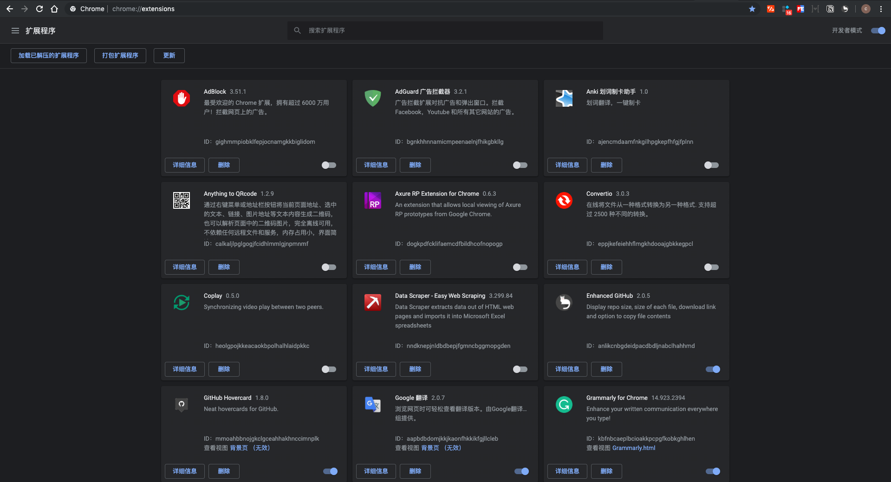

### 为什么要写这个？

- 知乎有个帖子写了软件篇，这次补上插件篇
- 朋友需要

### 插件的作用

> 浏览器扩展用于改善浏览器的使用接口、安全性或可访问性、阻止广告以及各种其他功能，使浏览网络更轻松和更愉快。有很多类型的扩展可用于控制浏览隐私的各个方面并减少威胁。

**Note**: 本次只针对`Chrome`进行推荐, 进入[Chrome应用商店](https://chrome.google.com/webstore/category/extensions?hl=zh-CN)，需要翻墙，可以使用[谷歌访问助手](https://github.com/haotian-wang/google-access-helper)，也可以去下载`crx`包直接拖拽到扩展程序里面安装。

### [Chrome插件安装](chrome://extensions/)

### 插件分类

#### 在线笔记

[Notion](https://www.notion.so/?r=a8b6e24bd86f4597a0b26266f6f8aee9): 一个笔记记录和协作应用程序，具有`markdown`支持，还集成了任务，`wiki`和数据库, 支持插件、`Windows`, `Mac`。

[Markdown Here](https://chrome.google.com/webstore/detail/markdown-here/elifhakcjgalahccnjkneoccemfahfoa?hl=zh-CN): 一键转换`markdown`格式

[Evernote Web Clipper](https://chrome.google.com/webstore/detail/evernote-web-clipper/pioclpoplcdbaefihamjohnefbikjilc?hl=zh-CN): 使用`Evernote`扩展程序一键保存精彩网页内容到`Evernote`帐户。

#### GitHub

[Octotree](https://chrome.google.com/webstore/detail/octotree/bkhaagjahfmjljalopjnoealnfndnagc): `GitHub`显示文件目录树。

[Sourcegraph](https://chrome.google.com/webstore/detail/sourcegraph/dgjhfomjieaadpoljlnidmbgkdffpack): 代码主机和代码审查的代码智能：文件，PR和差异中的悬停，文档，定义和引用

[OctoLinker](https://chrome.google.com/webstore/detail/octolinker/jlmafbaeoofdegohdhinkhilhclaklkp): `OctoLinker`是`Chrome`，`Firefox`和`Opera`的浏览器扩展，可让您更有效地浏览`GitHub`上的代码。

[Github Hovercard](https://chrome.google.com/webstore/detail/github-hovercard/mmoahbbnojgkclgceahhakhnccimnplk): 为`GitHub`提供整洁的`hovercards`。它使您可以从`GitHub`上的任何位置即时访问用户/回购/发布/提交信息。

[OctoHint](https://chrome.google.com/webstore/detail/octohint/hbkpjkfdheainjkkebeoofkpgddnnbpk): 智能感知提示`GitHub`。

[Isometric Contributions](https://chrome.google.com/webstore/detail/isometric-contributions/mjoedlfflcchnleknnceiplgaeoegien): 呈现`GitHub`贡献图的等距像素视图。

#### 前端

[WEB前端助手(FeHelper)](https://chrome.google.com/webstore/detail/web前端助手fehelper/pkgccpejnmalmdinmhkkfafefagiiiad): FE助手：包括JSON格式化、二维码生成与解码、信息编解码、代码压缩、美化、页面取色、Markdown与HTML互转、网页滚动截屏、正则表达式、时间转换工具、编码规范检测、页面性能检测、Ajax接口调试、密码生成器、JSON比对工具、网页编码设置、便签笔记

[Vue.js devtools](https://chrome.google.com/webstore/detail/vuejs-devtools/nhdogjmejiglipccpnnnanhbledajbpd): 用于调试Vue.js应用程序的Chrome和Firefox DevTools扩展。

[React Developer Tools](https://chrome.google.com/webstore/detail/react-developer-tools/fmkadmapgofadopljbjfkapdkoienihi): React Developer Tools是一个用于开源React JavaScript库的Chrome DevTools扩展。 它允许您检查Chrome开发人员工具中的React组件层次结构。

[掘金](https://chrome.google.com/webstore/detail/掘金/lecdifefmmfjnjjinhaennhdlmcaeeeb): 为程序员、设计师、产品经理每日发现优质内容。

[WhatRuns](https://chrome.google.com/webstore/detail/whatruns/cmkdbmfndkfgebldhnkbfhlneefdaaip): 了解运行网站的内容。 框架，分析工具，Wordpress插件，字体 - 您的名字。

[Axure RP Extension for Chrome](https://chrome.google.com/webstore/detail/axure-rp-extension-for-ch/dogkpdfcklifaemcdfbildhcofnopogp?hl=zh-CN): `Axure` 插件

[Host Switch Plus](https://chrome.google.com/webstore/detail/host-switch-plus/bopepoejgapmihklfepohbilpkcdoaeo?hl=zh-CN): 快速切换 Domain-IP 配置而不需要编辑 Hosts 文件，并方便的添加、修改、分组（批量开关）。

[User-Agent Switcher for Chrome](https://chrome.google.com/webstore/detail/user-agent-switcher-for-c/djflhoibgkdhkhhcedjiklpkjnoahfmg?hl=zh-CN): 切换浏览器代理`Agent`

[JSON Viewer](https://chrome.google.com/webstore/detail/json-viewer/gbmdgpbipfallnflgajpaliibnhdgobh):  方便查看 `JSON`结构的插件，展开，折叠，可以非常方便的查看接口返回数据。

[Postman](https://chrome.google.com/webstore/detail/postman/fhbjgbiflinjbdggehcddcbncdddomop)

[Restlet Client - REST API Testing](https://chrome.google.com/webstore/detail/restlet-client-rest-api-t/aejoelaoggembcahagimdiliamlcdmfm?hl=zh-CN): 可视化地创建和运行单个`HTTP`请求以及复杂方案。 使用我们的`CI / CD`插件自动化您的`API`测试。

[Spider - a smart web scraping tool](): `Spider`是一款智能的点击式网页抓取工具。 使用`Spider`，您可以将网站转换为有结构的数据，将其下载为`JSON`或`exce`。 无需编码经验或配置时间，只需打开`chrome`扩展程序并开始单击即可。

[Redux DevTools](https://chrome.google.com/webstore/detail/redux-devtools/lmhkpmbekcpmknklioeibfkpmmfibljd?hl=zh-CN)： `Redux DevTools`用于调试应用程序的状态更改。

[MobX Developer Tools](https://chrome.google.com/webstore/detail/mobx-developer-tools/pfgnfdagidkfgccljigdamigbcnndkod?hl=zh-CN): `MobX Developer Tools`调试工具

#### 英语

[Aboboo](http://www.aboboo.com/g/#/): 学外语必备神器

[Quizlet](https://quizlet.com/zh-cn): 免费的学习工具和单词卡

[Grammarly for Chrome](https://chrome.google.com/webstore/detail/grammarly-for-chrome/kbfnbcaeplbcioakkpcpgfkobkghlhen): `Enhance your written communication everywhere you type!`

[dadda-translate-crx](https://github.com/waynecz/dadda-translate-crx): 比较好看的 `Chrome` 划词翻译(搜狗)插件，自带生词簿及吐司弹词记忆，可与有道、扇贝单词同步。

[Google翻译](https://chrome.google.com/webstore/detail/google-translate/aapbdbdomjkkjkaonfhkkikfgjllcleb?hl=zh-CN)

[ImTranslator](https://chrome.google.com/webstore/detail/imtranslator-translator-d/noaijdpnepcgjemiklgfkcfbkokogabh?hl=zh-CN): 一款可以翻译外文、翻译网页、词典查询、阅读26种语言文字的谷歌浏览器插件。

#### 工具

[Tampermonkey](https://chrome.google.com/webstore/detail/tampermonkey/dhdgffkkebhmkfjojejmpbldmpobfkfo?hl=zh-CN): 方便的脚本管理、脚本概览、设置多样性、脚本自动更新、安全、兼容性、`Chrome` 同步、`CodeMirror `编辑器、`JSHint` 语法检查、快速开发、卸载等功能。 -> [脚本网站](https://greasyfork.org/zh-CN)

[Lucidchart 离线图表](https://chrome.google.com/webstore/detail/lucidchart-diagrams-deskt/djejicklhojeokkfmdelnempiecmdomj?utm_source=chrome-app-launcher-info-dialog): 在线和离线绘制流程图、实体模型、`UML`、思维导图与更多图表的最便捷方式。

[Proxy SwitchyOmega](https://chrome.google.com/webstore/detail/proxy-switchyomega/padekgcemlokbadohgkifijomclgjgif?hl=zh-CN): 轻松快捷地管理和切换多个代理设置。

[Smallpdf](https://chrome.google.com/webstore/detail/smallpdf/ohfgljdgelakfkefopgklcohadegdpjf): Smallpdf - 易于使用的PDF工具，转换，压缩，合并，拆分和编辑PDF文件

[新媒体管家](https://chrome.google.com/webstore/detail/新媒体管家/jicmnjcngcnfhgfggbdhlbjpcbadimaj?hl=zh-CN): 给你原本的微信公众号后台添加很多原本没有的功能。

[FireShot](https://chrome.google.com/webstore/detail/take-webpage-screenshots/mcbpblocgmgfnpjjppndjkmgjaogfceg?hl=zh-CN): 不仅支持区域截图，还支持完整的长网页截图

#### 其他

[扩展管理器(Extension Manager)](https://chrome.google.com/webstore/detail/extension-manager/gjldcdngmdknpinoemndlidpcabkggco): 管理扩展，快速启用/禁用，支持批处理操作，智能排序。 快速，简单，安全。

[浏览器扩展，简化了GitHub界面并添加了有用的功能](https://github.com/sindresorhus/refined-github)

[ChromeAppHeroes](https://github.com/zhaoolee/ChromeAppHeroes): 为优秀的Chrome插件写一本中文说明书, 让Chrome插件英雄们造福人类。

[AdGuard 广告拦截器](https://chrome.google.com/webstore/detail/adguard-adblocker/bgnkhhnnamicmpeenaelnjfhikgbkllg?hl=zh-CN): `AdGuard` 广告拦截器可有效的拦截所有网页上的所有类型的广告，甚至是在 `Facebook`、`Youtube `以及其他万千网站上的广告！

[ADBlock](https://chrome.google.com/webstore/detail/adblock/gighmmpiobklfepjocnamgkkbiglidom?hl=zh-CN): 拦截网页上的广告。

[Anything to QRcode](): 通过右键菜单或地址栏按钮将当前页面地址、选中的文本、链接、图片地址等文本内容生成二维码，也可以解析页面中的二维码图片，完全离线可用，不依赖任何远程文件和服务，内存占用小，界面简洁 :-)

[Convertio](https://chrome.google.com/webstore/detail/convertio/eppjkefeiehhflmgkhdooajgbkkegpcl?hl=zh-CN): 在线将文件从一种格式转换为另一种格式. 支持超过 2500 种不同的转换。

[crxMouse Chrome Gestures](https://chrome.google.com/webstore/detail/crxmouse-chrome-gestures/jlgkpaicikihijadgifklkbpdajbkhjo?hl=zh-CN): 原名:Gestures for Chrome(TM)汉化版.方便,快捷,充分发掘鼠标的所有操作.功能包括:鼠标手势,超级拖曳,滚轮手势,摇杆手势,平滑滚动,标签页列表等.

[Qlearly - Tab and Bookmark Manager](https://chrome.google.com/webstore/detail/qlearly-tab-and-bookmark/aicaflgmmblfaneodjfhkilgplnpjmig?hl=zh-CN): 按列和面板组织您喜欢的网站。 每次打开新标签页时，您的面板都会在一秒钟内加载。

