<!--

 * @Author: Rainy
 * @Github: https://github.com/Rain120
 * @Date: 2019-01-20 15:41:18
 * @LastEditTime: 2019-01-20 15:41:23
    -->

#### [不带图片的版本](/resources/front-end.md)

[DevDocs: API Documentation Browser](https://devdocs.io/)

[Github](https://github.com/freeCodeCamp/devdocs)

##### [React](https://react.docschina.org/)

> React是一个为数据提供渲染为HTML视图的开源JavaScript 库。React视图通常采用包含以自定义HTML标记规定的其他组件的组件渲染。React为程序员提供了一种子组件不能直接影响外层组件的模型，数据改变时对HTML文档的有效更新，和现代单页应用中组件之间干净的分离。

[React - Antd](https://ant.design/index-cn):  `antd` 是基于 Ant Design 设计体系的 React UI 组件库，主要用于研发企业级中后台产品。

[UxCore](http://uxco.re/): 为企业级后台而生的PC组件库。

[ZanUI](https://www.youzanyun.com/zanui): PC、移动、小程序

[React.part](https://react.parts/): 查找`React`的组件

##### [Vue](https://vuefe.cn/)

> Vue.js是一个用于创建用户界面的开源JavaScript框架，也是一个创建单页应用的Web应用框架。 2016年一项针对JavaScript的调查表明，Vue有着89%的开发者满意度。 在GitHub上，该项目平均每天能收获95颗星，为Github有史以来星标数第3多的项目。

[Vue - Antd](https://vue.ant.design/docs/vue/introduce/)

[IView](https://www.iviewui.com/): 一套基于 Vue.js 的高质量

[Element](http://element-cn.eleme.io/#/zh-CN): Element，一套为开发者、设计师和产品经理准备的基于 Vue 2.0 的桌面端组件库

[Mint UI](https://mint-ui.github.io/#!/zh-cn): 基于 Vue.js 的移动端组件库

[VUX](https://vux.li/#/?id=%E5%BF%AB%E9%80%9F%E5%85%A5%E9%97%A8): 一个凑合的 Vue.js 移动端 UI 组件库

[Vue-Map](https://github.com/ElemeFE/vue-amap): 基于 Vue 2.x 和高德地图的地图组件

[文档](https://elemefe.github.io/vue-amap/#/)

##### [Nodejs](https://nodejs.org/zh-cn/)

> Node.js是一个能够在服务器端运行JavaScript的开放源代码、跨平台JavaScript运行环境。Node.js由Node.js基金会持有和维护，并与Linux基金会有合作关系。

[Express](https://expressjs.com/)： 高度包容、快速而极简的 [Node.js](http://nodejs.org/) Web 框架

[koa](https://koajs.com/)

> Koa 是一个新的 web 框架，由 Express 幕后的原班人马打造， 致力于成为 web 应用和 API 开发领域中的一个更小、更富有表现力、更健壮的基石。 通过利用 async 函数，Koa 帮你丢弃回调函数，并有力地增强错误处理。 Koa 并没有捆绑任何中间件， 而是提供了一套优雅的方法，帮助您快速而愉快地编写服务端应用程序。

[egg](https://eggjs.org/): 为企业级框架和应用而生

[Nodejs学习笔记](https://github.com/chyingp/nodejs-learning-guide)

##### [Javascript](https://www.javascript.com/)

[现代 Javascript 教程](https://zh.javascript.info/): 从基础知识到高阶主题，只需既简单又详细的解释。

[Philip Roberts](http://latentflip.com/): **Visualizing the javascript runtime at runtime**

[Github](https://github.com/latentflip/loupe) -> [Demo](http://latentflip.com/loupe)

[Lodash](https://lodash.com/)

[Ramda](https://ramdajs.com/)

[Underscore](https://underscorejs.org/)

[Github](<https://github.com/jashkenas/underscore>)

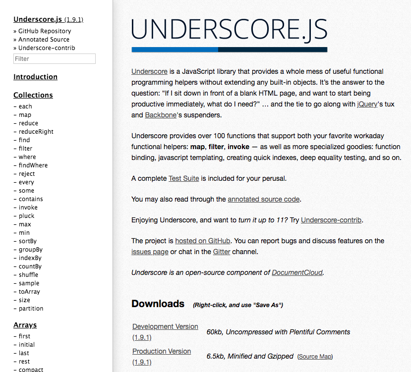

 [30 seconds of code](https://30secondsofcode.org/index)

[Github](<https://github.com/30-seconds/30-seconds-of-code>)

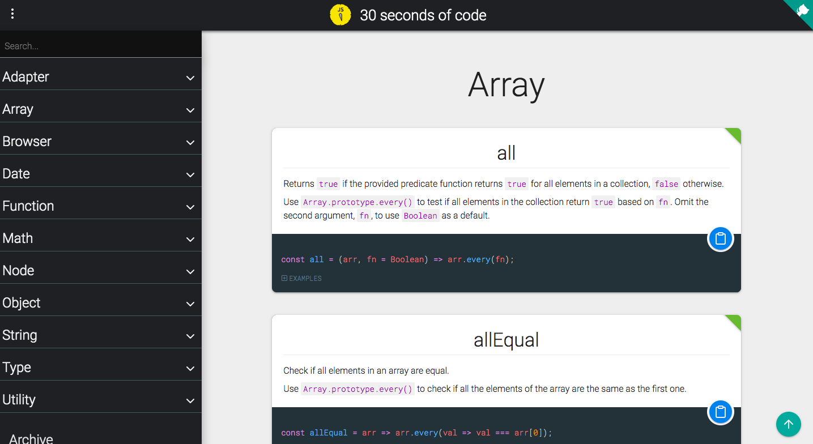

[AST Explorer](<https://astexplorer.net/>)

##### `Mock`

[Easy-Mock](https://easy-mock.com/): 高效伪造数据

[Mock.js](http://mockjs.com/):生成随机数据，拦截 Ajax 请求

[Rapid-Api](https://rapidapi.com/)

##### 动画库(Javascript & CSS)

[Three](<https://threejs.org/>)

[Github](<https://github.com/mrdoob/three.js/>)

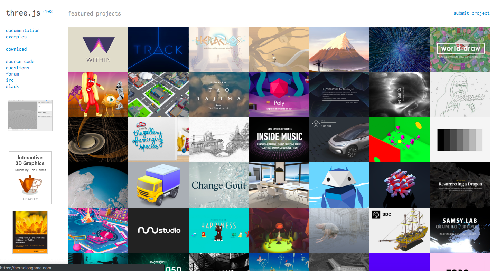

[Animate.css](https://daneden.github.io/animate.css/)

[Animejs](https://animejs.com/)

[TweenMax.js](https://www.tweenmax.com.cn/)

[GreenSock](https://greensock.com/)

Notes: [11 JavaScript Animation Libraries For 2019](<https://blog.bitsrc.io/11-javascript-animation-libraries-for-2018-9d7ac93a2c59>)

[Kubt.js](<http://thednp.github.io/kute.js/>)

[Github](<https://github.com/thednp/kute.js/>)

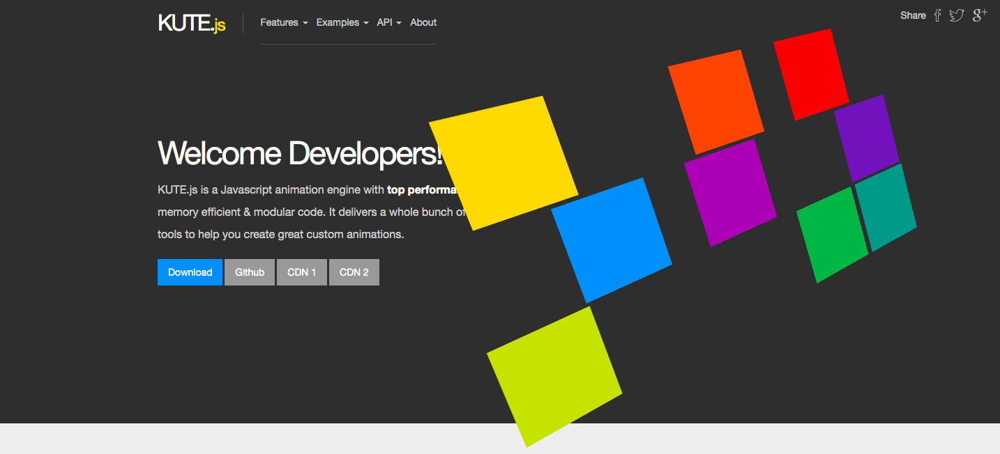

[Hover](<http://ianlunn.github.io/Hover/>)

[Github](<https://github.com/IanLunn/Hover>)

##### 测试框架

[Mocha](<https://mochajs.org/>)

[Mocha GitHub](<https://github.com/mochajs/mocha>)

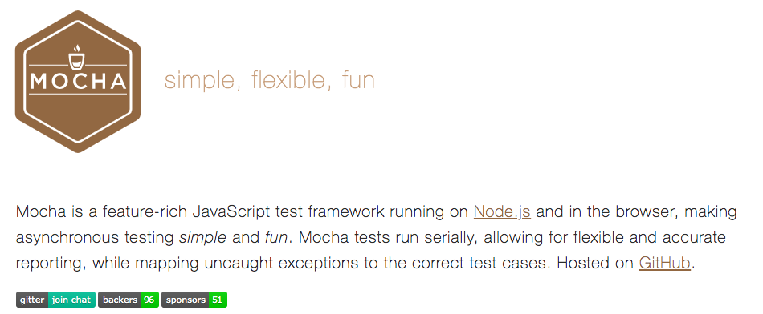

[Chai](<https://www.chaijs.com/>)

[Chai Github](<https://github.com/chaijs/chai>)

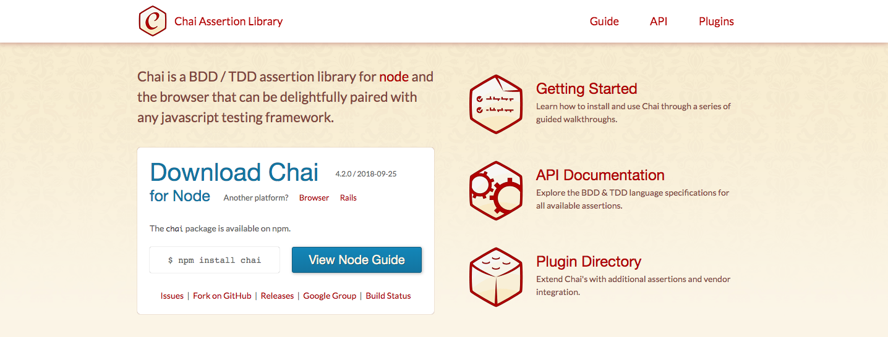

[Jest](<https://jestjs.io/>)

[Jest Github](<https://github.com/facebook/jest>)

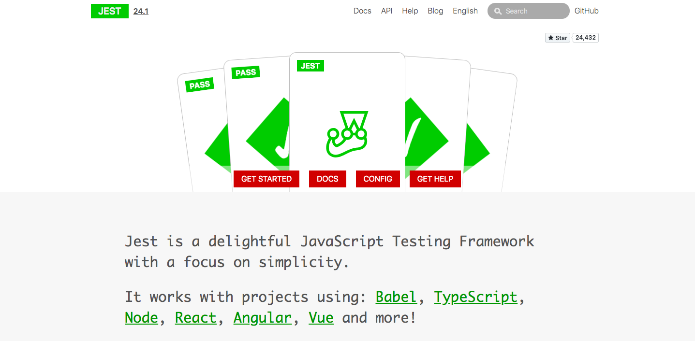

[Karma](<http://karma-runner.github.io/latest/index.html>)

[Github](<https://github.com/karma-runner/karma>)

[Tape Github](<https://github.com/substack/tape>)

[jsPerf — JavaScript performance playground](https://jsperf.com/)

[GitHub](https://github.com/jsperf/jsperf.com)

##### 优秀项目 & 插件

[Webpack](https://webpack.js.org/)

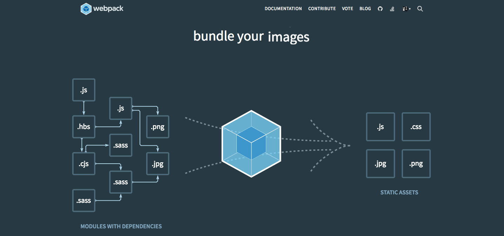

[Webpack config tool](<https://createapp.dev/>): webpack 配置工具

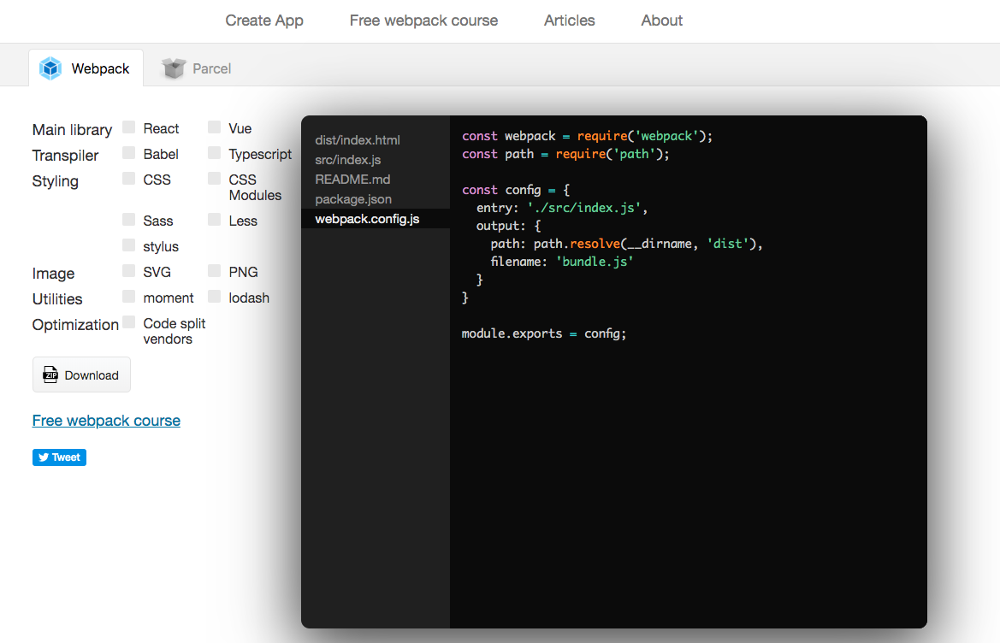

[BootCDN](https://www.bootcdn.cn/): 稳定、快速、免费的前端开源项目 CDN 加速服务

[BootStrap](https://v4.bootcss.com/)

[BootsWatch](https://bootswatch.com/): Free themes for Bootstrap

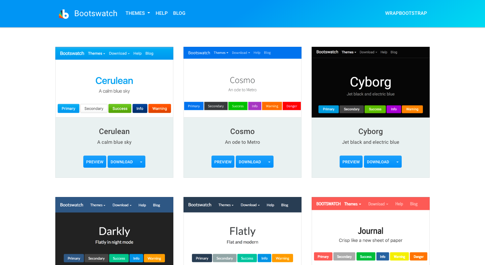

[RxJS](https://rxjs.dev/): 使用` Observables` 的响应式编程的库，它使编写异步或基于回调的代码更容易。

[Github](https://github.com/ReactiveX/RxJS)

[中文文档](https://cn.rx.js.org/)

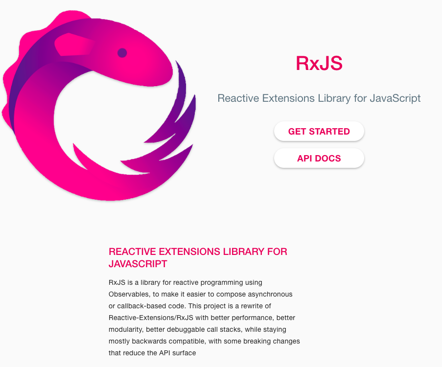

[Layui](https://www.layui.com/)

[Github](https://github.com/sentsin/layui/)

[Awesome Lists](<https://www.prettyawesomelists.com/lists>)

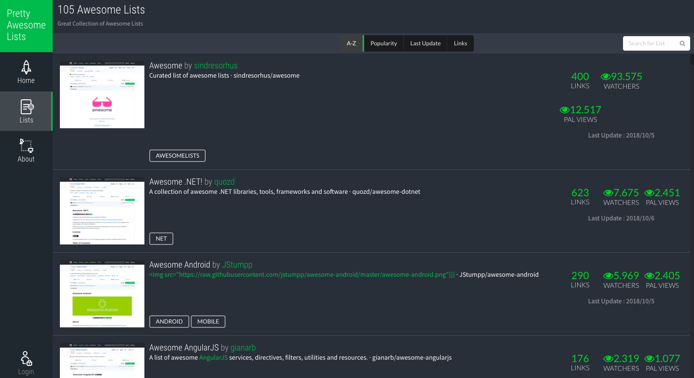

##### 图表库

[Echarts](<https://echarts.baidu.com/>)

[Github](<https://github.com/apache/incubator-echarts>)

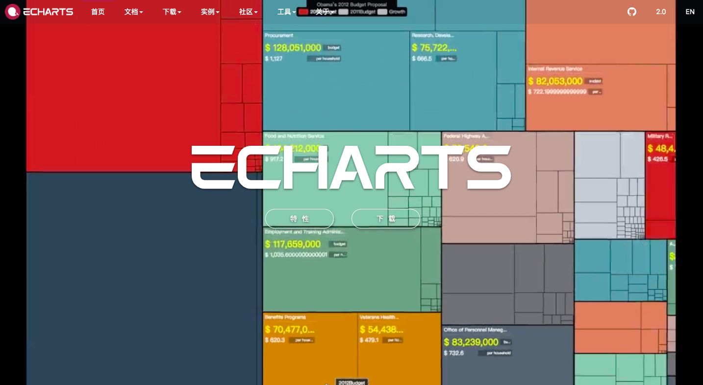

[AntV](<https://antv.alipay.com/zh-cn/index.html>)

[Github](<https://github.com/antvis/>)

[G2](<https://antv.alipay.com/zh-cn/g2/3.x/index.html>)

G2 是一套基于可视化编码的图形语法，以数据驱动，具有高度的易用性和扩展性，用户无需关注各种繁琐的实现细节，一条语句即可构建出各种各样的可交互的统计图表。

[G6](<https://antv.alipay.com/zh-cn/g6/3.x/index.html>)

G6 是一个简单、易用、完备的图可视化引擎，它在高定制能力的基础上，提供了一系列设计优雅、便于使用的图可视化解决方案。能帮助开发者搭建属于自己的图 图分析 应用或是 图编辑器 应用。

[F2](<https://antv.alipay.com/zh-cn/f2/3.x/index.html>)

F2 是一个专注于移动，开箱即用的可视化解决方案，完美支持 H5 环境同时兼容多种环境（Node, 小程序，Weex），完备的图形语法理论，满足你的各种可视化需求，专业的移动设计指引为你带来最佳的移动端图表体验。

[L7](<https://antv.alipay.com/zh-cn/l7/1.x/index.html>)

L7 中的 L 代表 Location，7 代表世界七大洲，寓意能为全球位置数据提供可视化能力。L7 的目标是提供一套地理空间数据可视化框架，易用易扩展，支持海量数据的高性能和 3D 高质量渲染，安全可靠（无地图法务风险）的地理空间数据可视化解决方案。

[Recharts](<http://recharts.org/>)

[Github](<https://github.com/recharts/recharts/>)

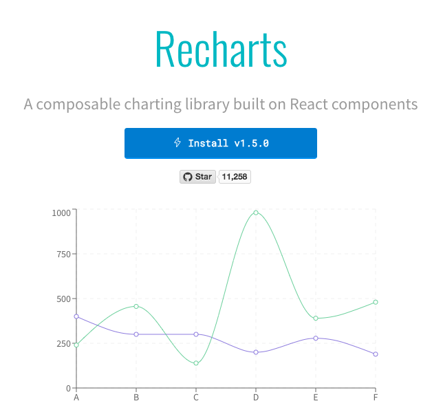

[Datamatic](<https://datamatic.io/>)

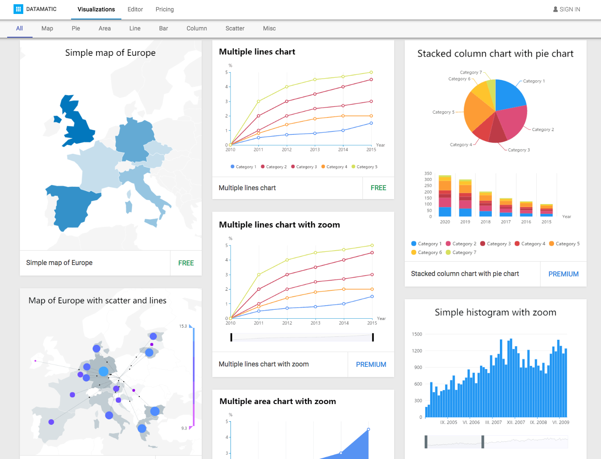

##### 开发资源

[Awesomes前端开发资源](https://www.awesomes.cn/)

[语雀 IT 百科精品知识库](https://www.yuque.com/yuque/blog/yuque-info-tech-encyclopedia)

##### 算法学习 & 机器学习

[Rappid算法学习](http://resources.jointjs.com/)

[AI算法工程师手册](http://www.huaxiaozhuan.com/)

[机器深度学习](http://redstonewill.com/)

[VisuAlgo - 数据结构和算法动态可视化 (Chinese)](https://visualgo.net/zh)

[Algorithm Visualizer](https://algorithm-visualizer.org/) 

[Github](https://github.com/algorithm-visualizer/algorithm-visualizer)

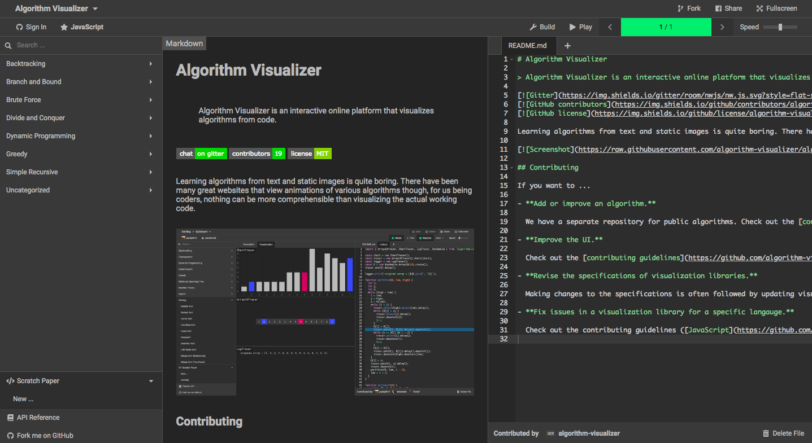

[Papers With Code : the latest in machine learning](https://paperswithcode.com/)

[Data Structure Visualizations](https://www.cs.usfca.edu/~galles/visualization/Algorithms.html): 旧金山大学CS Data Structure

[BestofML](<https://bestofml.com/>):  收集汇总了机器学习相关的资源，包括书籍、课程、博客、论文等

[Github](<https://github.com/RemoteML/bestofml>)

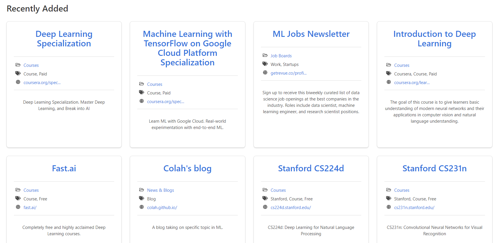

[internetfundamentals](http://internetfundamentals.com/watch/)：了解Web的工作原理，并迈出创建网页的第一步！ 一个完全免费的视频课程，适合初学者

##### 数学知识学习

> 微积分
>
> 线性代数
>
> 概率论
>
> 最优化方法

[Math ∩ Programming](https://jeremykun.com/)

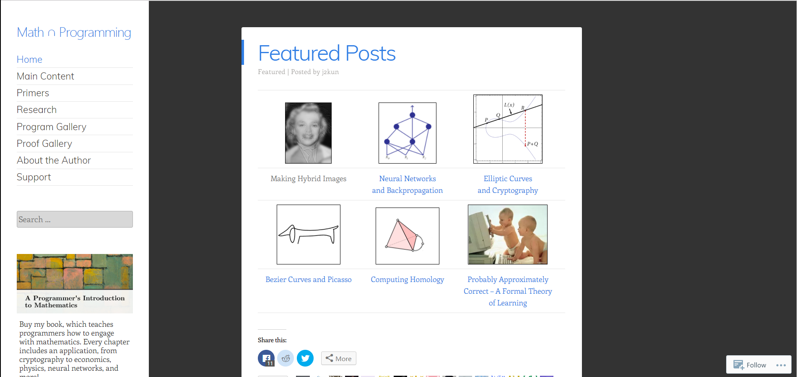

[Immersive Linear Algebra](http://immersivemath.com/ila/index.html):  一本会动的线代书，O(∩_∩)O哈哈~

[机器学习的数学基础知识](<https://mml-book.github.io/>)

[Github](<https://github.com/mml-book/mml-book.github.io>)

[Download](<https://mml-book.github.io/book/mml-book.pdf>)

[机器学习 - The Hundred-Page Machine Learning Book](http://themlbook.com/wiki/doku.php?id=start)

[MIT 的数据结构课程](https://courses.csail.mit.edu/6.851/fall17/)

[计算机科学速成课(视频)](https://www.yuque.com/computer/crush-course): Youtube 热门视频课程

##### [Linux](https://en.wikipedia.org/wiki/Linux)

[Linux命令大全](http://man.linuxde.net/)

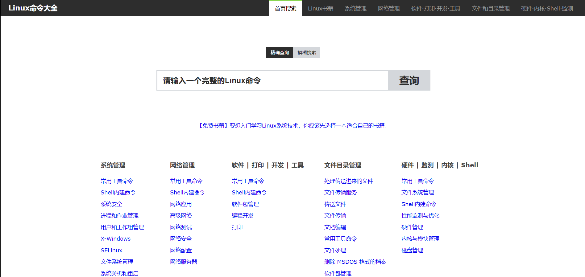

[Iodide](https://alpha.iodide.io/): `Mozilla `支持的在 `Web `中实现各种数据科学的效果

[Github](https://github.com/iodide-project/iodide)

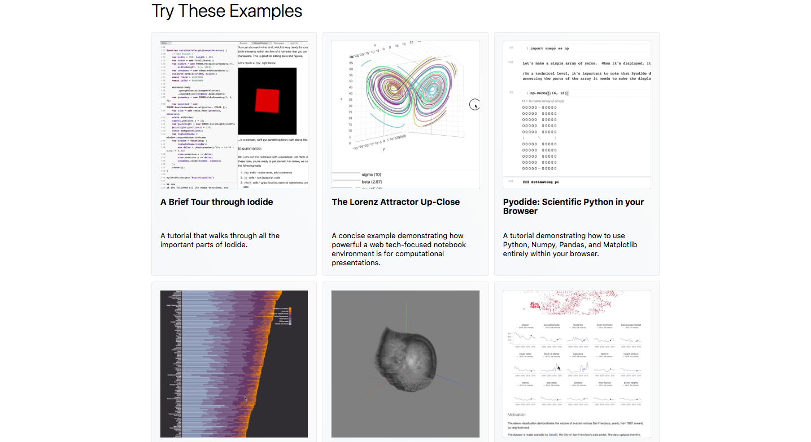

##### Icon & 设计 & 网页

[Iconfont](https://iconfont.cn)

[FontAwesome](https://fontawesome.com/)

[Ionicons](https://ionicons.com/)

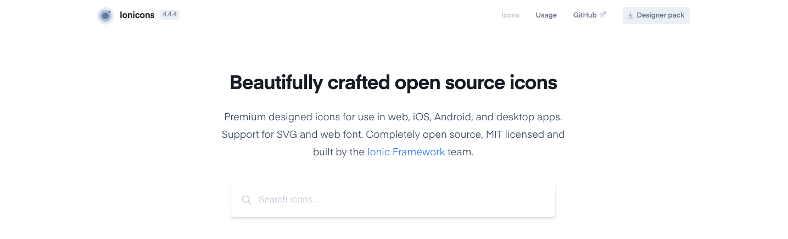

[Icomoon](https://icomoon.io/)

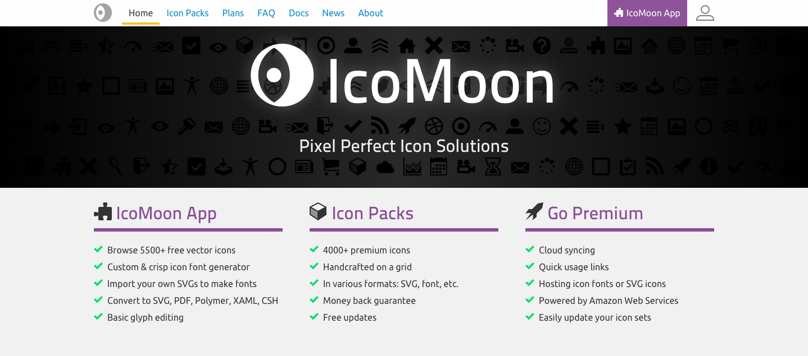

[Mobiriseicons](https://mobiriseicons.com/)

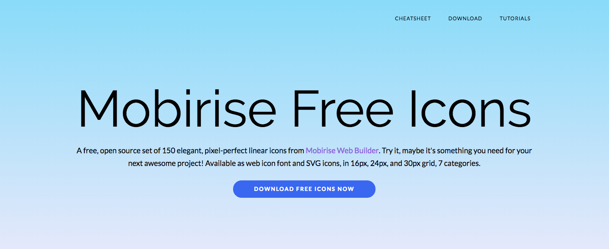

[zwicon](https://www.zwicon.com/cheatsheet.html)

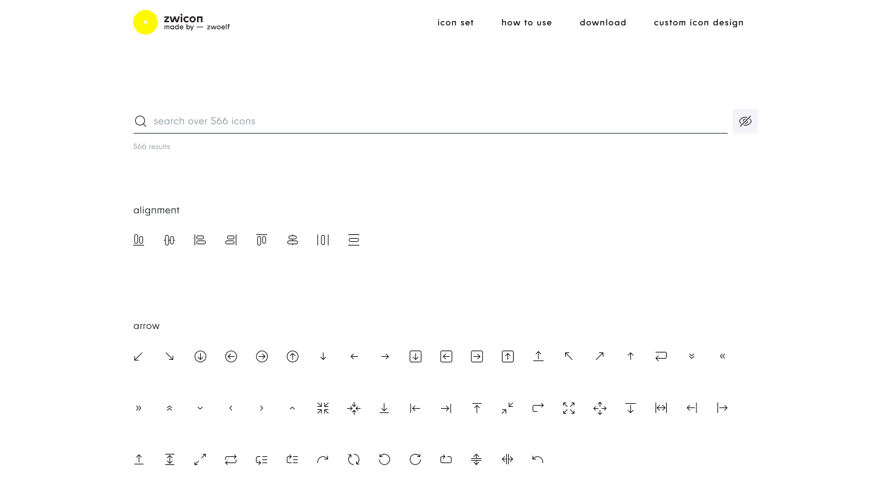

[unDraw](https://undraw.co/)

[优设](https://uiiiuiii.com/)

[uiforus](https://www.uiforus.com/)

> 它免费提供设计素材、插件、工具，其中设计素材包括：UI 、图标、网页、插画、实物、桌面、组件、表单、字体，并且按照不同的设计软件对应的文件进行分类，包括：Photoshop 、Sketch 、Adobe Xd 、Illustrator 文件。

[Can I Use](<https://caniuse.com/>): 查询浏览器的特性支持情况

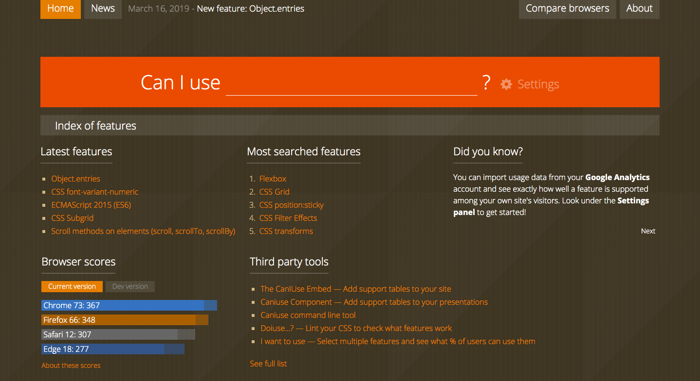

[Package Different](<https://diff.intrinsic.com/>)

[查询 NodeJS 的 ES2018 特性支持情况](<https://node.green/>)

[网络安全的教程](https://www.hacksplaining.com/lessons)

以一个黑客的角度将你带入，它配套了十几个小demo，一步一步带你发现各种各样的安全漏洞。因为这些demo都是交互式，玩起来很带感。

##### 开发社区 & 学习社区

[Vue.js 社区](https://www.vue-js.com/)

[React.js社区](http://react-china.org/)

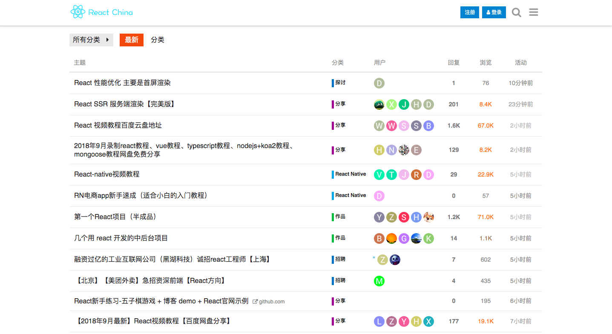

[掘金](https://juejin.im/timeline)

[InfoQ](https://www.infoq.cn/): *InfoQ* 是一个实践驱动的社区资讯站点，致力于促进软件开发领域知识与创新的传播。

[w3cplus](<https://www.w3cplus.com/>)

[V2EX](https://www.v2ex.com/)

[大前端](http://www.daqianduan.com/)

[开源中国](https://www.oschina.net/)

[segmentfault](https://segmentfault.com/)

[best-chinese-front-end-blogs](https://github.com/FrankFang/best-chinese-front-end-blogs): 收集优质的中文前端博客

[softnshare](https://softnshare.com/)

##### 路径及文章
[众成翻译](https://www.zcfy.cc/)

[Fly63前端](http://www.fly63.com/)

##### 博客 & 团队

[阮一峰ES6入门](http://es6.ruanyifeng.com/)

[廖雪峰官网](https://www.liaoxuefeng.com/)

[AlloyTeam - 腾讯Web前端团队](http://www.alloyteam.com/)

[IMWeb前端社区](<https://imweb.io/>)

[凹凸实验室](https://aotu.io/)

[淘宝前端团队FED](http://taobaofed.org/)

[奇舞团](https://75team.com/)

[腾讯互娱](https://tgideas.qq.com/)

[FEX 百度前端研发部](http://fex.baidu.com/)

[JDC 京东设计中心](http://jdc.jd.com/)

[携程UED](http://ued.ctrip.com/)

[饿了么前端](https://zhuanlan.zhihu.com/ElemeFE)

[美团前端](https://tech.meituan.com/)

##### 路径

[程序员不能错过的28份技术知识图谱，你的进阶路上必备](https://cloud.tencent.com/developer/article/1135231)

[学好机器学习需要哪些数学知识?](https://mp.weixin.qq.com/s?__biz=MzU4MjQ3MDkwNA==&mid=2247483713&idx=1&sn=1e7c81381d16806ac73e15691fe17aec&chksm=fdb69cd6cac115c05f1f90b0407e3f8ae9be8719e454f908074ac0d079885b5c134e2d60fd64&scene=21#wechat_redirect)

[浏览器的工作原理](https://www.html5rocks.com/zh/tutorials/internals/howbrowserswork/)

##### 工具

[Repl.it](<https://repl.it/>)

[Glitch](<https://glitch.com/>)

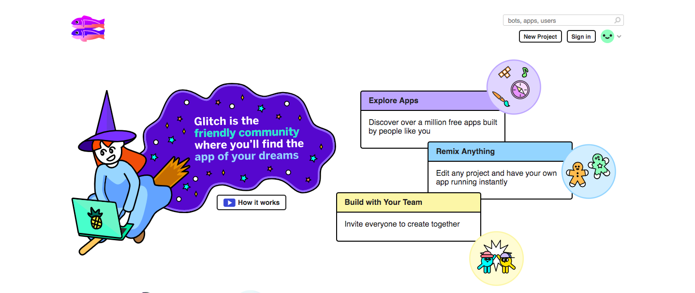

正则表达式可视化工具

[Regulex](<https://jex.im/regulex/>)

Regulex是一个JavaScript正则表达式可视化工具，由纯JavaScript实现，源码托管在[Github](https://github.com/JexCheng/regulex)上。

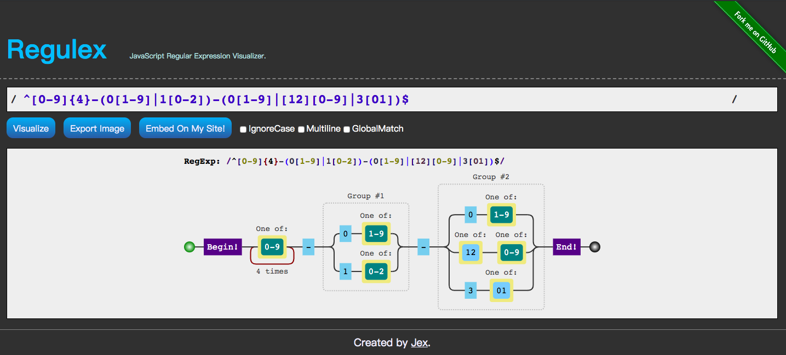

[Regexper](<https://regexper.com/>)

`Regexper`是由`Jeff Avallone`开发的一款`JavaScript`正则表达式可视化工具，源码托管在[Github](https://github.com/javallone/regexper)上。它能够让正则表达式字符串以 `Railroad `形式图形化，便于阅读和理解。同时推荐一款 `JavaScript` 正则在线测试工具——[Regexpal](http://regexpal.com/)，可以和` Regexper` 配合使用。

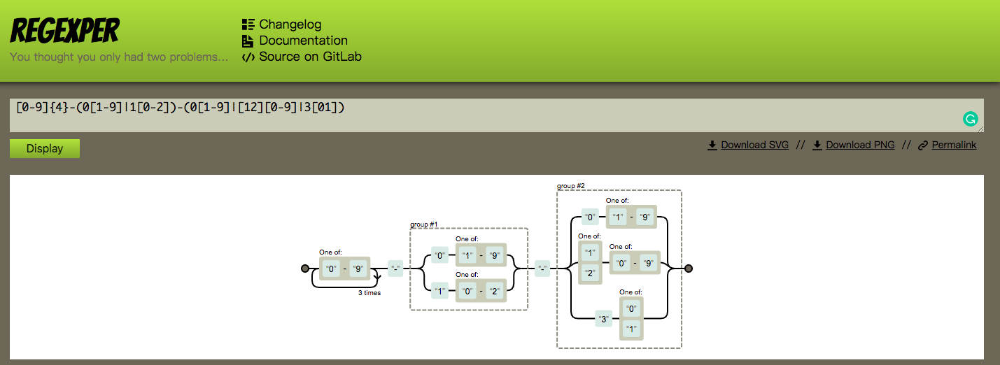

[Debuggex](<https://www.debuggex.com/>)

`Debuggex`是一个测试正则表达式的`Web`应用，它支持`JavaScript`、`Python`以及`PCRE`。

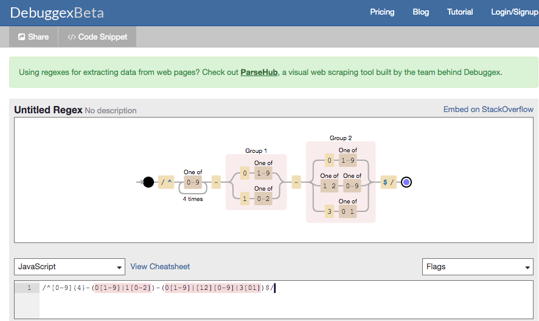

[前端网站导航](http://nav.web-hub.cn/)

[D2日报](https://daily.fairyever.com/)

[心谭博客](https://xin-tan.com/)

