<!--
 * @Author: Rainy
 * @Github: https://github.com/Rain120
 * @Date: 2019-01-20 15:41:18
 * @LastEditTime: 2019-01-20 15:41:23
    -->

##### [React](https://react.docschina.org/)

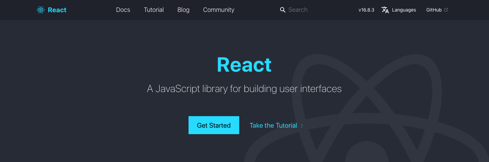

[React - Antd](https://ant.design/index-cn)

[UxCore](http://uxco.re/)

[ZanUI](https://www.youzanyun.com/zanui): PC、移动、小程序

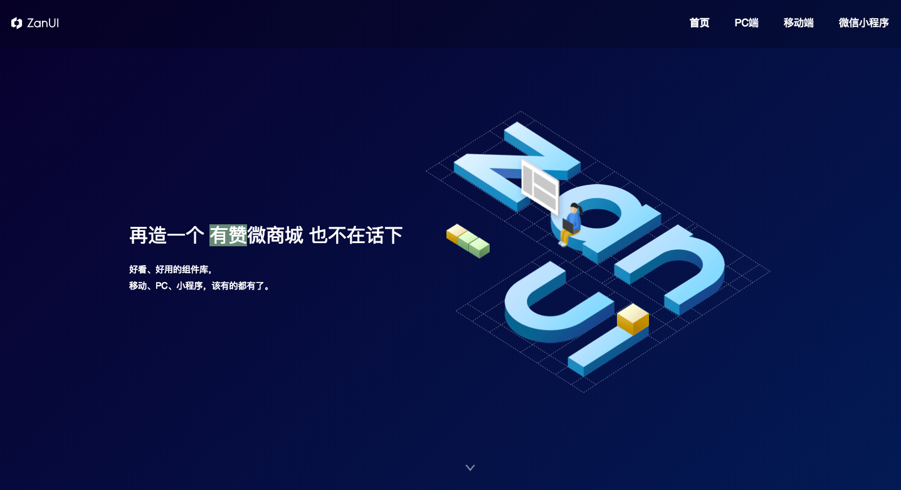

[React.part](https://react.parts/): 查找`React`的组件

##### [Vue](https://vuefe.cn/)

[Vue - Antd](https://vue.ant.design/docs/vue/introduce/)

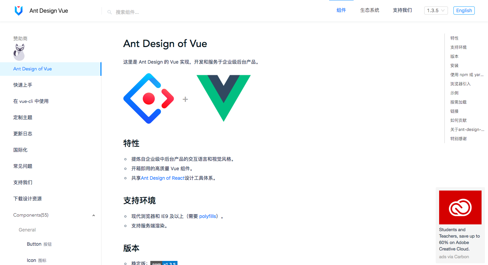

[IView](https://www.iviewui.com/): 一套基于 Vue.js 的高质量

[Element](http://element-cn.eleme.io/#/zh-CN): Element，一套为开发者、设计师和产品经理准备的基于 Vue 2.0 的桌面端组件库

[Mint UI](https://mint-ui.github.io/#!/zh-cn): 基于 Vue.js 的移动端组件库

[VUX](https://vux.li/#/?id=%E5%BF%AB%E9%80%9F%E5%85%A5%E9%97%A8): 一个凑合的 Vue.js 移动端 UI 组件库

[Vue-Map](https://github.com/ElemeFE/vue-amap): 基于 Vue 2.x 和高德地图的地图组件

[文档](https://elemefe.github.io/vue-amap/#/)

##### [Nodejs](https://nodejs.org/zh-cn/)

[Express](https://expressjs.com/)： 高度包容、快速而极简的 [Node.js](http://nodejs.org/) Web 框架

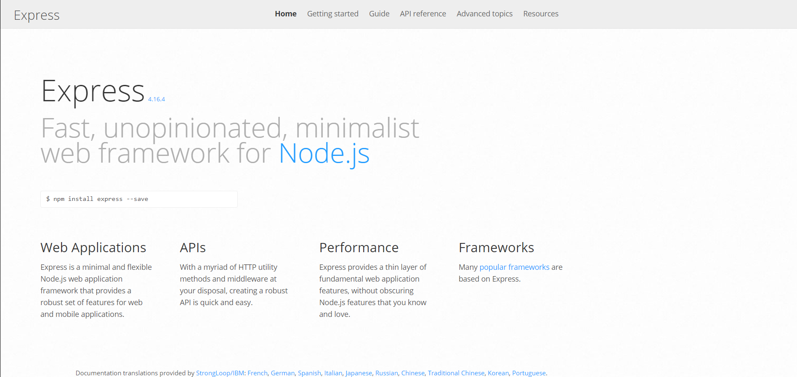

[koa](https://koajs.com/)

[egg](https://eggjs.org/): 为企业级框架和应用而生

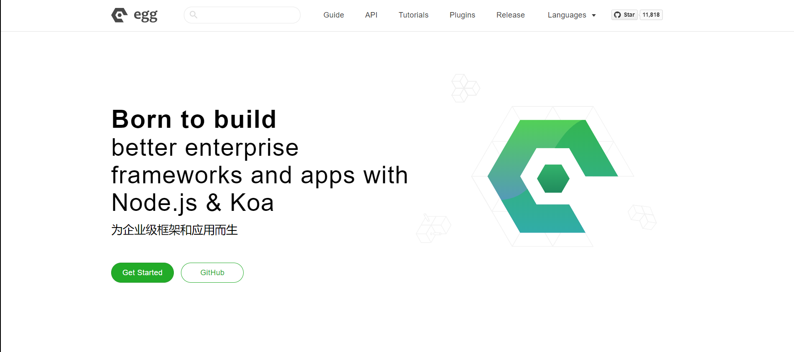

##### [Javascript](https://www.javascript.com/)

[现代 Javascript 教程](https://zh.javascript.info/)

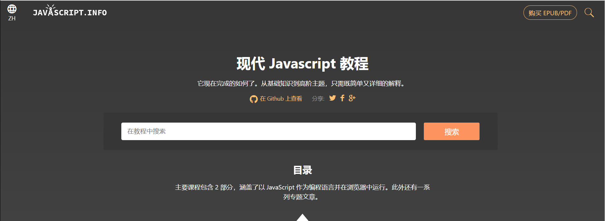

[Philip Roberts](http://latentflip.com/): **Visualizing the javascript runtime at runtime**

[Github](https://github.com/latentflip/loupe) -> [Demo](http://latentflip.com/loupe)

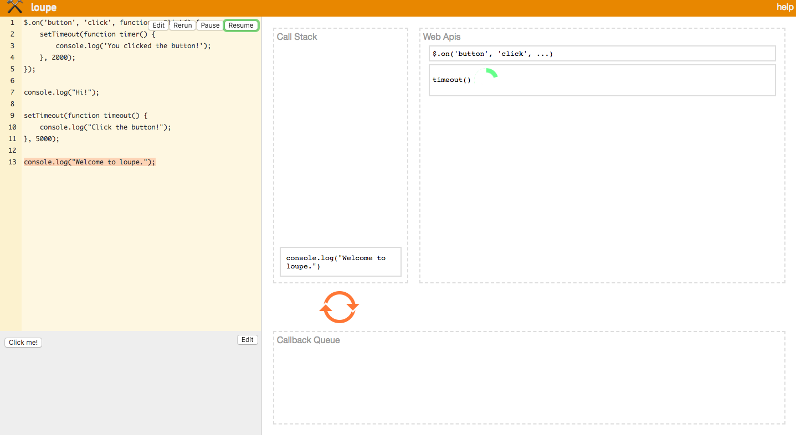

[Lodash](https://lodash.com/)

[Ramda](https://ramdajs.com/)

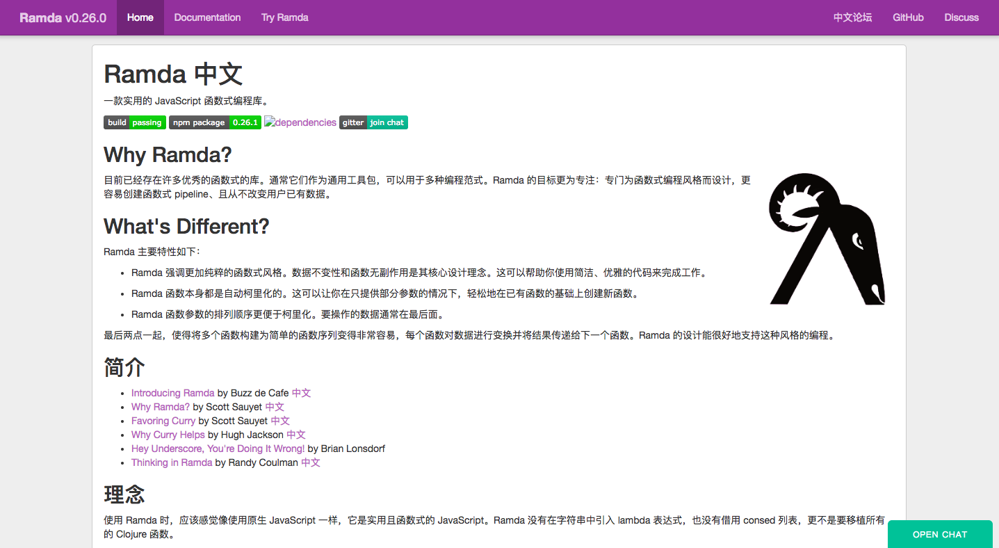

[Underscore](https://underscorejs.org/)

##### `Mock`

[Easy-Mock](https://easy-mock.com/): 高效伪造数据

[Mock.js](http://mockjs.com/):生成随机数据，拦截 Ajax 请求

[Rapid-Api](https://rapidapi.com/)

##### 动画库

[Animate.css](https://daneden.github.io/animate.css/)

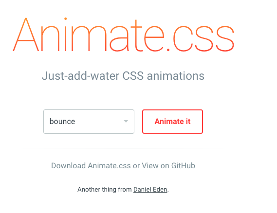

[Animejs](https://animejs.com/)

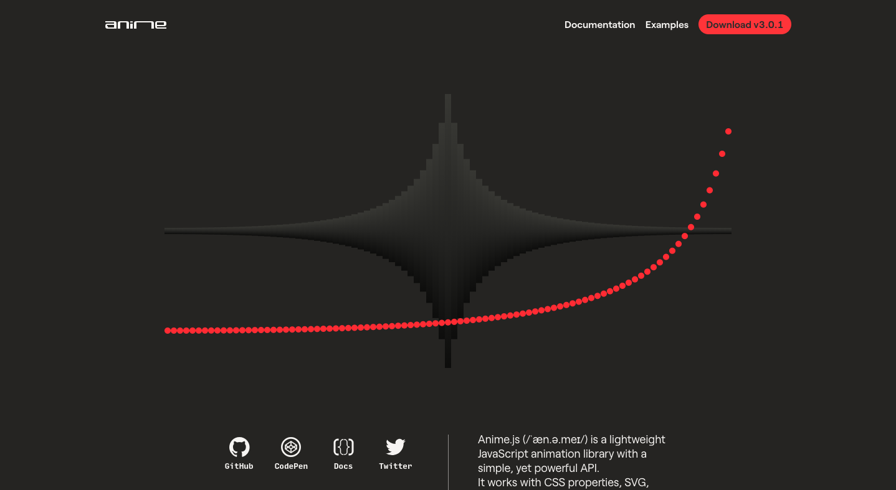

[TweenMax.js](https://www.tweenmax.com.cn/)

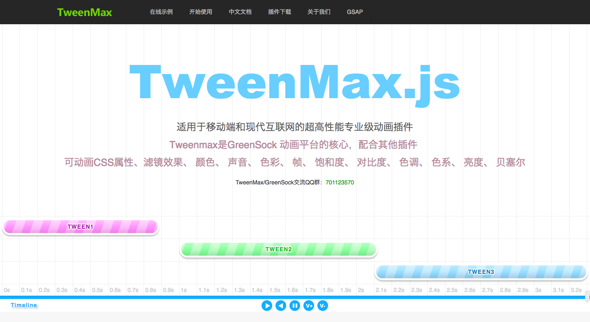

[GreenSock](https://greensock.com/)

##### 插件库

##### 开发资源

[Awesomes前端开发资源](https://www.awesomes.cn/)

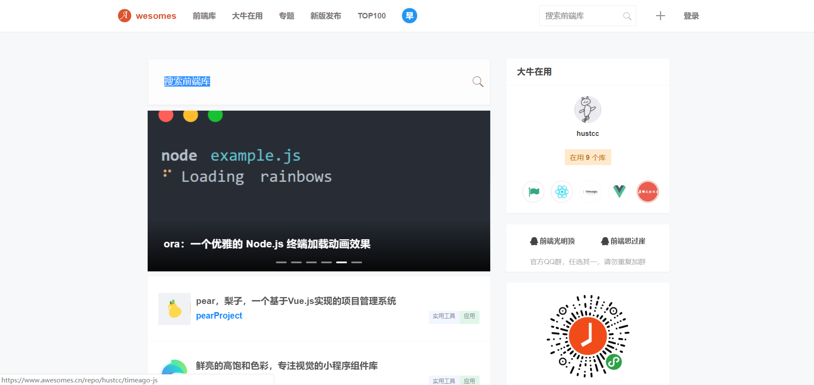

##### 算法学习

[Rappid算法学习](http://resources.jointjs.com/)

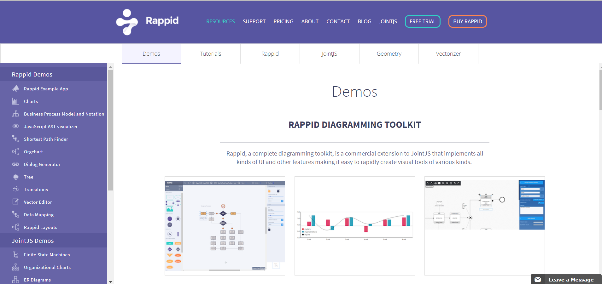

[机器深度学习](http://redstonewill.com/)

[VisuAlgo - 数据结构和算法动态可视化 (Chinese)](https://visualgo.net/zh)

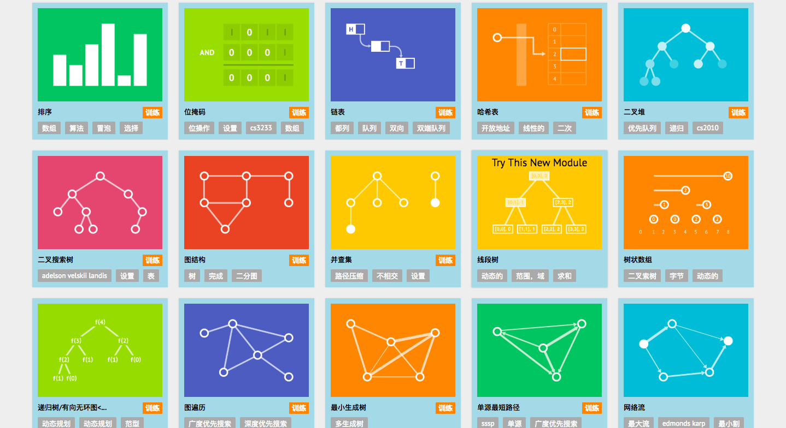

[Papers With Code : the latest in machine learning](https://paperswithcode.com/)

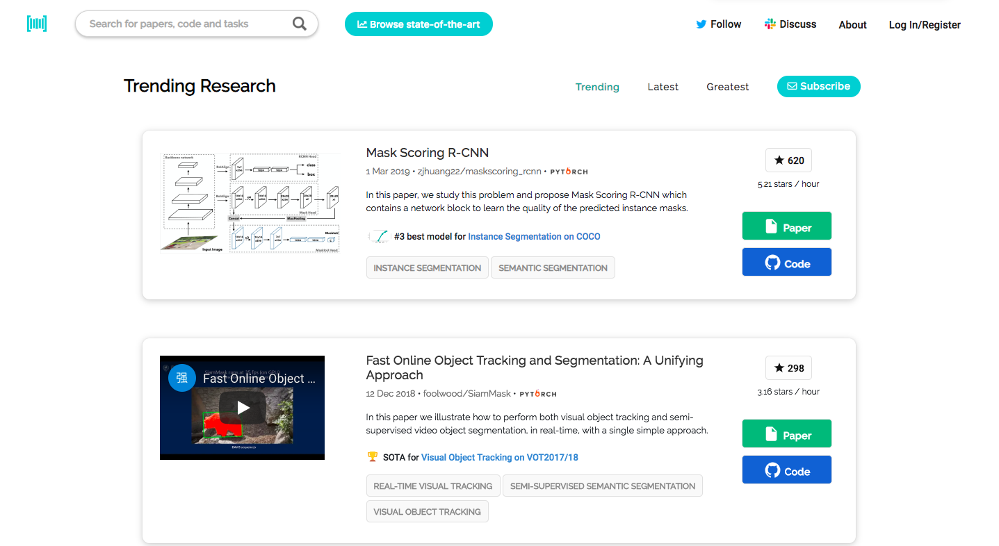

[Data Structure Visualizations]https://www.cs.usfca.edu/~galles/visualization/Algorithms.html): 旧金山大学CS Data Structure

##### 数学知识学习

> 微积分
>
> 线性代数
>
> 概率论
>
> 最优化方法

[Math ∩ Programming](https://jeremykun.com/)

[Immersive Linear Algebra](http://immersivemath.com/ila/index.html):  一本会动的线代书，O(∩_∩)O哈哈~

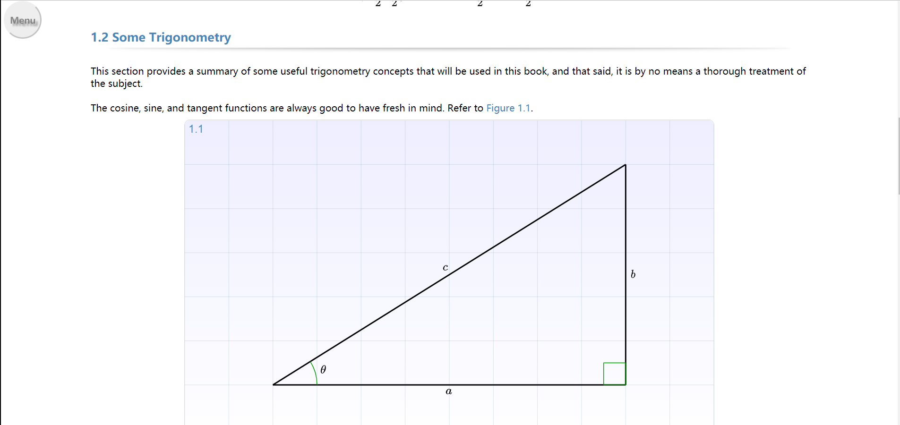

##### [Linux](https://en.wikipedia.org/wiki/Linux)

[Linux命令大全](http://man.linuxde.net/)

##### 开发社区 & 学习社区

[Vue.js 社区](https://www.vue-js.com/)

[React.js社区](http://react-china.org/)

[掘金](https://juejin.im/timeline)

[InfoQ](https://www.infoq.cn/): *InfoQ* 是一个实践驱动的社区资讯站点，致力于促进软件开发领域知识与创新的传播。

[V2EX](https://www.v2ex.com/)

[大前端](http://www.daqianduan.com/)

[开源中国](https://www.oschina.net/)

[segmentfault](https://segmentfault.com/)

[众成翻译](https://www.zcfy.cc/)

[Fly63前端](http://www.fly63.com/)

##### 博客 & 团队

[阮一峰ES6入门](http://es6.ruanyifeng.com/)

[廖雪峰官网](https://www.liaoxuefeng.com/)

[AlloyTeam - 腾讯Web前端团队](http://www.alloyteam.com/)

[凹凸实验室](https://aotu.io/)

[淘宝前端团队FED](http://taobaofed.org/)

[奇舞团](https://75team.com/)

##### 路径

[程序员不能错过的28份技术知识图谱，你的进阶路上必备](https://cloud.tencent.com/developer/article/1135231)

[学好机器学习需要哪些数学知识?](https://mp.weixin.qq.com/s?__biz=MzU4MjQ3MDkwNA==&mid=2247483713&idx=1&sn=1e7c81381d16806ac73e15691fe17aec&chksm=fdb69cd6cac115c05f1f90b0407e3f8ae9be8719e454f908074ac0d079885b5c134e2d60fd64&scene=21#wechat_redirect)

