### 提示：'软件已损坏，打不开' 或 '不是Mac Appstore下载'

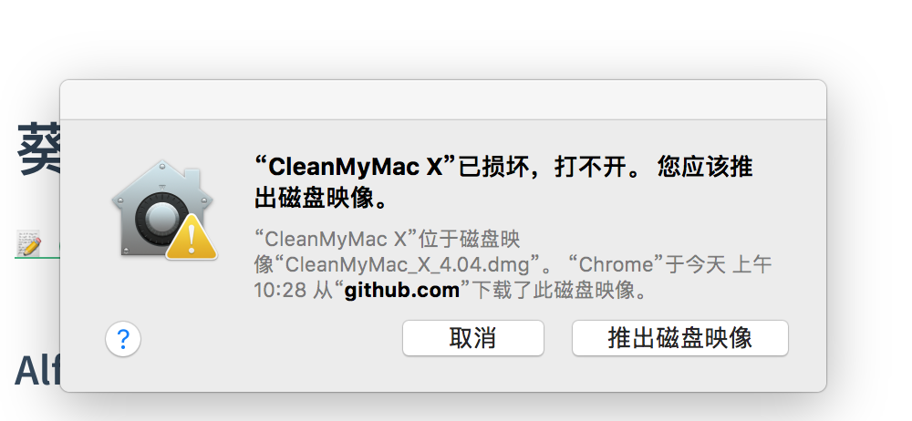

```shell
// 显示
sudo spctl --master-disable

// 隐藏
sudo spctl --master-enable
```

##### 安全性与隐私

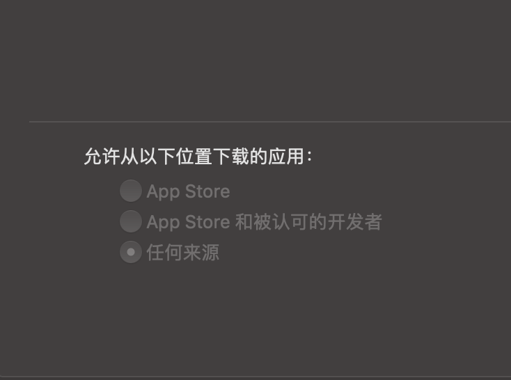

#### Xxx已损坏，无法打开。您应该将它移到废纸篓。

1. 在**系统偏好设置 - 安全与隐私 - 通用标签**中选择来自任何来源选项。
2. 命令行执行

```sh
sudo spctl --master-disable
```

3. 执行下面命令，将 `XMind\ ZEN.app` 换成 `xxx`

```sh
sudo xattr -r -d com.apple.quarantine /Applications/XMind\ ZEN.app
```

#### Homebrew

[**Homebrew**](https://brew.sh/index_zh-cn)是一款[自由](https://zh.wikipedia.org/wiki/自由软件)及[开放源代码](https://zh.wikipedia.org/wiki/开源软件)的[软件包管理系统](https://zh.wikipedia.org/wiki/软件包管理系统)。**macOS（或 Linux）缺失的软件包的管理器**

##### 官方安装方式

```sh
/bin/bash -c "$(curl -fsSL https://raw.githubusercontent.com/Homebrew/install/master/install.sh)"
```

##### 国内安装方式

```sh
/bin/zsh -c "$(curl -fsSL https://gitee.com/cunkai/HomebrewCN/raw/master/Homebrew.sh)"
```

[Homebrew国内如何自动安装（国内地址）](https://zhuanlan.zhihu.com/p/111014448)

[Gitee 地址](https://gitee.com/cunkai/HomebrewCN)

##### Error: brew services: Unknown command: services

```sh
brew update-reset
```

[issue](https://github.com/Homebrew/homebrew-services/issues/206)

#### Alfred

[下载地址](https://github.com/Rain120/Free-Source/blob/master/Mac%20Tools/Alfred_4.0.1%20b1078-EN.dmg)

`Alfred` 这是一款被称之为`Mac`效率神器的`App`，有了`Alfred` 你甚至无需鼠标就可以实现各种操作，包括出发各种文件、网络操作，其`UI`界面使用方便，而且不是通过命令来实现，是开发者们和键盘刘童鞋们的神器，比之此前类似的软件——`Pack`和`Power`来说完全是秒杀的节奏。

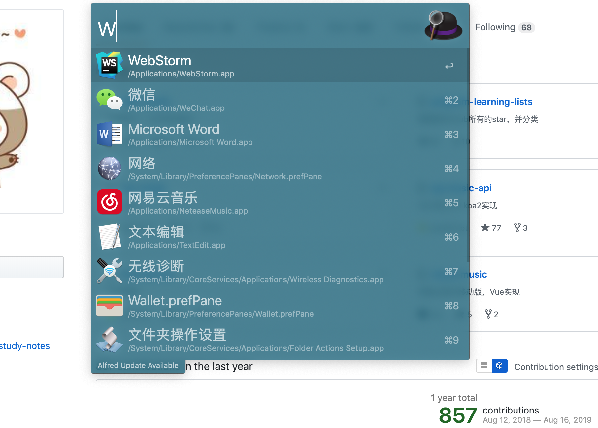

#### [KeyCastr](https://github.com/keycastr/keycastr)

[下载地址](https://github.com/Rain120/Free-Source/blob/master/Mac%20Tools/KeyCastr.app.zip)

实时显示键位操作

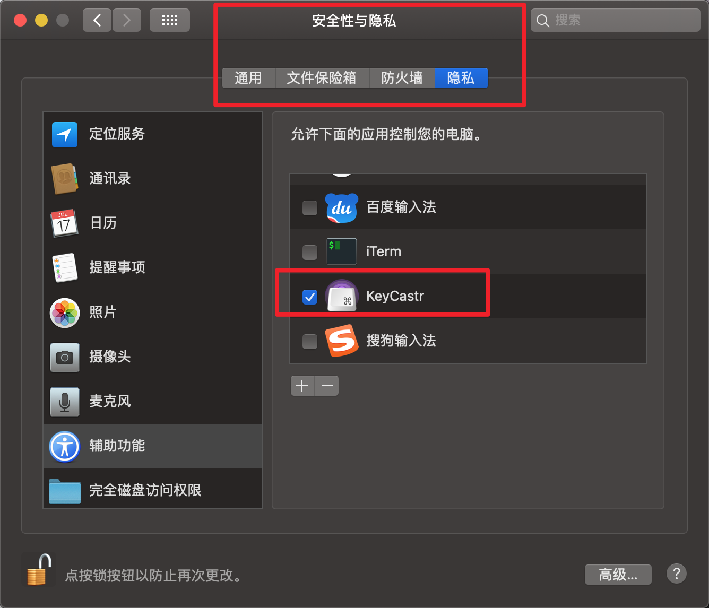

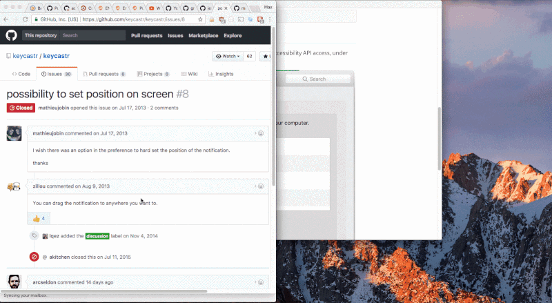

#### [Karabiner-Elements](https://karabiner-elements.pqrs.org/docs/) 

[下载地址](https://github.com/Rain120/Free-Source/blob/master/Mac%20Tools/Karabiner-Elements-12.6.0.dmg)

`Mac` 上一款非常好用的开源改键利器，能让键盘顺着你的意愿来工作。

[官方拔插式配置](https://pqrs.org/osx/karabiner/complex_modifications/)

`import` [这个](https://ke-complex-modifications.pqrs.org/?q=change%20caps_lock) 插件，选择 **Import** `Change caps_lock key (rev 4)` ，然后在你的`Karabiner`中选择`enable F19`.

```sh
vi ~/.config/karabiner/karabiner.json

# 将 caps_lock 更改为 right_command
# from.key_code: caps_lock -> right_command
```

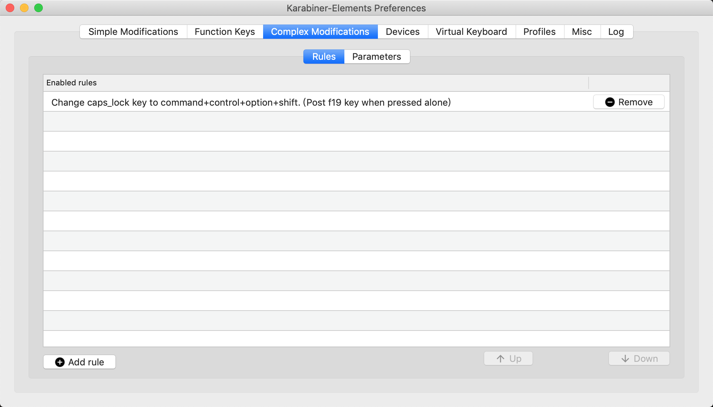

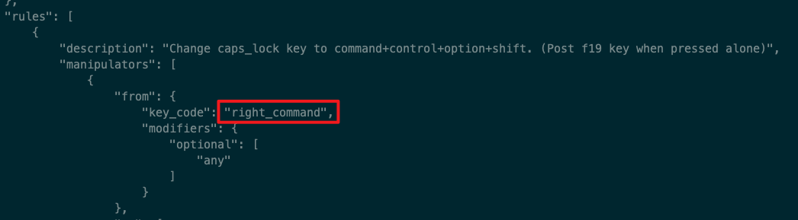

#### [Thor](https://github.com/gbammc/Thor)

[下载地址](https://github.com/Rain120/Free-Source/blob/master/Mac%20Tools/Thor_1.3.1.zip)

一键直达应用

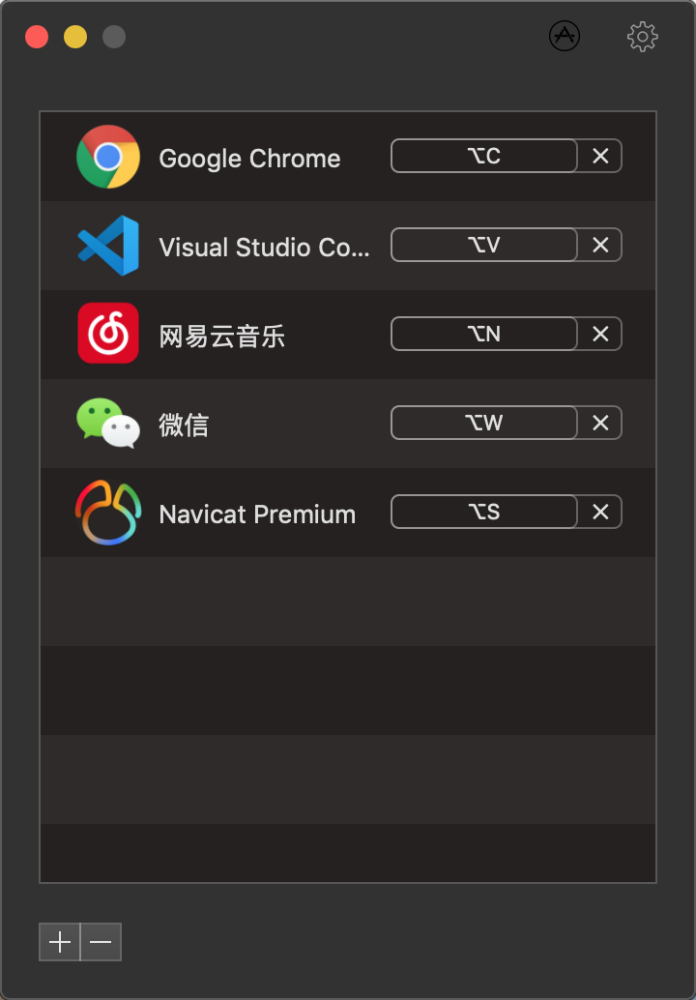

#### [SpaceLauncher](https://spacelauncherapp.com/)

按住空格键的同时按一个键以启动或切换到应用程序。

#### [FlyKey](https://www.better365.cn/FlyKey.html)

快速查看应用快捷键程序

#### [XMind](https://www.xmind.cn/)

思维导图

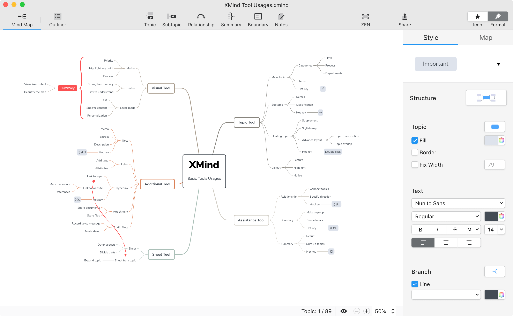

#### [Iterm2](https://www.iterm2.com/) + zsh - [oh-my-zsh](https://ohmyz.sh/)

`Mac`的`terminal`工具

[Iterm2 & oh my zsh 配置终端环境](notes/iterm2/iterm2+zsh.md)

#### [Sourcetree](https://www.sourcetreeapp.com/)

`git`版本管理工具,支持`git-flow`,`UI`简洁

`Mac`使用跳过注册

```bash
defaults write com.torusknot.SourceTreeNotMAS completedWelcomeWizardVersion 3
```


#### [Flox](https://mac.eltima.com/cn/download-manager.html)

`Folx`是一款免费的`macOS`专用的下载器，完全`Mac`风格的用户界面。提供便捷的下载管理、灵活的设置等等。`Folx`拥有强大的排序系统实现下载内容的最佳管理。

#### [Softorino YouTube Converter for Mac](https://github.com/Rain120/Free-Source/blob/master/Mac%20Tools/Softorino%20YouTube%20Converter%202_2.1.7_WaitsUn.com.dmg)

一款视频下载和转换工具，可以方便的下载`YouTube`或`Vimeo`视频，以便在线下享受它们，并使用这个易用的应用程序将剪辑直接复制到`iPhone`或`iPad`上。无论您的互联网连接不可靠，还是只想观看`YouTube`或`Vimeo`视频而不会受到刺激性广告的侵扰，您都可以从简单的方法将这些片段保存到本地存储中。

#### [Charles](https://www.charlesproxy.com/)

抓包用，支持` https`

#### [Typora](https://typora.io/)

一款支持实时预览的 `Markdown` 文本编辑器。 它有 `OS X`、`Windows`、`Linux` 三个平台的版本，并且由于仍在测试中，是完全免费的。

#### [Notion](https://www.notion.so/?r=a8b6e24bd86f4597a0b26266f6f8aee9)

`Notion` 自称是一款「**将笔记、知识库和任务管理无缝整合的协作平台**」。它具有无限的层级和相互链接的组织弹性，给笔记间的关系提供了足够自由的组织方式；它排版灵活，能够把笔记里的内容按块(`Block`)进行组织和拖拽，甚至可以做出 `Trello `看板进行项目管理；它的内容类型丰富，可以嵌入图片、网页、文档甚至视频，几乎无所不能。


#### [Snipaste](https://www.snipaste.com/)

`Snipaste` 是一个简单但强大的截图工具，也可以让你将截图贴回到屏幕上！下载并打开 Snipaste，按下 `F1` 来开始截图，再按 `F3`，截图就在桌面置顶显示了。就这么简单！

你还可以将剪贴板里的文字或者颜色信息转化为图片窗口，并且将它们进行缩放、旋转、翻转、设为半透明，甚至让鼠标能穿透它们！如果你是程序员、设计师，或者是大部分工作时间都在电脑前，贴图功能将改变你的工作方式、提升工作效率。

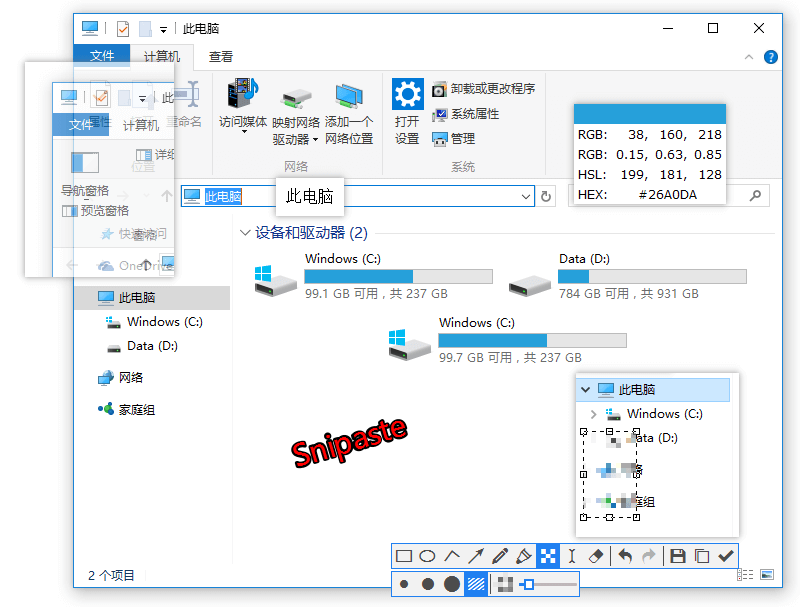

##### 网页截屏

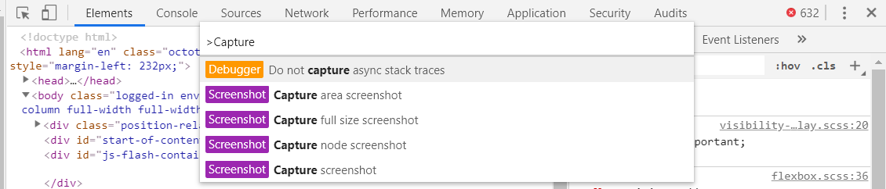

`chrome 59版本+` 

`chrome`支持截取网页长屏，网页可视区域截屏，网页区域截屏

1. 截取网页长屏

```shell
Mac:

⌘ Command + ⌥ Option + I
	(1)
 	-> ⌘ Command + ⇧ Shift + P
 	-> Capture full size screenshot
 	(2)
 	-> ⌘ Command + P
 	-> >Capture full size screenshot
 
Windows:
F12 / Shift + Ctrl + I
	(1)
	-> Ctrl + Shift + P
	-> Capture full size screenshot
	(2)
	-> Ctrl + P
	-> >Capture full size screenshot

```

2. 网页可视区域截屏

   ```shell
   Mac:
   
   ⌘ Command + ⌥ Option + I
   	(1)
    	-> ⌘ Command + ⇧ Shift + P
    	-> Capture screenshot
    	(2)
    	-> ⌘ Command + P
    	-> > Capture screenshot
    
   Windows:
   F12 / Shift + Ctrl + I
   	(1)
   	-> Ctrl + Shift + P
   	-> Capture screenshot
   	(2)
   	-> Ctrl + P
   	-> >Capture screenshot
   ```

   

3. 网页区域截屏

   ```shell
   Mac:
   
   ⌘ Command + ⌥ Option + I
   	(1)
   	-> ⌘ Command + ⇧ Shift + C 选取元素
    	-> ⌘ Command + ⇧ Shift + P
    	-> Capture node screenshot
    	(2)
    	-> ⌘ Command + ⇧ Shift + C 选取元素
    	-> ⌘ Command + P
    	-> >Capture node screenshot
    
   Windows:
   F12 / Shift + Ctrl + I
   	(1)
   	-> Ctrl + Shift + C 选取元素
   	-> Ctrl + Shift + P
   	-> Capture node screenshot
   	(2)
   	-> Ctrl + Shift + C 选取元素
   	-> Ctrl + P
   	-> >Capture node screenshot
   ```

   

#### [Cleanmymac](https://macpaw.com/cleanmymac) -> [CleanMyMacx 4.5.2 破解版](https://github.com/Rain120/Free-Source/releases/tag/0.0.24)

它可以流畅地与系统性能相结合，静默清理、记录更新、清洁缓存、快速和安全删除、卸载应用程序和清空回收站等重要功能。节省硬盘空间，提高电脑的速度，CleanMyMac X 会使您的Mac更出色

**Note:** 不知道为什么总会自动更新，请自己保存安装包，更新就删除，重新安装。

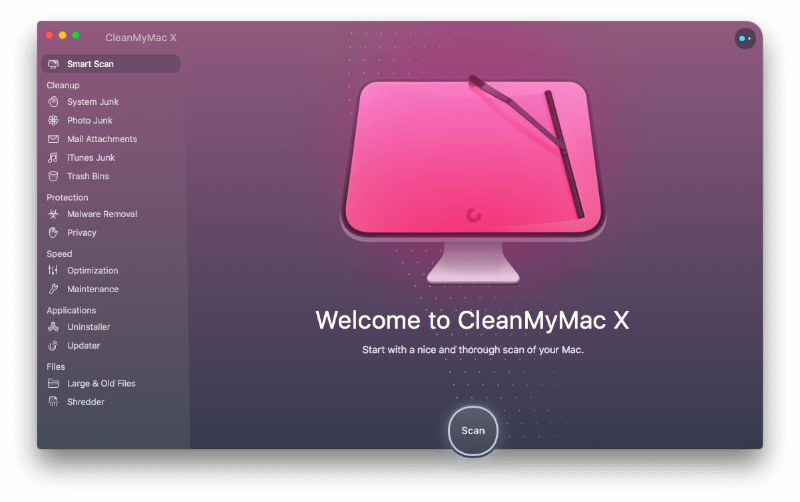

[腾讯柠檬清理](https://lemon.qq.com/): 专业的深层*清理*，保持Mac清爽干净；浏览器隐私*清理*，避免敏感信息泄露；五大深度*清理*小工具，全方位*清理*多余垃圾

#### [Mounty](https://mounty.app/)

`Mac OS`平台上的一款`NTFS`格式读写工具，软件虽小小但是功能挺实用的，其主要功能类似`Paragon NTFS for mac`。当你插入 `NTFS` 硬盘后会提示是否创新加载成读写模式。大多数情况下 `Mac OS X` 是默认没有开启 `NTFS `的写入模式。所以这样你就这一不在需要安装其他软件就可以对 `Windows` 的 `NTFS` 硬盘进行复制文件操作。

#### [NTFS 助手](https://apps.apple.com/cn/app/ntfs助手/id1448227400?mt=12)

一款读写NTFS磁盘工具, 它能够帮助用户快速稳定以读写方式访问NTFS分区，简单易用，只需一键操作。

1. 以读写模式打开NTFS磁盘
2. 安全传输文件到NTFS磁盘

#### [Licecap](https://www.cockos.com/licecap/)

屏幕录制工具，支持导出 GIF 动画图片格式，轻量级、使用简单，录制过程中可以随意改变录屏范围。运行后会以窗口的方式显示在桌面，拖动选取一个合适的大小范围，点击 Record 选取保存路径就开始录屏了。**LICEcap** 在录屏过程中可以随时拖动窗口改变录屏范围，Stop 过后自动保存为 GIF 格式。

[GIF Brewery 3](https://itunes.apple.com/cn/app/gif-brewery-3-video-to-gif/id1081413713?l=en&mt=12)

`Mac` 动图制作工具 `GIF Brewery 3`

#### [Kap](https://getkap.co/)

录屏工具。

- 录某个窗口
- 全屏录制
- 自定义录制区域

#### [Paper](https://paper.meiyuan.in/)

专为 Mac 设计的壁纸应用,每天享受来自全球新鲜精美的壁纸

#### [动态壁纸下载](https://dynamicwallpaper.club/)

专门用于`macOS Mojave`动态壁纸的平台。

#### 屏保

##### 时间屏保

[Fliqlo](https://fliqlo.com/#/screensaver)

翻页日历式的复古界面，结合了电子和机械的美感

[padbury](https://padbury.app/)

极简主义的时钟屏保，没有太多附加的修饰，但它设置选项却很丰富。

[applewatch](https://www.rasmusnielsen.dk/applewatch.php)

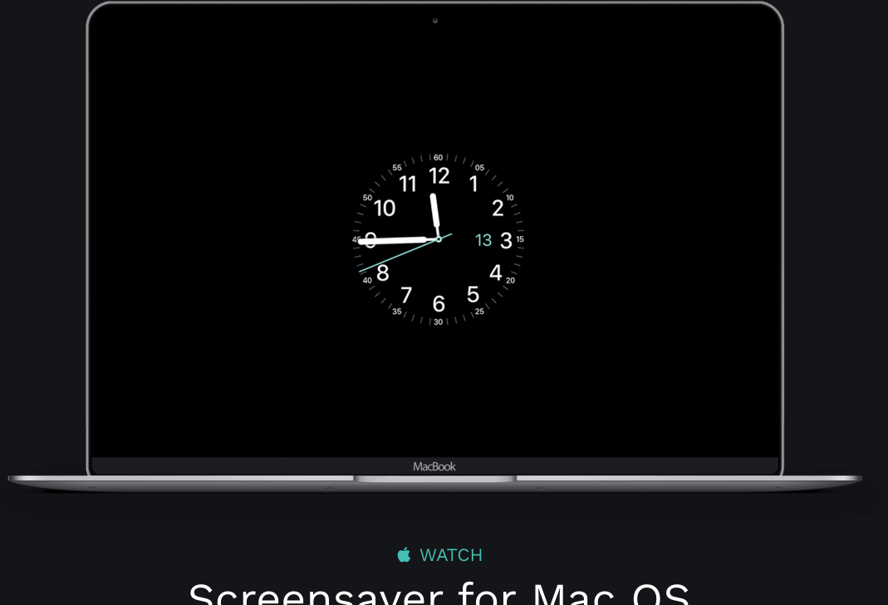

#### [DeepL](https://www.deepl.com/home)

`DeepL` 通过训练人工智能来理解和翻译文本。

#### [Eagle - 图片收集及管理必备工具](https://cn.eagle.cool/)

*Eagle* 可以轻松管理大量图片、视频、音频素材，满足素材「收藏、整理、查找」的各种场景，支持Mac 与Windows 系统。

#### [Mos](https://github.com/Caldis/Mos)

一个用于在 macOS 上平滑你的鼠标滚动效果或单独设置滚动方向的小工具, 让你的滚轮爽如触控板

#### [Copyless](https://copyless.net/)

剪贴板插件

#### [Bob](https://ripperhe.gitee.io/bob/#/)

一款 `Mac` 端 `OCR` 翻译软件，支持**划词翻译**、**截图翻译**以及手动输入翻译。

### 参考

[云谦 - 装了啥 2019 版](https://juejin.im/post/5c9446e36fb9a071082f5118)

[有什么让你相见恨晚的 MacBook 神器？](https://www.zhihu.com/question/41049134)

