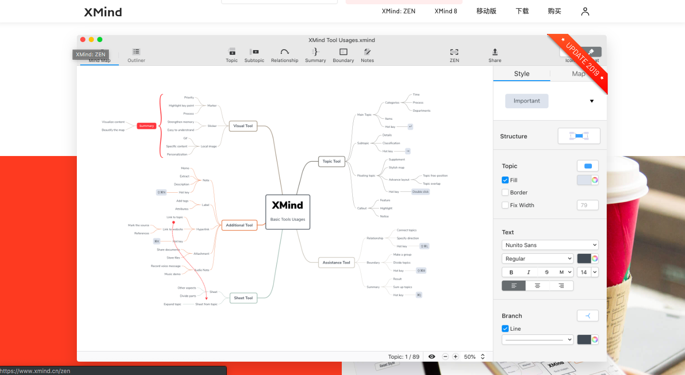
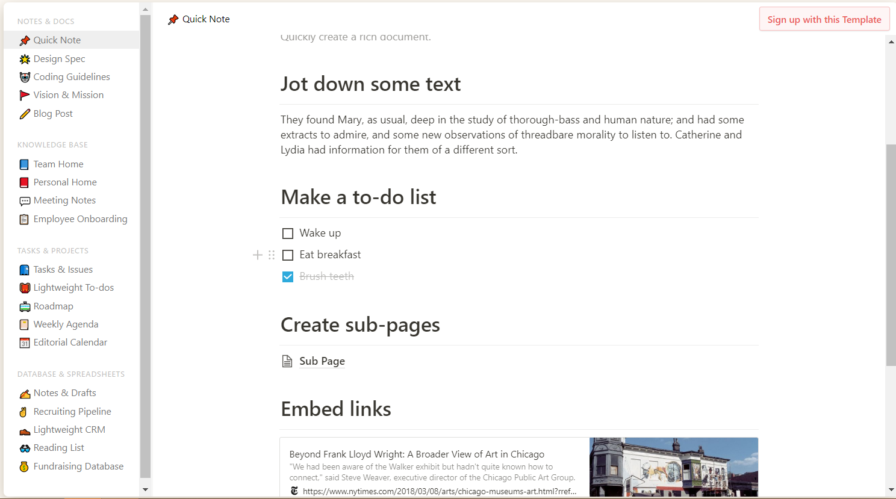

<!--
 * @Author: Rainy
 * @Github: https://github.com/Rain120
 * @Date: 2019-01-20 16:09:45
 * @LastEditTime: 2019-01-20 17:34:22
 -->

#### 文献查找

[免费知网、维普下载方式](http://210.47.0.21/~root/user?from_link=%2F)
* 账号：cclglib
* 密码：cclglib

[浙江图书馆](https://mp.weixin.qq.com/s/227_l0xNa85n1U9evAe6_A)

网站｜万方、知网、维普、超星学术论文免费下载，杂志期刊免费看

[iData](https://www.cn-ki.net/)

[爱学术](https://www.ixueshu.com/)

[SciHub 桌面版](https://www.appinn.com/sci-hub/)
有点久，不知道还行不行

[墙内Google学术](http://ac.scmor.com/)

#### 代码生成图片

[Carbon](https://carbon.now.sh/)

#### 文件分享

[FireFox Send](<https://send.firefox.com/>)

[Github](<https://github.com/mozilla/send>)

[PPT制作](<https://slides.com/>)

#### 思维导图

[XMind](<https://www.xmind.cn/>)

[Mindmeister](<https://www.mindmeister.com/zh>)

[Draw.IO](<https://www.draw.io/>)

[Notion](https://www.notion.so/?r=a8b6e24bd86f4597a0b26266f6f8aee9)

[Sketchboard](<https://sketchboard.me/>)

[幕布](<https://mubu.com/>)

