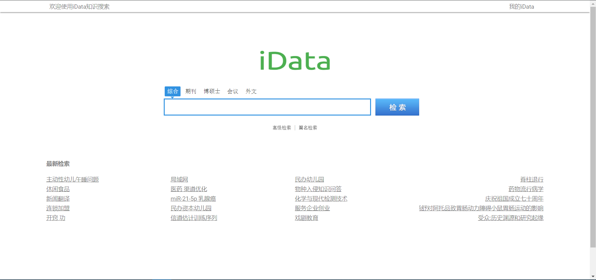
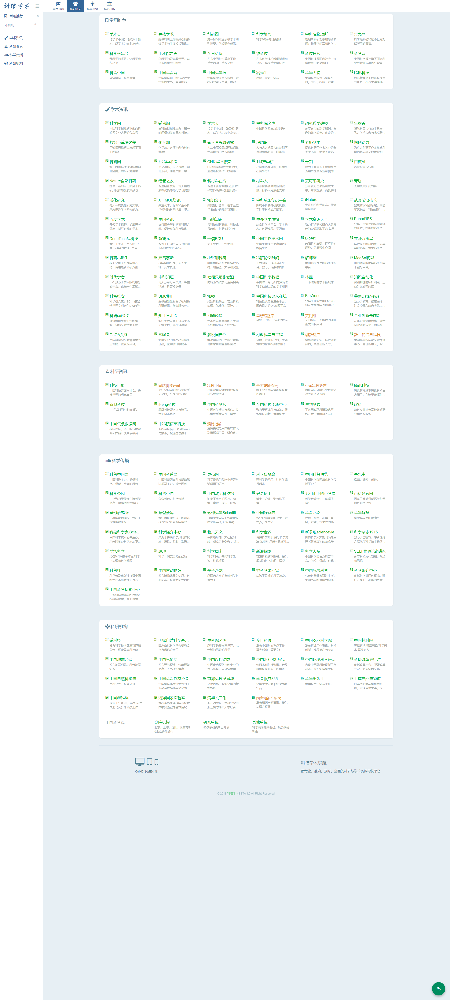
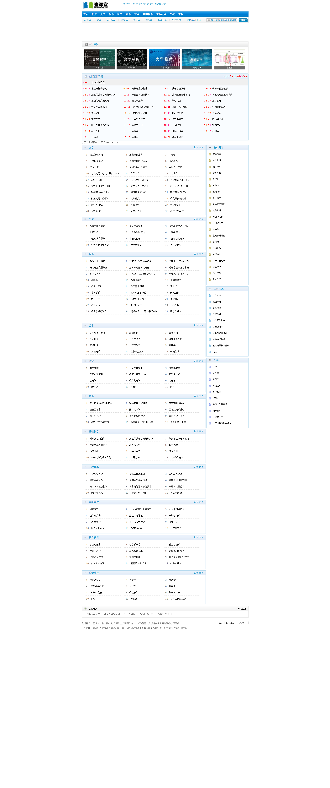
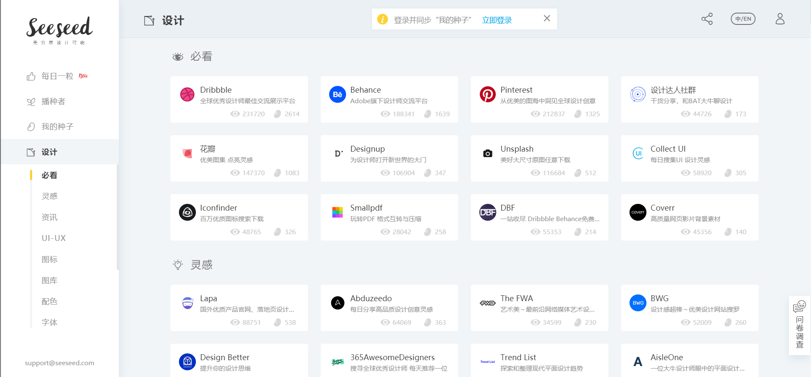
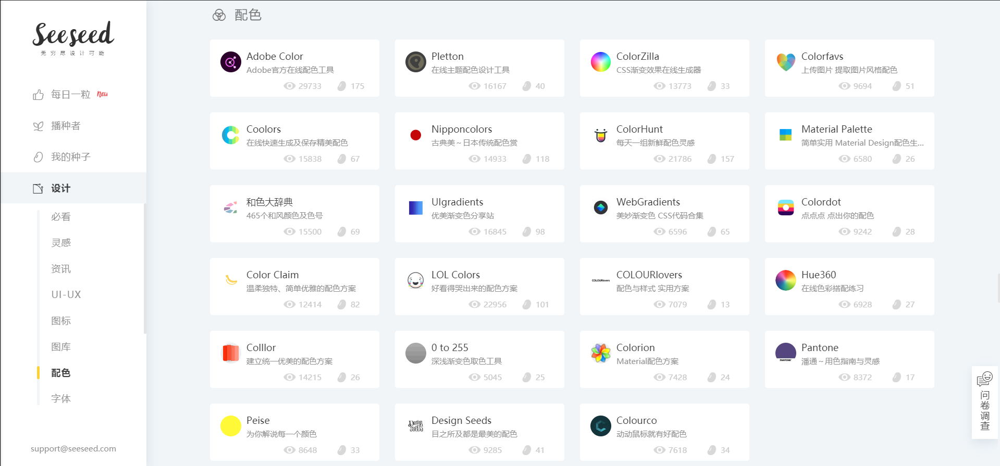
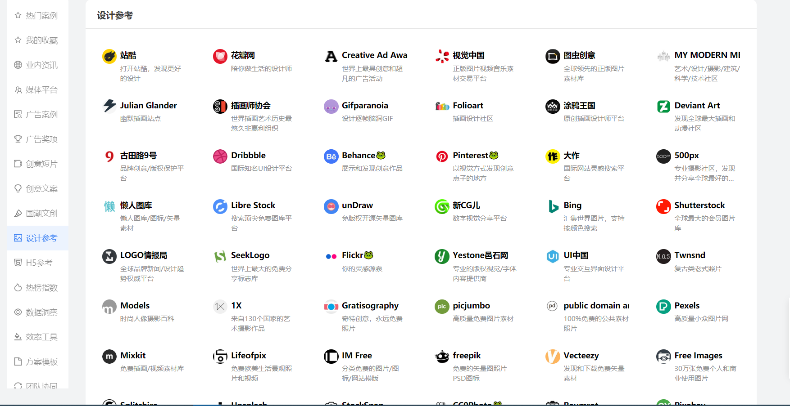
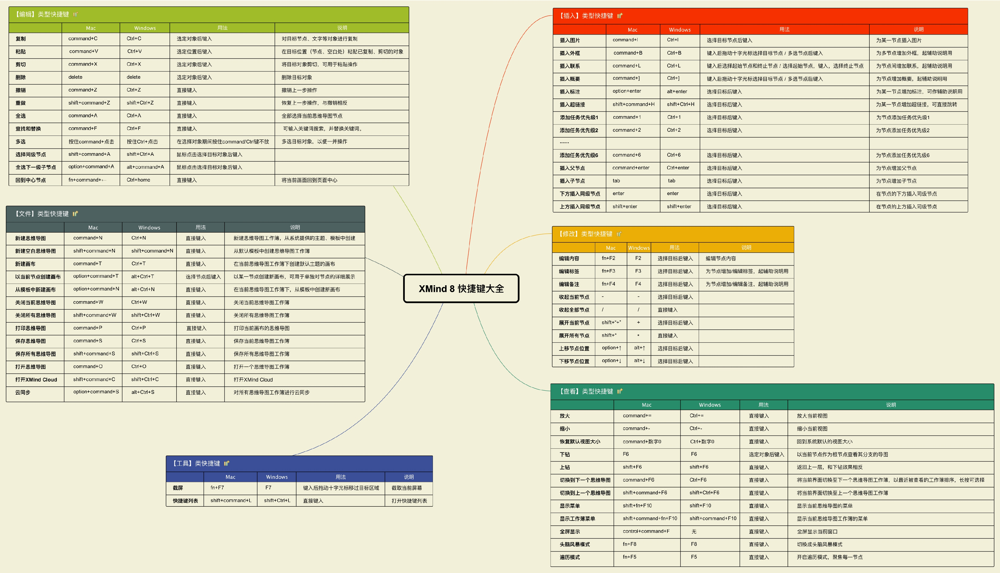

<!--

 * @Author: Rainy
 * @Github: https://github.com/Rain120
 * @Date: 2019-01-20 16:09:45
 * @LastEditTime: 2019-10-20 14:48:45
    -->

### 文章索引

- [文献查找](resources/website?id=文献查找)
- [学习网站](resources/website?id=学习网站)
  - [英语](resources/website?id=英语)
  - [综合](resources/website?id=综合)
  - [计算机](resources/website?id=计算机)
- [工具网站](resources/website?id=工具网站)
  - [开发相关](#开发相关)
  - [设计相关](#设计相关)
  - [Logo生成](resources/website?id=Logo生成)
  - [在线代码编辑器](resources/website?id=在线代码编辑器)
  - [图片相关](resources/website?id=图片相关)
  - [AI图片无损放大](resources/website?id=AI图片无损放大)
  - [图片压缩](resources/website?id=图片压缩)
  - [文件相关](resources/website?id=文件相关)
  - [office相关](resources/website?id=office相关)
  - [思维导图](resources/website?id=思维导图)
- [书籍查找](resources/website?id=书籍查找)
- [视频](resources/website?id=视频)
- [视音频](resources/website?id=视音频)
- [其他](resources/website?id=其他)

#### 文献查找

[iData](https://www.cn-ki.net/)

`iData`是由北京大学、清华大学、浙江大学、复旦大学等师生学者共同筹建的用于教学、科研目的的公益互联网项目，旨在促进知识的传播和最新学术科技的共享。`iData`平台上所有信息均为公开发表的学术文献，由学者自由上传，并提供有限的免费浏览、下载服务。

[问答库](https://www.asklib.com/)

问答库一直致力于让所有的互联网用户更便捷的寻找到常见问题的答案，让大家更好的学习和提高自己。问答库收录了数百万的公务员考试，建筑工程，`IT`认证，资格考试，会计考试，医药考试，外语考试，外贸考试，学历考试以及一些常见的普通练习的题目供大家查询。

[OALib/免费论文搜索引擎](http://www.oalib.com/)

学术论文存储超过420万篇，涵盖所有领域而且全部**免费下载！**比`iData`还好用！而且还跟国内外诸多大学合作！可以直接搜索你想要的宝藏文章！

[科塔学术](https://site.sciping.com/)

学术搜索、文献数据、共享资源、学术标准、人才计划、专利标准！

[Library Genesis](http://gen.lib.rus.ec/)

它不仅可以免费下载文献，还能免费下载很多外文书籍，且 Library Genesis 几乎每天都在更新。可以随意下载 80 多万本图书的网站，其中 99% 是难以买到的科学著作！

[墙内Google学术](http://ac.scmor.com/)

[爱学术](https://www.ixueshu.com/) **会员制**

爱学术旨在构建一个专业的学术文献交流分享平台。我们将精心挑选有影响力,有特色的机构和学者,为广大用户提高有价值的可利用的学术文献.同时,我们也会帮助认证机构展示擅长领域给广大用户,提升机构的影响力,活跃用户.我们也会竭力提供一个良好学术生态圈,让用户分享和交流自己的学术成果,发现更有价值的学术科研信息,获得分享和交流的乐趣和满足感.

~~[免费知网、维普下载方式](http://210.47.0.21/~root/user?from_link=%2F)~~

* ~~账号：cclglib~~
* ~~密码：cclglib~~

[浙江图书馆](https://mp.weixin.qq.com/s/227_l0xNa85n1U9evAe6_A)

网站｜万方、知网、维普、超星学术论文免费下载，杂志期刊免费看

~~[SciHub 桌面版](https://www.appinn.com/sci-hub/)~~
有点久，不知道还行不行

[http://sci-hub.tw/](http://sci-hub.tw/)

[http://sci-hub.se/](http://sci-hub.se/)

[http://sci-hub.si/](http://sci-hub.si/)

[hejizhan](http://www.hejizhan.com/bbs/)

万千合集站是一个质量很高的论文，文档搜索网站。

它支持的学科非常丰富，包括：数学、物理学、化学、天文学、地球科学、生物科学、心理学、计算机科学与技术、医药卫生、管理学、语言和文字、艺术学、经济学、法律与社会、科普与百科，并且大部分文档都是支持直接免费下载的。

#### 学习网站
[文章索引](resources/website?id=文章索引)

##### 英语

[微软小英写作网站](https://app.mtutor.engkoo.com/englishwriting/)

- **考试分类**

  覆盖8种考试类型，可根据自身需求选择不同评分标准

- **语法检查**

  AI技术自动检查拼写和语法错误，提供修改建议

- **图片识别**

  无须输入文字，可一键上传照片，自动识别作文内容

- **写作助手**

  单词不会拼，逻辑连接词用哪个，写作助手全搞定

[听力练习](https://www.voscreen.com/)

`Voscreen`通过简短的视频剪辑帮助您提高英语水平。 在`Voscreen`视频学习环境中，学习和提高英语比以往更加有趣。

##### 综合
[文章索引](resources/website?id=文章索引)

[中国大学MOOC](https://www.icourse163.org/)

中国大学`MOOC`是由网易与高教社携手推出的在线教育平台，承接教育部国家精品开放课程任务，向大众提供中国知名高校的`MOOC`课程。在这里，每一个有意愿提升自己的人都可以免费获得更优质的高等教育。

`MOOC`是`Massive Open Online Course`（大规模在线开放课程）的缩写，是一种任何人都能免费注册使用的在线教育模式。`MOOC`有一套类似于线下课程的作业评估体系和考核方式。每门课程定期开课，整个学习过程包括多个环节:观看视频、参与讨论、提交作业，穿插课程的提问和终极考试。

[壹课堂](http://www.1ketang.com/index.html)

一个非常强大的在线视频教程网站，所有的视频都是免费观看！你想要的学科这里都有，还可以直接搜索高校，找到你想要的学校的课程！

[frontendmasters](https://frontendmasters.com/)

通过深入的现代 `JavaScript` 和前端工程课程提高您的技能。

##### 计算机

[文章索引](resources/website?id=文章索引)

[openprocessing](https://www.openprocessing.org/)

在线学习编程网站

[慕课网](https://www.imooc.com/)

慕课网（`IMOOC`）是`IT`技能学习平台。慕课网(`IMOOC`)提供了丰富的移动端开发、`php`开发、`web`前端、`android`开发以及`html5`等视频教程资源公开课。

[oeasy](http://oeasy.org/)

提供的视频教程非常丰富并且质量很高，包括：`PS` 教程、手机摄影教程、`Ai `做图教程、`Excel `教程、`Word `教程、PPT 教程、`Pr` 视频剪辑教程、`Ae` 视频特效教程`、Au` 音频教程、`Flash` 教程、做网页教程、`css `样式教程、`js` 教程、`Cad` 制图教程、电路制作教程、`Windows `教程、色彩搭配教程、`Prezi `演示教程、`Keynote` 教程、做图标教程。

[2uts](https://2uts.com/)

一个完全免费的视频教程网站，它提供了丰富并且免费的高质量国外视频教程。

它提供的视频教程都是一些专业技能视频教程，包括：3D 和动画、Web 开发、程序设计、移动开发、设计与插图、游戏开发、视觉与视觉特效、音频制作。

#### 工具网站

[文章索引](resources/website?id=文章索引)

##### 开发相关

取色网站

[flatuicolors](https://flatuicolors.com/)

[zhongguose](http://zhongguose.com/)

[Colourcode](https://colourco.de/)

可以自由配色，也能在色彩调和规则的限制下配色。Colourcode 的特色在于它的操控体验。

[Color Hunt](https://colorhunt.co/)

色板由用户自己创建，点赞高的色板自然会排在网页前面。这上面展示的配色方案还是挺好看的，毕竟它的用户很多都是专业设计师。

[这些实用的色彩工具，非设计师也能快速上手](https://sspai.com/post/43885)

**Digital Color Meter(macOS自带)** ： `Mac`直接数码取色器即可

##### 设计相关

[配色分享](https://juejin.im/post/5e7cdee26fb9a03c6e640cc7)

[lookae](http://www.lookae.com/)

大众脸为您提供的后期技术交流平台

[seeseed](https://www.seeseed.com/)

你想知道设计**灵感**、**配色**、**字体**、**图标**等众多信息，它全都有。

[addog](http://www.addog.vip/)

广告创意/设计/文案/PPT模板/营销策略大全网址导航

addog.vip涵盖380个必备网站，共分为18类营销策划大全。包含了常用的微博、微信、小红书、知乎、B站、淘宝、天猫、爱奇艺、好奇心日报等社交 APP 和平台。

25个营销垂直门户，有广告门、数英网、梅花网、adweek、topys、campaignbrief 等海内外营销广告资讯平台。

16个广告案例库，包含海内外主流案例库，涵盖了上千万个经典创意广告，adsoftheworld、adforum、welovead、广告门案例库、strategy都一一在列，找参考案例是非常方便。

[shapefactory](https://shapefactory.co/)

一个多功能设计网站，它提供了 `Logo `制作、配色推荐、渐变色推荐、双色调图片制作

[imgcook](https://imgcook.taobao.org/)

由设计稿一键智能生成代码

[videezy](https://www.videezy.com/)

免费下载 `4k`视频

##### Logo生成

[wuruihong](https://icon.wuruihong.com/): 启动图生成工具

[designmantic](https://www.designmantic.com/)

[brandmark](https://brandmark.io/): 生成的`logo`图标符号形状较多，造型简单，整体质量较好

[logosc](https://www.logosc.cn/) 在线付费`logo`制作设计网站，为企业定制`logo`

[凡科快图](https://kt.fkw.com/)

[canva](https://www.canva.cn/)

[创客贴](https://www.chuangkit.com/): 包含有海量海报、名片、PPT、简历、宣传单、易拉宝、邀请函、信息图表等设计模板

[懒设计](https://www.fotor.com.cn/): `Fotor`懒设计提供了适用于各种尺寸和应用场景的设计模板，包括国内外的主流社交媒体配图、电商平台配图，以及各种广告`banner`、朋友圈邀请函、海报设计等，用户也可根据设计需求，选择所需尺寸，然后从`Fotor`的海量模板素材中挑选合适的进行设计。

[图怪兽](https://818ps.com/): 一个在线ps图片编辑器,它相当于`ps`精简版,可提供微信公众号图文在线编辑、在线ps照片处理、在线拼图、在线设计、平面设计、海报制作、在线图片处理等功能

[sketchvalley](https://sketchvalley.com/): 手绘免费矢量图资源

[更多](https://zhuanlan.zhihu.com/p/46980463) `or` [这个](https://www.v1tx.com/post/best-online-graphic-design-tool/#artboard-studio)

##### 在线代码编辑器

[文章索引](resources/website?id=文章索引)

[Codesandbox](https://codesandbox.io/)

在线代码编辑器,支持`React` ,`Vue`, `Angular`, `Web`，和你平常耍的`VSCode`快捷键完全一致，还可以在线安装依赖，一键同步到你的`GitHub`，除了有点卡，其他的好耍到爆炸

[stackblitz](https://stackblitz.com/)

[JS Run](http://jsrun.net/)

`JSRUN`在线编辑器

[Codepen](https://codepen.io/)

[JSBin](http://jsbin.com/?html,css,js,output)

[mdnice](https://mdnice.com/): `Markdown` 在线排版网站, 支持微信， 知乎，掘金

##### 图片相关

[文章索引](resources/website?id=文章索引)

[unDraw](https://undraw.co/): 可免费使用的优质插图插画图片素材，并且可以自己定制主题颜色

[Unsplash](https://unsplash.com/)

[remove - 移除背景](https://www.remove.bg/)

[在线替换图片背景](https://www.gaoding.com/koutu)

[Pexels](https://www.pexels.com/)

这个网站提供免费的高质量图片！并且这些图片都是没有版权的。

[pngimg](http://pngimg.com/)

世界最大 `png` 透明背景图库推荐，两万张免费插图下载

[imagecyborg](https://imagecyborg.com/)

它的主要功能是帮助你下载网页上面的所有图像，它的使用方法同样非常简单，也是复制你要下载图片的对应网页链接到网站的输入框，点击下载图片按钮，就可以轻松下载对应网页的所有图片了。

它还支持下载在线视频，将网页转换为 PDF，将在线视频转换为 MP3 等功能。

[AI人工智能图片放大](https://bigjpg.com/)

使用最新人工智能深度学习技术——深度卷积神经网络(`Deep Convolutional Neural Networks, based on [waifu2x](https://github.com/nagadomi/waifu2x)`)。它会将噪点和锯齿的部分进行补充，实现图片的无损放大

[Carbon](https://carbon.now.sh/)

[codeimg](https://codeimg.io/): 源代码生成图片工具

##### AI图片无损放大

使用最新人工智能深度学习技术——深度卷积神经网络。它会将噪点和锯齿的部分进行补充，实现图片的无损放大。

[letsenhance](https://letsenhance.io/)

注册可免费5张

[bigjpg](https://bigjpg.com/zh)

一款`AI`人工智能图片放大工具，它使用深度学习将图片中的噪点和锯齿进行补充，从而实现图片的修复和无损放大

[waifu2x](http://waifu2x.udp.jp/)

一个开源的图片放大工具，它使用卷积神经网络对动漫风格的图片和照片进行放大操作，支持网络图像和本地上传，最大可以支持到2倍放大，如果你对人工智能图片放大感兴趣，[Github](https://github.com/nagadomi/waifu2x)

[Smart upscaler](https://icons8.com/upscaler)

是由icons8推出的一款免费AI图片放大工具，它使用人工智能来放大和增强照片画质，让图片更加清晰。Smart upscaler 使用非常简单，无需注册，只要上传图片就能自动放大，并且会在网页上显示实时效果图，支持图形和照片类型图像，支持放到2倍到4倍，如果你希望照片放大的同时变得更加清晰，`Smart upscaler` 是一个非常好的选择

[pixfix](https://pixfix.com/)

 一款图片修复工具，它使用算法清理图片中的噪点和因压缩造成的图片损坏，上传图片后，你可以调节修复强度，并且实时预览图片的效果，直到满意后再下载图片

[UPSCALE PICS](https://upscalepics.com/)

一款照片放大工具，它使用AI算法来增强照片，可以在不降低画质的情况下放大图片，并图片增加更多细节，最大可以支持到8倍放大，`UPSCALE PICS` 目前还在测试中，需要注册后才能使用

##### 图片压缩

[压缩图](https://www.yasuotu.com/): 在线处理图片的网站

[Recompressor](https://recompressor.com/): 一款免费图片最佳压缩工具，将图片拖曳到网页中就能处理，支持`.svg`、`.jpg` 和`.png `三种格式，和其他同类服务不同的是` Recompressor `会自动进行多种压缩，产生不同文档大小、压缩比和画质对比图，提供给使用者最佳的压缩结果建议。`Recompressor`使用上完全免费、无广告，压缩会在使用者浏览器的` JavaScript `中进行，图片不会上传到远端服务器，相当安全。压缩后会显示各种图片画质对应的文档大小、`RMSE` 和最大误差等数据，绘制成图表后更易于检视。

[Tinyjpg](https://tinyjpg.com/): 一次性可批量压缩最多20张不超过`5M`的`JPG`或者`PNG`图片，在线就可以使用。

[jpeg.io](https://www.jpeg.io/): 优点是支持压缩的格式特别多，连`PSD` 都可以压缩，不过压缩后的格式会统一为`JPG`。免费可打包下载。

[Optimizilla](https://imagecompressor.com/zh/)

优点：

- 在保证图像最佳画质前提下压缩率达40%-70%
- 支持多文件同时压缩，JPG/PNG均可同时存在
- 可以自定义画质来压缩图像
- 可即时对比预览效果图

[智图](https://zhitu.isux.us/): 智图是腾讯`ISUX`前端团队开发的一个专门用于图片压缩和图片格式转换的平台，其功能包括针对`png`,`jpeg`,`gif`等各类格式图片的压缩，以及为上传图片自动选择最优的图片格式。同时，智图平台还会为用户转换一份`webp`格式的图片。

[图好快](https://www.tuhaokuai.com/): 可以压缩静态图，还可以压缩`Gif`，还有一系列贴心的小功能：批量下载、加水印、格式转换，一键处理淘宝店图等等。

##### 字符(注释+绘图)

[注释 - 字符串写法](http://asciiflow.com/)

[照片生成代码](https://www.text-image.com/convert/)

[文字转换成字符](http://patorjk.com/software/taag/)

[有趣的ASCII注释](http://www.asciiworld.com/)

[字符文字生成器](http://patorjk.com/software/taag/#p=display&h=0&v=1&f=3D%20Diagonal&t=Rainy)

##### 文件相关
[文章索引](resources/website?id=文章索引)

文件快速分享

[FireFox Send](<https://send.firefox.com/>) [Github](<https://github.com/mozilla/send>)

[wenshushu](https://www.wenshushu.cn/): 极速传文件给他人 [Github](https://github.com/Aruelius/wenshushu)

[Airportal](https://airportal.cn/): 极速分享

文件格式转换

[文章索引](resources/website?id=文章索引)

[SmallPDF](https://smallpdf.com/)

[ILovePDF](https://www.ilovepdf.com/zh-tw)

[CleverPDF](https://www.cleverpdf.com/cn)

[ExtractPDF.com](https://www.extractpdf.com/zh.html): `14M`

[迅捷PDF转换器](https://app.xunjiepdf.com/): 非会员`2M`文件

[pdf24](https://tools.pdf24.org/zh/): 免费且易于使用的在线 `PDF` 工具

[convertio.co](https://convertio.co/zh/): 支持多类的文件转换、小于100M的文件

[ffmpeg](http://ffmpeg.org/): 完整的跨平台解决方案，用于记录，转换和流传输音频和视频。

##### Office相关

[OfficePLUS](http://www.officeplus.cn/Template/Home.shtml)

旨在为全球`Office`用户提供丰富的高品质原创`PPT`模板、实用文档、数据图表及个性化定制服务，帮助用户随时随地提升效率，成就更多。
也许您还为如何美化`PPT`而发愁，为排版和构架而烦恼，`OfficePLUS`将让您的困惑一扫而光。这里有行业内最优的原创模板，不仅设计精美，更针对用户不同的使用场景提供了清晰的逻辑架构以及非常灵活的排版和图表。大到背景图，小到每一个图标，都可以实现轻松自如的个性化设计，从此让`PPT`的制作变得轻松愉悦。

[声享PPT制作](https://ppt.baomitu.com/)

[PPT制作](<https://slides.com/>)

[方方格子](http://www.ffcell.com/index.aspx)

方方格子是一个专注于 `Excel `的综合学习网站，它不仅提供实用的 Excel` 插件和工具箱，还提供各种 ``Excel `学习教程。

[文章索引](resources/website?id=文章索引)

#### 思维导图

[文章索引](resources/website?id=文章索引)

[XMind](<https://www.xmind.cn/>)

快捷键

[Mindmeister](<https://www.mindmeister.com/zh>)

[visual-paradigm](https://online.visual-paradigm.com/): 直观的 **信息图表软件**

[Draw.IO](<https://www.draw.io/>)

[极品脑图](https://jpdaotu.com/)

[Notion](https://www.notion.so/?r=a8b6e24bd86f4597a0b26266f6f8aee9)

[Sketchboard](https://sketchboard.me/)

[幕布](https://mubu.com/)

[ASCII: 字符创建流程图](http://asciiflow.com/)

[gitmind](https://gitmind.cn/): 免费在线思维导图软件，简化逻辑梳理，集思广益，释放创造力在线脑图、思维导图、流程图、工业设计、工程管理，一图涵千面

[Excalidraw](https://excalidraw.com/): 手绘流程图

#### 书籍查找

[BookSC](https://booksc.org/)

世界上最大的在线图书馆之一。

网站截至今日，已有 257 万多书籍可免费下载，大多数是 `pdf`、`djvu`、`eupb` 格式。下载也很方便，直接搜书名即可，也可下载论文或者文章，还可选择地区并设置成中国。

[书栈纲](https://www.bookstack.cn/): 既是一个开源书籍和文档分享站点，也是一套使用 `Go` 语言开发的开源程序，助您更好地实现文档阅读管理。

#### 视频

[Mixkit](https://mixkit.co/): 免费可商用的视频网站

[bilibili 在线视频下载](https://xbeibeix.com/api/bilibili/)

[在线文件转换](https://cloudconvert.com/):  `CloudConvert` 是一个在线文件转换器。 几乎支持所有音频，视频，文档，电子书，档案，图像，电子表格和演示文稿格式。

[MV Cat](http://www.mvcat.com/)

[全网VIP 视频解析](http://qmaile.com/)

[茶杯狐](https://www.cupfox.com/)

#### 视音频

[文章索引](resources/website?id=文章索引)

[mixkit](https://mixkit.co/) 免版权音频文件下载

[耳聆网](https://www.ear0.com/): 中国最专业的声音分享平台，汇聚国内众多专业录音师和业余声音爱好者，拥有庞大的声音资源云库和完善的授权使用机制，一直以来为音乐创作、影视后期、场景设计和游戏制作等领域提供广泛的资源及技术支持。

[视频模板](https://panzoid.com/) 众多免费视音频模板下载

#### 其他

[文章索引](resources/website?id=文章索引)

[Fliqlo](https://fliqlo.com/index.html)

极简的翻转时钟屏保，将你的电脑或手机变成极简的翻转数字时钟。

[toolnb](https://www.toolnb.com/)

[精准云工具](https://jingzhunyun.com/)

[miku.tools](https://miku.tools/)

[Atoolbox](http://www.atoolbox.net/)

[Bige](https://bigezhang.com/)

[汉典](https://www.zdic.net/)

[测试网站网络速度](http://www.17ce.com/site)

[MSDN](https://msdn.itellyou.cn/)

收集大量的应用程序、操作系统、工具等资源下载

[similarsitesearch](https://www.similarsitesearch.com/)

帮助你搜索同类型网站

[emojipedia](https://emojipedia.org/) + [getemoji](https://getemoji.com/)

搜索、选择各类的`emoji`表情，你懂得~~

[Emoji 中文网](https://www.emojiall.com/zh-hans)

[egouz](https://www.egouz.com/)

国外网站推荐

[分享大师](http://www.fenxiangdashi.com/)

[LaTex 在线编辑](https://latexlive.com/): 数学公式书写

[Open Source Builders](https://opensource.builders/): 查找您喜欢的应用程序的开源替代方案

[React Vue 框架实例 Demo](http://md-md-e867c335436d-fc.madewith.cn/)

[zoomeye.org](https://www.zoomeye.org): 一款针对网络空间的搜索引擎，收录了互联网空间中的设备、网站及其使用的服务或组件等信息。

[羽兔](https://www.yutu.cn/)

羽兔网（ yutu.cn）是深圳字节信息网络有限公司旗下设计类在线学习平台，目前有软件入门、电商设计、UI设计、室内设计等四大学院，包含600多套在线学习课程，为每一位热爱设计、想学到实用技能的学习者，提供贴心的一站式学习服务。

立足于实用性的需求，羽兔网精选各类课程，并与多位行业大咖、多家权威教育培训机构建立合作，为用户打造了从理论到职场、全方位的自学内容，并且拥有数量可观、制作精良的独家课程，致力于成为国内全面、丰富、优质、受用户喜爱的设计在线学习平台。

[starCounter](https://gs.statcounter.com/): 数据统计

[repl.it](https://repl.it/)

