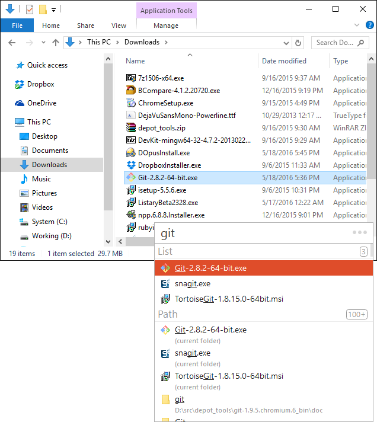
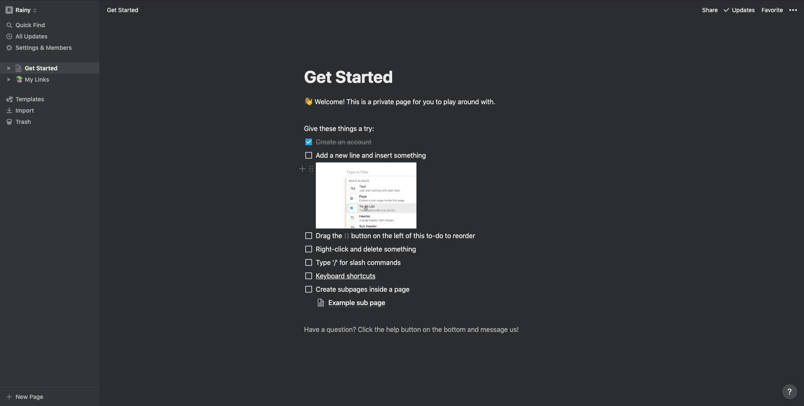
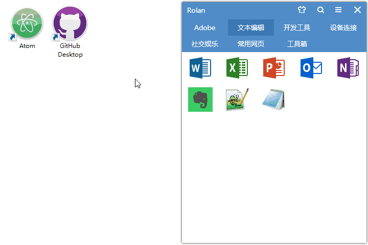
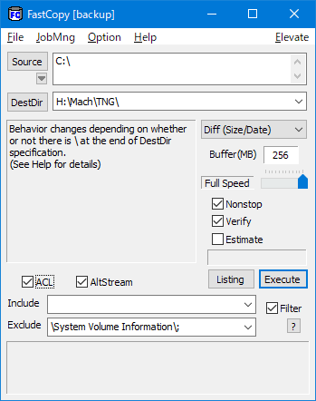
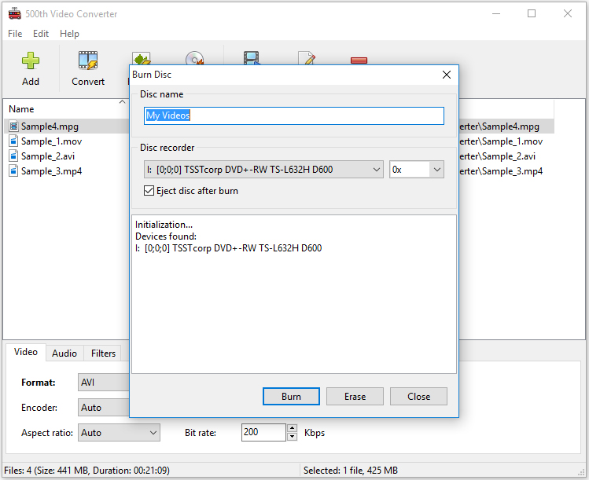
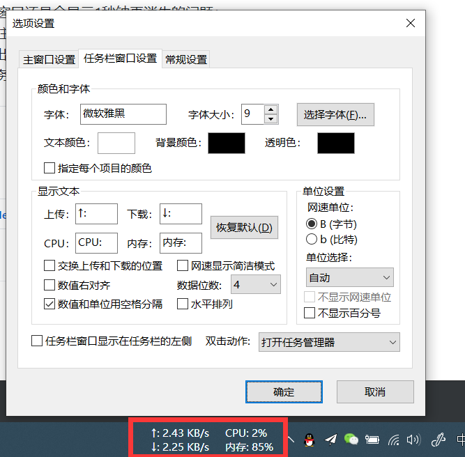
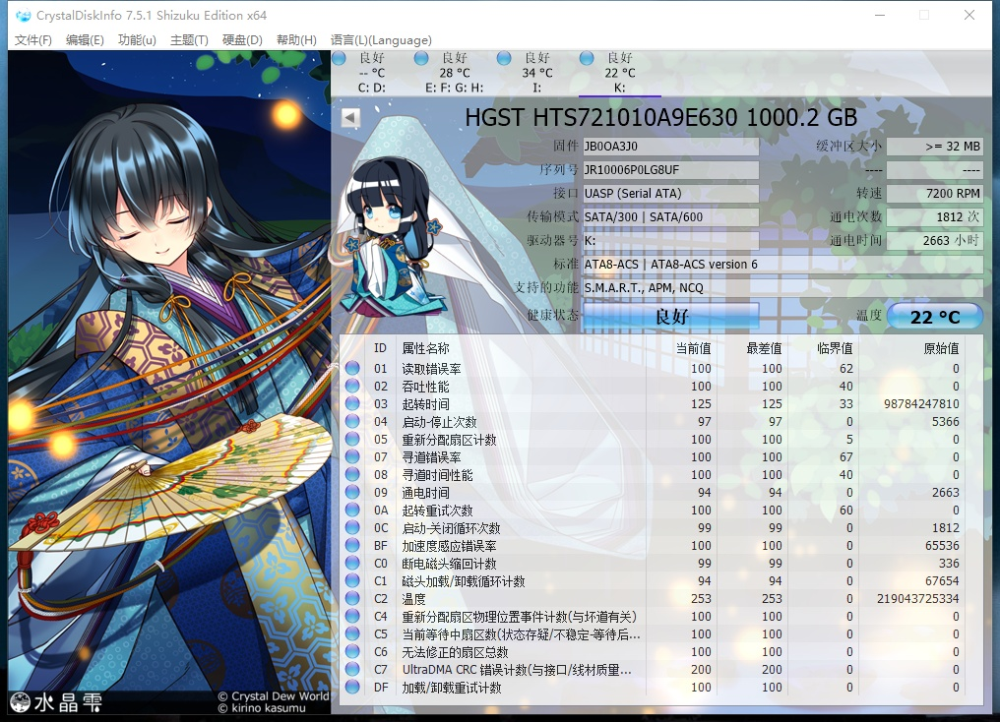
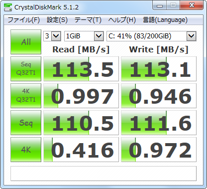
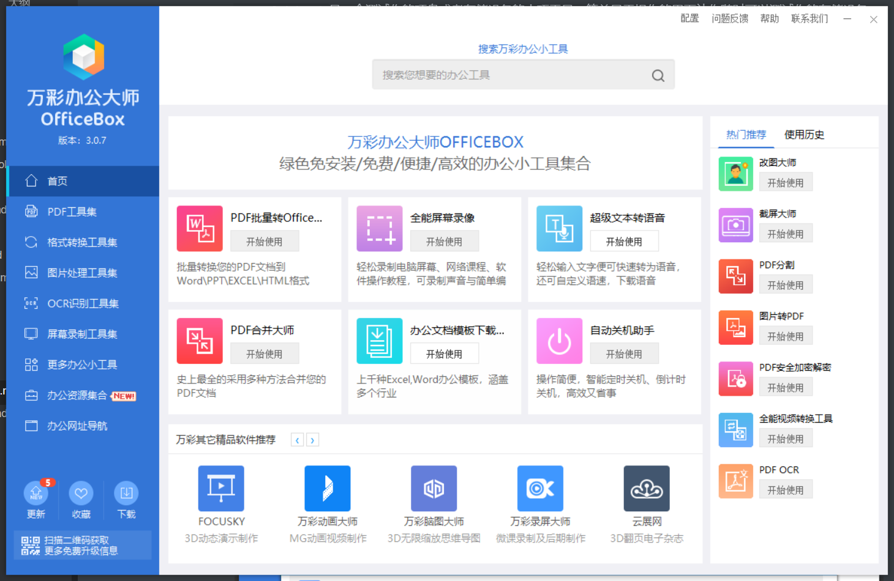
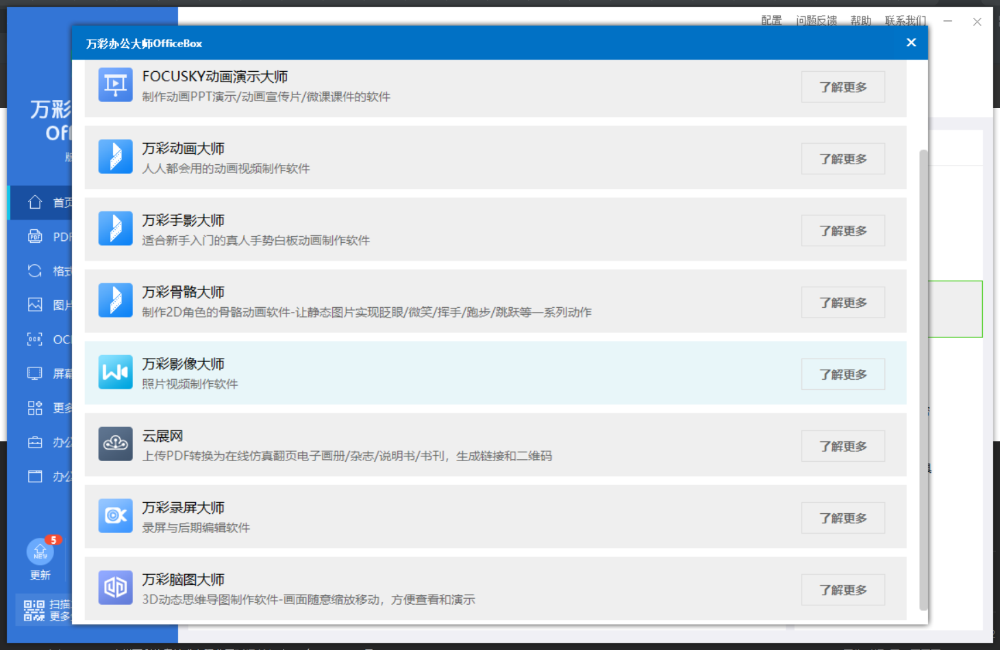

### 文件搜索 -- Listary  & Everything & Wox & 火柴

[Listary](https://www.listary.com/)是一款经典的 `Windows` 搜索增强工具，它通过与资源管理器的紧密结合，就可以帮助你快速搜索文件（支持拼音缩写）、打开文件、定位路径，全键盘操作，甚至可以把它当作启动器来使用，非常爽快。

[Everything](https://www.voidtools.com/)是一款文件名搜索软件。其速度之快令人震惊，它可以在几秒钟之内完成索引；文件名搜索瞬间呈现结果。它小巧免费，支持中文，支持正则表达式，可以通过HTTP或FTP分享搜索结果。

[Wox](http://www.wox.one/)它拥有和` Alfred` 相同的使用方式和逻辑。无需安装，解压出来的文件夹就是软件目录，打开文件夹中的` Wox.exe `即可开启` Wox`。

[火柴](http://huochaipro.com/)(原*火萤酱*)是一款效率神器软件，支持Windows、Mac系统。具备文件秒搜，局域网秒传文件，局域网聊天的强大功能。

<video controls="controls" src="https://skincdn.huoying666.com/jimg/v.mp4" id="v1" width="800" height="450" loop="loop" preload="metadata" poster="https://skincdn.huoying666.com/jimg/video_mask.png" webkit-playsinline="true" playsinline="true"></video>
### [Typora](https://typora.io/)

一款支持实时预览的` Markdown` 文本编辑器。它有 `OS X`、`Windows`、`Linux` 三个平台的版本，并且由于仍在测试中，是完全免费的。

<video muted="muted" preload="preload" loop="loop" style="width=100%;" src="https://typora.io/img/beta.mp4"></video>

### [Notion](https://www.notion.so/?r=a8b6e24bd86f4597a0b26266f6f8aee9)

一款将笔记、知识库和任务管理无缝整合的协作平台。它具有无限的层级和相互链接的组织弹性，给笔记间的关系提供了足够自由的组织方式；它排版灵活，能够把笔记里的内容按块`Block`进行组织和拖拽，甚至可以做出 `Trello `看板进行项目管理；它的内容类型丰富，可以嵌入图片、网页、文档甚至视频，几乎无所不能。

### [Rolan 2](https://getrolan.com/)

一个干净利落的快捷软件启动器软件。这款由国内独立开发者开发的软件，大小不到 1 MB，十分轻量，无需安装就能使用。

添加软件:

1. 将软件图标拖进 `Rolan 2` 快速添加。 支持批量添加操作，如果你之前的大部分图标都在桌面上，把这些图标直接拖进去就能完成添加。
2. 右键空白区域，选择「新建项目」。 在新建窗口中`Rolan 2 `会列出桌面快捷方式、开始菜单中的项目、系统项目以及 `Pro `功能中的快捷操作。通过这几个方式，很快就可以把大部分软件添加到 `Rolan 2` 中。

也可以进入自定义界面，添加高度定制的项目。可以修改路径和图标，还能添加运行参数，可定制化程度非常高。尽管 `Rolan 2` 的定位是软件启动器。但是它同时也支持放置文件夹、文件、网页。只要你愿意，完全可以把它当作一个小型桌面来用。

### [FastCopy](https://fastcopy.jp/en/)

一款快速的文件拷贝计算机软件，是遵循`GPLv3`的开源软件，适用于`Microsoft Windows`平台，也是一款绿色软件。该软件的特点是复制速度更快，能保留被复制文件和文件夹的原始时间，以及其他高级功能。

- 完全支持拖曳操作，支持拖曳多个文件到来源中；
- 支持外壳整合，方便的让你利用右键菜单直接复制文件；
- 支持三种不同的 HDD 模式；
- 内建多种人性化的操作模式；
- 支持过滤，可以使用通配符；
- 支持任务管理；
- 支持命令行操作；

### [500th Video Converter](http://www.glorylogic.com/video-converter.html)

一款轻巧且易于使用的视频转换软件，可让您转换和刻录视频文件，从视频文件中提取音轨，预览视频并应用视觉效果。

- 将视频转换为AVI，MOV，MKV，WMV，VCD，DVD，MP4
- 提取音频并保存到MP3，WAV，OGG，FLAC，WMA
- 将视频文件刻录到CD，DVD或蓝光光盘
- 预览视频文件并保存快照
- 命令行支持
- 支持批量转换和提取
- 支持所有类型的CD / DVD /蓝光刻录机
- 支持Windows XP，Vista，7、8、8.1、10（32和64）

### [TrafficMonitor](https://github.com/zhongyang219/TrafficMonitor) 

一款开源免费的`Windows`平台实时网速监控软件，可以在任务栏或桌面悬浮窗显示系统资源占用信息。[download 地址](https://github.com/zhongyang219/TrafficMonitor/releases)

- 显示当前实现网络传输速率、CPU和内存占用率
- 如果电脑有多个网卡，支持自动和手动选择网络连接
- 查看网络详细信息
- 支持嵌入到任务栏显示
- 支持更换皮肤和自定义皮肤
- 历史流量统计

还有一些其他的[网速监控工具](https://sspai.com/post/47057)，请移步。

[Tickeys](http://www.yingdev.com/projects/tickeys)

一款免费开源的键盘音效工具，可以在键入时模拟「打字机」的声音，也有「爆裂鼓手」、「机械键盘」、「冒泡」、「剑气」等声音方案，支持` Mac`，`Windows`，`Linux` 三大平台。

### [CrystalDiskInfo](https://crystalmark.info/en/software/crystaldiskinfo/)

`CrystalDiskInfo`硬盘检测工具通过读取`S.M.A.R.T`了解硬盘健康状况。打开它，您就可以迅速读到本机硬盘的详细信息，包括接口、转速、温度、使用时间等。`CrystalDiskInfo`还会根据`S.M.A.R.T`的评分做出评估，当硬盘快要损坏时还会发出警报，支持简体中文，推荐一试。

### [CrystalDiskMark](https://crystalmark.info/en/software/crystaldiskmark/)

`CrystalDiskMark`是一个测试你的硬盘或者存储设备的小巧工具，简单易于操作的界面让你随时可以测试你的存储设备，测试存储设备大小和测试数字都可以选择，还可测试可读和可写的速度。

### [万彩办公大师](http://www.wofficebox.com/)

[绿色免安装下载](http://files.wofficebox.com/officebox/download/OfficeBox%E5%AE%98%E6%96%B9%E7%BB%BF%E8%89%B2%E7%89%88.zip)

包含60+个无任何广告及插件的办公小工具，所有的小工具无需安装，直接加载启动，从此省去到处寻找工具、安装及卸载的麻烦。本软件完全免费，无论个人还是企业，无需注册无VIP。

当然他还有其他系列产品，有其他需要，请移步[万彩信息](http://www.wancaiinfo.com/)。

### [Clover ](http://cn.ejie.me/)

`Windows Explorer` 资源管理器的一个扩展，为其增加类似谷歌` Chrome `浏览器的多标签页功能。

