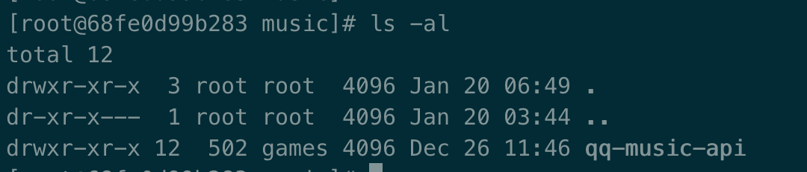

#### `cp` 命令

用于容器与主机之间的数据拷贝。

```sh
docker cp [Options] Container:source_path dest_path/-

docker cp [Options] source_path- Container:dest_path
```

- `--follow-link`, `-L` : 保持源目标中的链接
- `--archive` , `-a`:  存档模式(复制所有`uid / gid`信息)

##### 实例

将主机 `/path`目录拷贝到容器 `68fe0d99b283` 的 `/path`目录下。

```
docker cp /path 68fe0d99b283:/path/
```

将主机 `/path`目录拷贝到容器 `68fe0d99b283`中，目录重命名为`/rename`。

```
docker cp /www/runoob 68fe0d99b283:/rename`
```

将容器 `68fe0d99b283` 的 `/path` 目录拷贝到主机的 `/tmp`目录中。

```
docker cp  68fe0d99b283:/www /tmp/
```




#### `commit`

从容器创建一个新的镜像

```
docker commit [OPTIONS] CONTAINER [REPOSITORY[:TAG]]
```

- `--author`, `-a` : 提交的镜像作者

  

- `--change`, `-c` : 使用 `Dockerfile`指令来创建镜像

  

- `--message`, `-m` : 提交时的说明文字

  

- `--pause`, `-p` : 在`commit`时，将容器暂停, 默认值是 `true`

```sh
docker commit -a "rain120" -m "test" -='CMD ["apachectl", "-DFOREGROUND"]' c3f279d17e0a  svendowideit/testimage:version4
```

#### `diff`

检查容器里文件结构的更改

```
docker diff [OPTIONS] CONTAINER
```

##### 实例

查看容器mymysql的文件结构更改。

```sh
docker diff CONTAINER
```

#### 参考资料

[Docker commandline cp](https://docs.docker.com/engine/reference/commandline/cp/)

[Docker commandline commit](https://docs.docker.com/engine/reference/commandline/commit/)

[Docker commandline diff](https://docs.docker.com/engine/reference/commandline/diff/)

