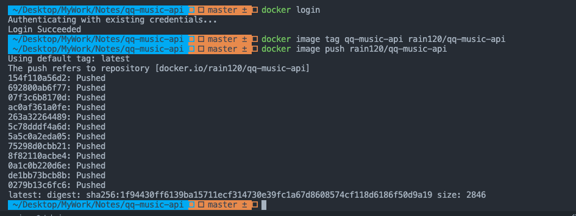

#### Docker 事件流


[Event](https://docs.docker.com/engine/reference/api/docker_remote_api/)

#### 发布到 Docker Hub

登陆 Docker，已登陆的可以忽略这一步

```sh
docker login
```

本地镜像打标签，`tag` 不写默认为 `latest`

```sh
# docker image tag [imageName] [username]/[repository]:[tag]
docker image tag qq-music-api rain120/qq-music-api
```

发布镜像文件

```sh
# docker image push [username]/[repository]:[tag]
docker image push rain120/qq-music-api
```



#### 参考资料

[Docker —— 从入门到实践](https://yeasy.gitbook.io/docker_practice/)