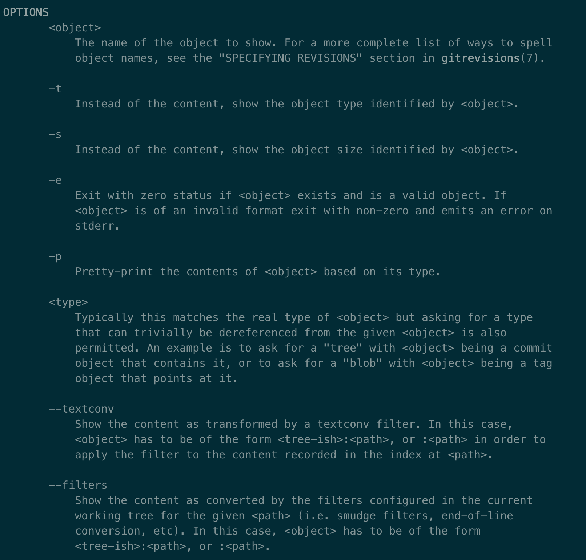
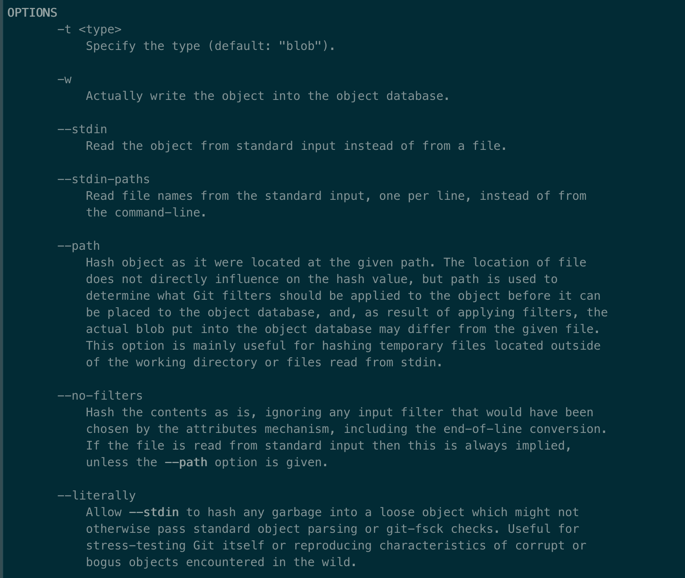

前文 [Git 底层深入浅析 - 目录篇](./git-npm/git-base-analysis.md)我们讲了`git`目录下的文件都是什么，最后我们来讲一下`git objects`。

### 前置知识

- `git cat-file -option xxx`: 用来实现所有 `Git`对象的读取，包括数据对象、树对象、提交对象的查看

我们先了解两个参数`-p`表示查看`Git`对象的内容，`-t`表示查看`Git`对象的类型，更多请执行`git cat-file --help`查看。



- `git-hash-object xxx`: 用来计算文件内容的 `hash` 值，并将生成的数据对象存储到 `Git` 文件系统中。

`-w`表示将数据对象写入到 `Git` 文件系统中

`--stdin`表示从标准输入中获取文件内容

可以使用`git hash-object --help`来查看他的参数列表。



### git objects分类

`git objects`分为 `3`类:

- `commit`: 对象存储` git `中的提交信息.
- `tree `: 对象存储` git` 仓库中的文件元数据信息, 包括文件名及目录结构信息等.
- `blob `: 对应的是 `git `仓库中的文件内容.

```sh
// 查看日志
git log -5

// 查看 Git 对象的类型
git cat-file -t 7369f96

// 查看 Git 对象的内容
git cat-file -p 7369f96
```

我们先找到一个`hash`值，然后对这个`hash`值 执行 `git cat-file`，我们发现这个`hash`类型是`commit`，以及它的内容包括父节点，作者信息，提交者信息等其他信息。


### 参考资料

[Git内部原理之Git对象](https://jingsam.github.io/2018/06/03/git-objects.html)

[Git 内部原理 - 底层命令和高层命令](https://git-scm.com/book/zh/v2/Git-%E5%86%85%E9%83%A8%E5%8E%9F%E7%90%86-%E5%BA%95%E5%B1%82%E5%91%BD%E4%BB%A4%E4%B8%8E%E4%B8%8A%E5%B1%82%E5%91%BD%E4%BB%A4)

[这才是真正的GIT——GIT内部原理](https://www.lzane.com/tech/git-internal/)

[这才是真正的GIT——GIT内部原理 - 视频](https://www.bilibili.com/video/av77252063?t=2070)

