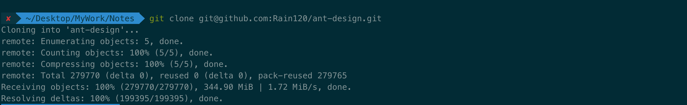
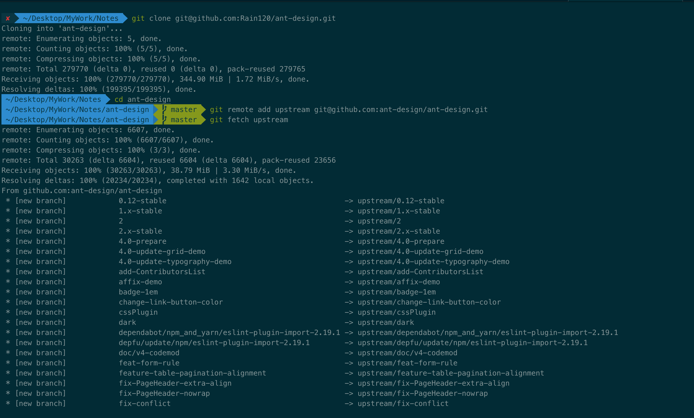
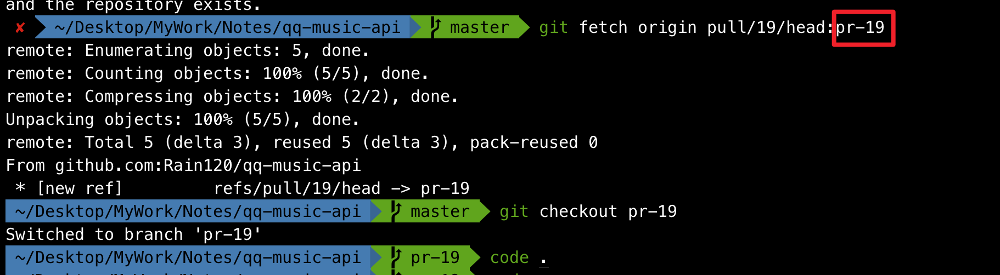
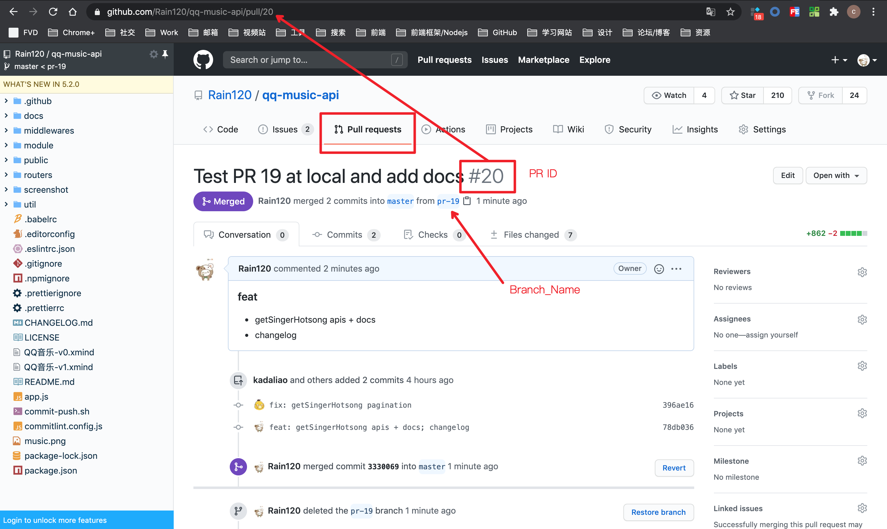

#### Git 如何同步Fork 项目的最新代码

```sh
git clone git@github.com:ant-design/ant-design.git

git remote add upstream git@github.com:ant-design/ant-design.git

git fetch upstream
```

以`Ant Desingn`为例





#### git pull 与 git pull --rebase的区别

```sh
git pull # => git fetch + git merge

git pull --rebase # => git fetch + git rebase
```


#### 如何从 GitHub 测试Pull Request(PR) 的代码 (本地检查 Pull Request(PR) 代码)

找到PR请求的 `ID`，打开 `Iterm2` 或者你的 `Terminal(终端)`

```sh
# 根据该 ID 获取本次 PR 的引用，并在该过程中创建一个新分支
# git fetch origin pull/PR_ID/head:Branch_Name
git fetch origin pull/19/head:pr-19

# 切换到该新分支
# git checkout Branch_Name
git checkout pr-19

# push
# git push origin Branch_Name
git push origin pr-19

# PR GitHub 可视化提交PR即可
```





[本地检查拉取请求 - Github 官方](https://docs.github.com/cn/github/collaborating-with-issues-and-pull-requests/checking-out-pull-requests-locally)
