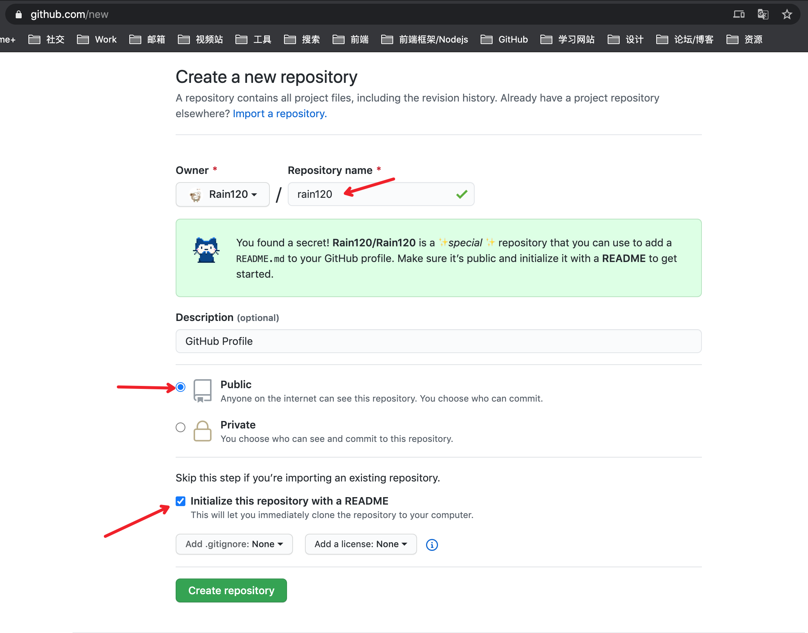

# GitHub 隐藏功能 - 个人首页

## 创建一个同名的仓库

[Create a new repository](https://github.com/new)



## README.md

```md
### Hi there, I'm Rain120! 👋

<div>
  <a target="_blank" href="https://rain120.github.io/study-notes/" style="display: inline-flex;">
    
  </a>

  <a target="_blank" href="https://codesandbox.io/u/rain120" style="display: inline-flex;">
    
  </a>
  <a target="_blank" href="https://www.zhihu.com/people/yan-yang-nian-hua-120" style="display: inline-flex;">
    
  </a>
  <a target="_blank" href="https://juejin.im/user/57c616496be3ff00584f54db" style="display: inline-flex;">
    
  </a>
  <a target="_blank" href="http://weibo.com/5304058050/profile" style="display: inline-flex;">
    
  </a>
</div>

<br />
<br />

**Hi, I'm Rain120**, 一名已经 **北漂** 两年的菜鸡前端, 技术栈是 `React` + `Mobx`, 正在积极学习 `Typescript`, 生活组成就是出门练习练习摄影, 试图捡起篮球以及 **折腾并学习那些不会的前端知识** (PS: 学不动了要😭😭) , 并且会将学习心得和笔记记录下 [study-notes](https://rain120.github.io/study-notes/)上, 除此之外, 还会实践一些个人感兴趣的小东西, 虽然流产率比较高, 但还是比较喜欢折腾这些, 有喜欢折腾的可以一起啊。

<!--
**Rain120/rain120** is a ✨ _special_ ✨ repository because its `README.md` (this file) appears on your GitHub profile.

Here are some ideas to get you started:

- 🔭 I’m currently working on ...
- 🌱 I’m currently learning ...
- 👯 I’m looking to collaborate on ...
- 🤔 I’m looking for help with ...
- 💬 Ask me about ...
- 📫 How to reach me: ...
- 😄 Pronouns: ...
- ⚡ Fun fact: ...
-->

- 🌱 目前正在学习并书写 `Typescript` 指导书, 为了方便小白入门以及自己日后温习 [Here](https://github.com/Rain120/typescript-guide)

- 👯 真正寻求大佬的 `PR` [Here](https://github.com/Rain120/typescript-guide)

- 💬 欢迎各位向我提问 [Here](https://github.com/Rain120/rain120/issues)

**Languages and Tools:**

<div>
  <code></code>
  <code></code>
  <code></code>
  <code></code>
</div>

<br />

[](https://github.com/Rain120/)

**我热度最高的Repositories:**

<a target="_blank" href="https://github.com/Rain120/typescript-guide" style="display: inline-flex;">
  
</a>

<a target="_blank" href="https://github.com/Rain120/study-notes" style="display: inline-flex;">
  
</a>

<a target="_blank" href="https://github.com/Rain120/awesome-javascript-code-implementation" style="display: inline-flex;">
  
</a>

```


## 参考

[github-readme-stats](https://github.com/anuraghazra/github-readme-stats)

[GitHub 隐藏功能 - 个人首页](https://zhuanlan.zhihu.com/p/161029860)

