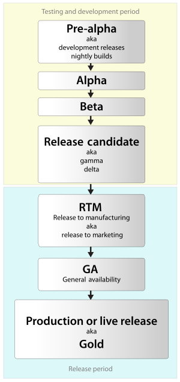

# GitHub 软件(包)版本问题

## 版本介绍

**alpha版**：内部测试版。`α`是希腊字母的第一个，表示最早的版本，一般用户不要下载这个版本，这个版本包含很多BUG，功能也不全，主要是给开发人员和 测试人员测试和找`Bug`用的。

**beta版**：公开测试版。`β`是希腊字母的第二个，顾名思义，这个版本比`alpha`版发布得晚一些，主要是给“部落”用户和忠实用户测试用的，该版本任然存 在很多`Bug`，但是相对`alpha`版要稳定一些。这个阶段版本的软件还会不断增加新功能。如果你是发烧友，可以下载这个版本。

**rc版**：全写：`Release Candidate`（候选版本），该版本又较`beta`版更进一步了，该版本功能不再增加，和最终发布版功能一样。这个版本有点像最终发行版之前的一个类似 预览版，这个的发布就标明离最终发行版不远了。作为普通用户，如果你很急着用这个软件的话，也可以下载这个版本。

**stable版**：稳定版。在开源软件中，都有`stable`版，这个就是开源软件的最终发行版，用户可以放心大胆的用了。

## 版本生命周期

## 参考资料

[软件版本周期](https://zh.wikipedia.org/zh-cn/%E8%BB%9F%E4%BB%B6%E7%89%88%E6%9C%AC%E9%80%B1%E6%9C%9F)

