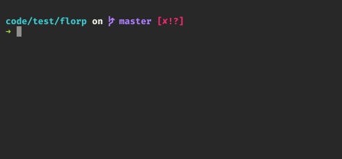
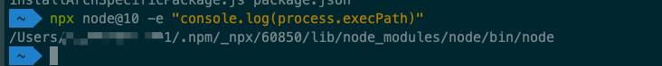

#### 1. 什么是`npm scripts`? 

   >  **脚本语言**(英语: `Scripting language`)是为了缩短传统的「编写、编译、链接、运行」(`edit-compile-link-run`)过程而创建的计算机[编程](https://zh.wikipedia.org/wiki/编程)语言。 ——[维基百科 - 脚本语言](https://zh.wikipedia.org/wiki/脚本语言)

   `npm scripts`就是通过使用脚本来自动执行重复性任务。

#### 2. 启动原理

   通过命令行将命令作为脚本参数传递给`sh`来运行脚本。`npm` 脚本的退出码，也遵守 `Shell` 脚本规则。如果退出码不是`0`，npm 就认为这个脚本执行失败，则会中止该过程。

   请注意，这些脚本文件不必是`nodejs`甚至是`javascript`程序。 它们只需要是某种可执行文件。

#### 3. `Path`

   如果依赖于定义可执行脚本的模块（如测试套件），那么这些可执行文件将添加到`path`以执行脚本。 所以，如果你的`package.json`有这个：

   ```json
   {
       "name": "webpack-demo",
       "dependencies": {
           "webpack": "4.1.0"
       },
       "scripts": {
           "build:dev": "webpack ./test"
       }
   }
   ```

   然后你可以运行`npm build:dev`来执行`webpack`脚本，它被导出到`npm install`上的`node_modules/.bin`目录中。

#### 4. 参数

   向 `npm` 脚本传入参数，要使用`—`标明，表明在此之后的任何东西都应该直接附加到命令中。

   可以直接执行命令，也可以将命令写成一条脚本命令执行。

#### 5. 环境变量

   `npm`可以通过`npm_package_xxx`来访问`package.json`中的字段。

   - `node`环境下可以通过`process.env.npm_package_xxx`来访问`package.json`中的变量，`Eg`:

     ```javascript
     console.log(process.env.npm_package_name) // webpack-demo
     ```

     

#### 6. 执行顺序

   如果一条自定义脚本可能需要执行多条任务，那么他们会存在两种情况，并行和穿行。

   - 并行执行任务

     ```shell
     node app.js & npm run dev
     ```

     如果多次任务结果并没有相互依赖关系，就使用并行任务。

   - 串行执行任务

     ```shell
     node app.js && npm run dev
     ```

     如果下一次任务依赖上一次任务的执行结果，就使用串行执行任务。`Note`: 上一次任务不能出现以`0`为退出码的情况才能执行下一次任务。

 **常见的符号**

| 符号 | 解释                                                         |
| ---- | ------------------------------------------------------------ |
| &    | 工作控制: 将命令转为后台运行，即让命令同时执行               |
| &&   | 逻辑与, 如果前一个命令执行正确, 则执行下一个指令             |
| ;    | 无逻辑判断的命令顺序执行, 即无逻辑判断的 `&&`                |
| \|   | 管道符号 `(pipe)`, 将 `cmd1` 的 `standard output (STDOUT) `传给 `cmd2` 的 `standard input (STDIN)` |
| >    | 以覆盖的方式将 `STDOUT` 输出到指定的文件                     |


#### 7. 钩子函数

   在 `npm script` 中存在两种类型的钩子，`pre-xxx` 和 `post-xxx`。

   `Eg`: `prebuild` `build` `postbuild`

   用户执行`npm run build`的时候，会自动按照下面的顺序执行。

   ```shell
   npm run prebuild && npm run build && npm run postbuild
   ```

   `npm` 提供👇钩子:

   ```shell
   prepare # 在打包和发布包之前运行，在没有任何参数的本地npm install上运行，以及安装git依赖项时（见下文）。 这是在preublish之后运行，但是在preublishOnly之前运行.
   prepublishOnly # 在包准备和打包之前运行，仅限于npm发布.
   prepack # 在打包tarball之前运行(在npm pack，npm发布，以及安装git依赖项时).
   postpack # 在生成tarball之后运行并移动到其最终目标.
   prepublish # 在打包并发布包之前运行，以及在没有任何参数的本地npm安装之前运行.
   publish, postpublish # published package之后运行.
   preinstall # installed package之后运行.
   install, postinstall # installed package之后运行.
   preuninstall, uninstall # uninstalled package之前运行.
   postuninstall # uninstalled package之后运行.
   preversion # Bumping package version之前.(Bumping Verison: 将版本号增加到一个新的唯一值, 简单理解就是修改版本号.)
   version: # Bumping package version之后，提交之前运行.
   postversion: # Bumping package version之后，提交之后运行.
   pretest, test, posttest # npm test 命令运行.
   prestop, stop, poststop # npm stop 命令运行.
   prestart, start, poststart # npm start命令运行.
   prerestart, restart, postrestart # npm restart 命令运行. 注意：如果没有提供重启脚本，npm restart将运行stop和start脚本.
   preshrinkwrap, shrinkwrap, postshrinkwrap # npm shrinkwrap 命令运行.
   ```

   

#### 8. `npx`

   [npm@5.2.0](https://github.com/npm/npm/releases/tag/v5.2.0)版本更新最大的一个特性就是`npx`命令，那么`npx`是个什么呢？

   > npx is a tool intended to help round out the experience of using packages from the npm registry — the same way npm makes it super easy to install and manage dependencies hosted on the registry, npx is meant to make it easy to use CLI tools and other executables hosted on the registry. It greatly simplifies a number of things that, until now, required a bit of ceremony to do with plain npm.

   `npx`是一个工具，旨在帮助完善使用`npm`注册表中的包的体验， 它以同样的方式使得`npm`安装和管理托管在注册表上的依赖项变得非常容易，`npx`旨在使其易于使用`Cli`工具和其他 注册表上托管的可执行文件。 它大大简化了许多事情，直到现在，还需要一些与普通的`npm`有关的步骤。

   

   

   

   使用场景：

   1. 使用不同版本的`node`版本
   2. 执行`github gist`
   3. 执行`npm`二进制包
   4. 以交互方式开发`npm run-scripts`

#### 参考资料

[npm scripts 使用指南](http://www.ruanyifeng.com/blog/2016/10/npm_scripts.html)

[npm scripts: how npm handles the "scripts" field](https://docs.npmjs.com/misc/scripts)

[2018 年了，你还是只会 npm install 吗？](https://juejin.im/post/5ab3f77df265da2392364341)

[Introducing npx: an npm package runner](https://medium.com/@maybekatz/introducing-npx-an-npm-package-runner-55f7d4bd282b)

