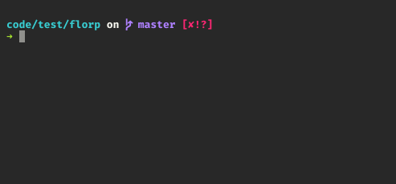
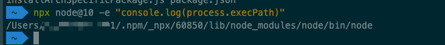

# Npx如何run

## 什么是`npx`?

[npm@5.2.0](https://github.com/npm/npm/releases/tag/v5.2.0)版本更新最大的一个特性就是`npx`命令，那么`npx`是个什么呢？

> npx is a tool intended to help round out the experience of using packages from the npm registry — the same way npm makes it super easy to install and manage dependencies hosted on the registry, npx is meant to make it easy to use CLI tools and other executables hosted on the registry. It greatly simplifies a number of things that, until now, required a bit of ceremony to do with plain npm.

`npx`是一个工具，旨在帮助完善使用`npm`注册表中的包的体验， 它以同样的方式使得`npm`安装和管理托管在注册表上的依赖项变得非常容易，`npx`旨在使其易于使用`Cli`工具和其他 注册表上托管的可执行文件。 它大大简化了许多事情，直到现在，还需要一些与普通的`npm`有关的步骤。

## 怎么使用`npx`?

## 为什么npx能在不安装的情况下使用？

> `npx`执行`<command>`从本地`node_modules/.bin`，或从`cache`安装，以便需要的`packages` `<command>`来运行。

默认情况下，`npx`将检查是否`<command>`存在于`$PATH`本地项目二进制文件中，并执行该操作。如果`<command>`未找到，则会在执行之前安装。

除非`--package`指定了选项，`npx`否则将尝试根据提供的说明符猜测要调用的二进制文件的名称。`npm`可以使用所理解的所有包说明符`npx`，包括`git`说明符，远程`tarball`，本地目录或作用域包。

如果包含完整说明符，或者`--package`使用了完整说明符，则npx将始终使用新安装的临时版本的程序包。这也可以用使用标志位`--ignore-existing`来强制忽略。

当用户在使用的时候，可以先打开另一个`shell`窗口并进入`~/.npm/_npx`目录，你可以发现当前你的`_npx`目录一无所有，然后你执行`npx node@11 -v`, 你会发现`_npx`目录开始写东西进来了，进入之后可以发现就是当前版本的`node`包。

同样的, 你可以执行`npx node@10 -e "console.log(process.execPath)"`, 会输出当前`node`的`path`.

## `npx`的使用场景

1. 使用不同版本的`node`版本
2. 执行`github gist`
3. 执行`npm`二进制包
4. 以交互方式开发`npm run-scripts`

## 参考

[npx](https://github.com/zkat/npx)

[Introducing npx: an npm package runner](https://medium.com/@maybekatz/introducing-npx-an-npm-package-runner-55f7d4bd282b)

[npm package npx](https://www.npmjs.com/package/libnpx)