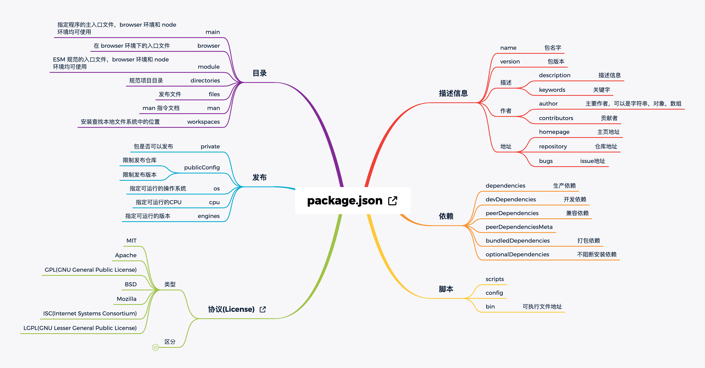

# npm package.json

## package

## Resources

[下载地址](https://github.com/Rain120/study-notes/blob/master/docs/notes/git-npm/images/package.json.xmind)

## 参考

[npm package-json](https://docs.npmjs.com/cli/v7/configuring-npm/package-json)
