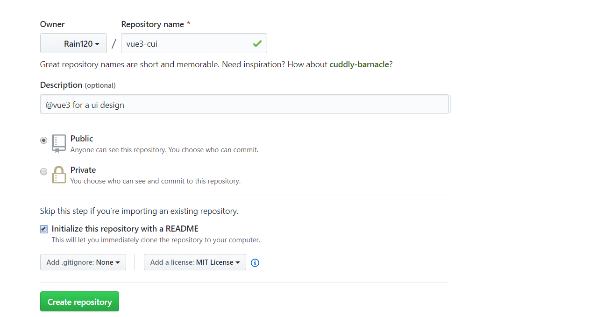
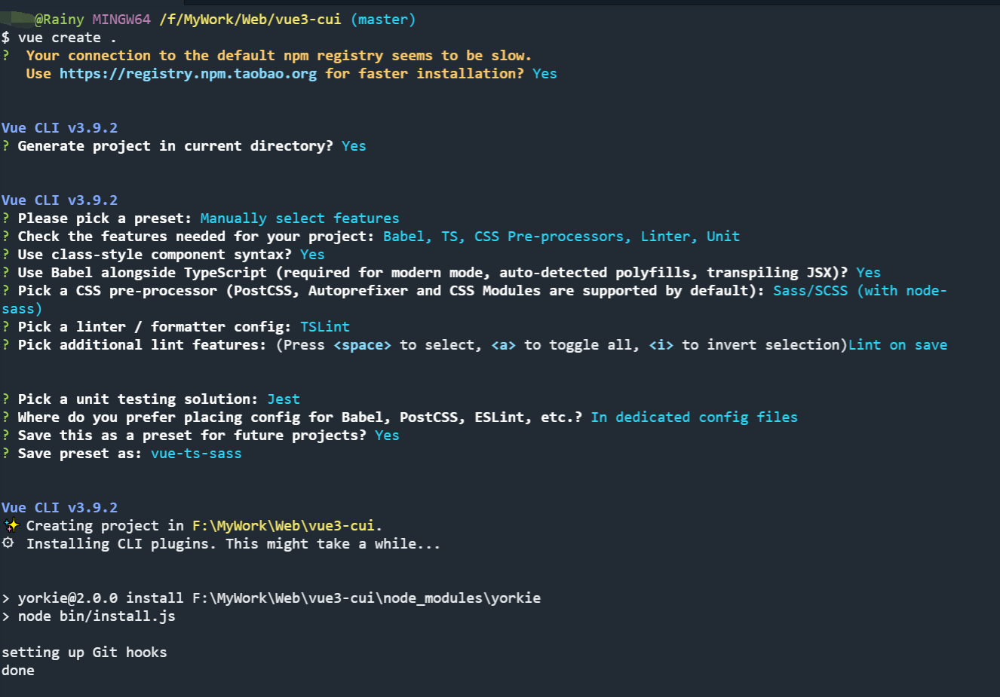

# Npm 包发布笔记

## 注册`npm`账号

[npm注册地址](https://www.npmjs.com/)

```shell
npm login
```


## 新建一个`repository`



`npm init`


## 创建项目

`vue-create`



`remote github`


`push error`


## 发布`npm`

查看你的包名是否已存在


`npm publish`


## 使用`vue3.x`进行组件库开发

 1. 基础框架的搭建(`typescript`+`Vue 3.x`)

    - 目录结构

    ```shell
     tree -L 3 -I "node_modules"
    ```

    ```shell
    .
    ├── LICENSE
    ├── README.md
    ├── babel.config.js
    ├── examples // demo
    │   ├── App.vue
    │   ├── assets
    │   │   └── logo.png
    │   ├── components
    │   │   └── Alert.vue
    │   ├── main.ts
    │   └── router.ts
    ├── jest.config.js
    ├── package-lock.json
    ├── package.json
    ├── packages // 组件库
    │   ├── alert
    │   │   ├── index.ts
    │   │   └── src
    │   ├── index.ts
    │   └── typings // ts types
    │       ├── shime-global.d.ts
    │       ├── shims-tsx.d.ts
    │       └── shims-vue.d.ts
    ├── postcss.config.js
    ├── public
    │   ├── favicon.ico
    │   └── index.html
    ├── tests // unit tests
    │   └── unit
    │       └── example.spec.ts
    ├── tsconfig.json
    ├── tslint.json
    └── vue.config.js // vue 3.x webpack配置
    ```

    - 组件开发`packages/alert/index.ts`

    ```typescript
    import Alert from './src/main.vue';
    
    (<any>Alert).install = function(Vue: any) {
      Vue.component(Alert.name, Alert);
    };
    
    export default Alert;
    ```

    - 导出组件 `packages/index.ts`

    ```typescript
    import Alert from './alert';
    
    const components = [
      Alert,
    ]
    
    const install: any = function (Vue: any) {
      if (install.installed) {
        return;
      }
      components.map(component => Vue.component(component.name, component))
    }
    
    if (typeof window !== 'undefined' && (<any>window).Vue) {
      install((<any>window).Vue);
    }
    
    export default {
      install,
      Alert,
    }
    
    ```

    - 使用组件`examples/main.ts`

    ```typescript
    import Vue from 'vue';
    import App from './App.vue';
    import router from './router';
    import Alert from '../packages/index';
    
    Vue.config.productionTip = false;
    
    Vue.use(Alert);
    
    new Vue({
      router,
      render: (h) => h(App),
    }).$mount('#app');
    ```

    - 打包

      增加打包`scripts`

      `--target`: 构建目标，默认为应用模式

       `--dest` : 输出目录，默认 `dist`

      `[entry]`: 最后一个参数为入口文件，默认为 `src/App.vue`

      ````javascript
      "scripts": {
          "lib": "vue-cli-service build --target lib --name vue3-cui lib packages/index.ts",
      },
      ````

##

1. `vue 3.x`学习
2. 组件库开发
3. 持续集成学习

待学习ing

参考资料:

[详解：Vue cli3 库模式搭建组件库并发布到 npm](https://juejin.im/post/5bbab9de5188255c8c0cb0e3)


