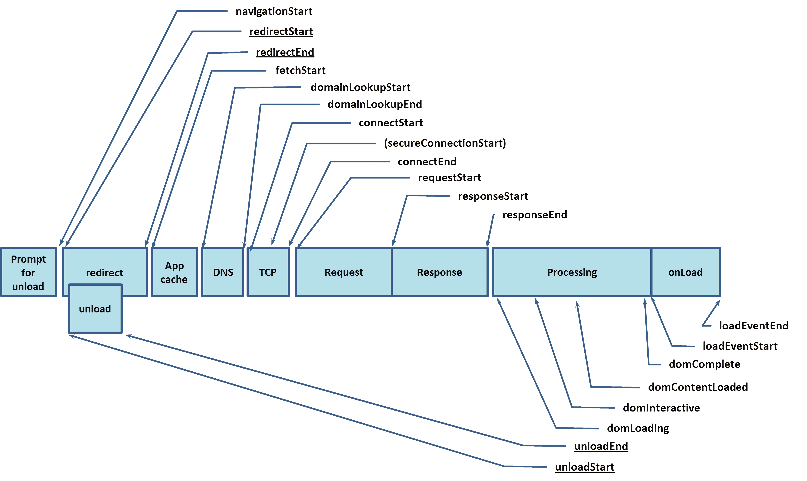

# 从请求到渲染页面的过程



1. DNS解析耗时: domainLookupEnd - domainLookupStart
2. TCP连接耗时: connectEnd - connectStart
3. SSL安全连接耗时: connectEnd - secureConnectionStart
4. 网络请求耗时(TTFB): responseStart - requestStart
5. 数据传输耗时: responseEnd - responseStart
6. DOM解析耗时: domInteractive - responseEnd
7. 资源加载耗时: loadEventStart - domContentLoadedEventEnd
8. 首包时间: responseStart - domainLookupStart
9. 首次渲染时间 / 白屏时间: responseEnd - fetchStart
10. 首次可交互时间: domInteractive - fetchStart
11. DOM Ready时间: domContentLoadEventEnd - fetchStart
12. 页面完全加载时间: loadEventStart - fetchStart

```js
[
    {
        "key": "Redirect",
        "desc": "网页重定向的耗时",
        "value": 0
    },
    {
        "key": "AppCache",
        "desc": "检查本地缓存的耗时",
        "value": 0
    },
    {
        "key": "DNS",
        "desc": "DNS查询的耗时",
        "value": 0
    },
    {
        "key": "TCP",
        "desc": "TCP连接的耗时",
        "value": 0
    },
    {
        "key": "Waiting(TTFB)",
        "desc": "从客户端发起请求到接收到响应的时间 / Time To First Byte",
        "value": 0
    },
    {
        "key": "Content Download",
        "desc": "下载服务端返回数据的时间",
        "value": 0
    },
    {
        "key": "HTTP Total Time",
        "desc": "http请求总耗时",
        "value": 0
    },
    {
        "key": "DOMContentLoaded",
        "desc": "dom加载完成的时间",
        "value": 0
    },
    {
        "key": "Loaded",
        "desc": "页面load的总耗时",
        "value": 0
    }
]
```