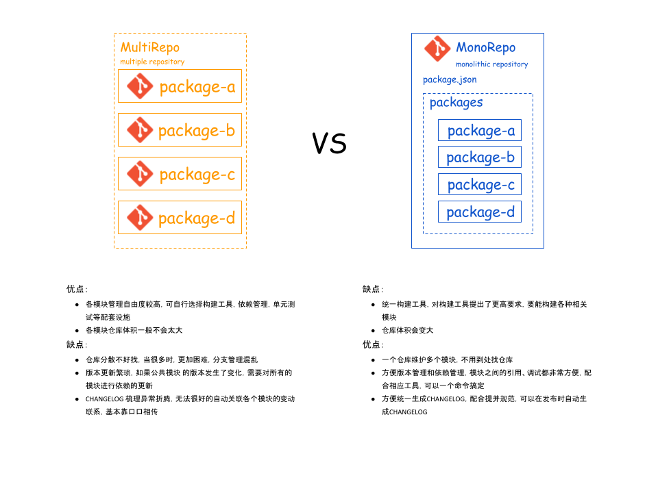

# Lerna 入门篇

## 多包管理方案

### Multirepo

又称`multiple repository`, 多代码仓库

#### 优势

- **灵活**
允许多元化发展, 各个`module`有各自的构建等方式

- **安全**
自然的权限控制, 发布上线对其他项目无影响

#### 痛点

- **代码复用成本过高**
`core repo`版本更新麻烦, 需要同步所有`module`更新其依赖的`core repo`版本

- **开发调试成本过高**
涉及多个项目开发时, 你可能需要开启多个IDE窗口进行切换开发, 另外虽然可以使用`npm link`方式进行调试, 但手动管理诸多link操作十分不便

- **项目基建, 工作流混乱**
由于在 `Multirepo` 当中, 各个项目的工作流是割裂的, 因此每个项目需要单独配置开发环境、配置 CI 流程、配置部署发布流程等等, 甚至每个项目都有自己单独的一套脚手架工具, 然而很多情况下这些项目里的基建和逻辑是有很大部分重复的, 而且各个项目间存在构建、部署和发布的规范不能统一的情况下维护成本也高了起来。

- **issue管理混乱**

- **changelog难以整合**
需要人工梳理所有变动的仓库, 并做整合

### Monorepo

`monolithic repository`, 单代码仓库

#### 优势

可以解决上面描述 `Multirepo` 的痛点

- **统一工作流**

- **降低基建成本**
所有项目复用一套标准的工具和规范, 无需切换开发环境, 如果有新的项目接入, 也可以直接复用已有的基建流程

- **提升团队协作效率**
集中管理, 减少不同仓库配置的差异带来的沟通成本


#### 痛点

- **repo体积较大**

- **权限问题**

- **统一构建工具, 对构建工具提出了更高要求, 要能构建各种相关`module`**



:::tip
在实际场景来落地 Monorepo, 需要一套完整的工程体系来进行支撑, 因为基于 Monorepo 的项目管理, 绝不是仅仅代码放到一起就可以的, 还需要考虑项目间`依赖分析`、`依赖安装`、`构建流程`、`测试流程`、`CI` 及`发布流程`等诸多工程环节, 同时还要考虑项目规模到达一定程度后的`性能`问题, 比如`项目构建/测试时间`过长需要进行`增量构建/测试`、`按需执行CI`等等, 在实现全面工程化能力的同时, 也需要兼顾到性能问题

**Tips: 借助 lerna + pnpm 实现多仓库管理**。(待实践)
:::

## lerna 是什么？

`Lerna`是一种工具, 用于优化使用`git`和`npm`管理多包存储库的工作流程。

## 为什么要使用 lerna?

将大型代码库分成单独的独立版本化的软件包对于代码共享非常有用。 但是, 跨许多存储库进行更改很麻烦且难以跟踪, 并且跨存储库的测试变得非常复杂。

为了解决这些（以及许多其他）问题, 某些项目会将其代码库组织到多包存储库中。 众多项目以及许多其他项目都在一个存储库中开发了所有软件包。

`lerna`可以让你在主项目下管理多个子项目, 从而解决了多个包互相依赖, 且发布时需要手动维护多个包的问题。

## 安装 lerna

```sh
npm install -g lerna

# yarn

yarn global add lerna
```

## 创建 lerna 仓库

```sh
git init lerna-repo && cd lerna-repo
```

## Lerna 常用命令

[详见 Lerna 命令](./commands)

## 参考资料

[Lerna 官方文档](https://lerna.js.org/)

[【PPT】白鹭引擎首席架构师@王泽：框架开发中的基础设施搭建 ](https://www.sohu.com/a/343217202_463970)

