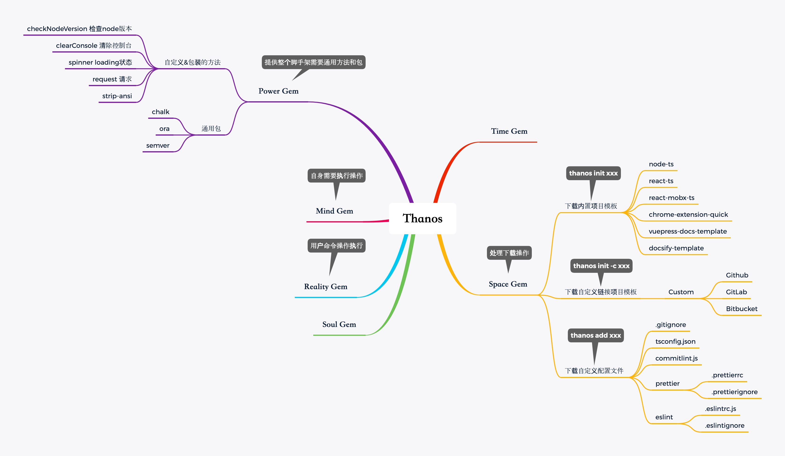
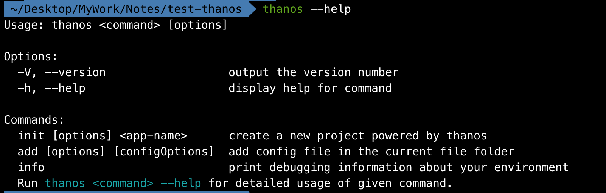

# Lerna 搭建脚手架 第二集

## 脚手架结构



组织结构

- `Thanos` 主要是执行用户的输入命令解析
- `space-gem` 主要是处理下载操作
- `power-gem` 主要是提供整个脚手架需要的包和公共方法

其他的还没想好，目前简单的脚手架，这些就已经足够了，日后补全。

## 目录结构

```sh
lerna create pkg-name
```

`packages/thanos/`

```sh
├── .npmignore
├── README.md
├── bin
│   └── thanos.js
├── lib
│   ├── add.js
│   ├── create.js
│   └── index.js
├── package-lock.json
└── package.json
```

`packages/space-gem/`

```sh
├── .npmignore
├── README.md
├── __tests__
│   └── space-gem.test.ts
├── dist
│   ├── @types
│   │   ├── index.d.ts
│   │   └── lib
│   │       ├── gitClone.d.ts
│   │       └── gitignore.d.ts
│   ├── index.js
│   └── lib
│       ├── gitClone.js
│       └── gitignore.js
├── index.ts
├── lib
│   ├── gitClone.ts
│   └── gitignore.ts
├── package-lock.json
├── package.json
└── tsconfig.json
```

`packages/power-gem/`

```sh
├── .npmignore
├── README.md
├── __tests__
│   └── power-gem.test.ts
├── index.ts
├── lib
│   ├── checkNodeVersion.ts
│   ├── clearConsole.ts
│   ├── logger.ts
│   ├── request.ts
│   ├── spinner.ts
│   └── strip-ansi.ts
├── package-lock.json
├── package.json
├── tsconfig.json
└── typings
    ├── index.d.ts
    └── typings.d.ts
```

## 调试配置

执行`npm link` 将本地的包设置成软链接使用。

引用其他`ts`开发的包，需要转换成`js`才可以引用，执行`tsc - -w`可以实时监控包内容的变化，并编译成 `js`。

## 脚手架开发

### 版本检测

`power-gem/lib/checkNodeVersion.ts`

```typescript
import chalk from 'chalk';
import semver from 'semver';

export default function checkNodeVersion(wanted: string, id: string | number) {
  if (!semver.satisfies(process.version, wanted)) {
    console.log(
      chalk.red(
        'You are using Node ' +
          process.version +
          ', but this version of ' +
          id +
          ' requires Node ' +
          wanted +
          '.\nPlease upgrade your Node version.',
      ),
    );
    process.exit(1);
  }
}

```

`thanos/bin/thanos.js`

```javascript
#!/usr/bin/env node

const { checkNodeVersion, chalk } = require('power-gem');
const currentNodeVersion = process.versions.node;
const semver = currentNodeVersion.split('.');
const major = +semver[0];

if (major < 8) {
  checkNodeVersion(major, 'Rain120/thanos');
  console.error(
    'You are running Node ' +
      currentNodeVersion +
      '.\n' +
      'Thanos requires Node 8 or higher. \n' +
      'Please update your version of Node.',
  );
  process.exit(1);
}
```

### 命令输入

```javascript
const program = require('commander');
const minimist = require('minimist');

program
  .version(`Rain120/thanos ${require('../package').version}`)
  .usage('<command> [options]');

program
  .command('init <app-name>')
  .description('create a new project powered by thanos')
  .option('-c, --custom', 'Custom init project')
  .action((name, cmd) => {
    console.log(name, cmd);
  });

program
  .command('add [configOptions]')
  .description('add config file in the current file folder')
  .option('-g, --gitignore', 'add the file for gitignore')
  .option('-tsc, --tsconfig', 'add the file for tsconfig.json')
  .option('-c, --commitlint', 'add the file for commitlint.js')
  .option('-p, --prettier', 'add the file for prettier')
  .option('-es, --eslint', 'add the file for eslint')
  .allowUnknownOption()
  .action(type => {
    require('../lib/add')(type, minimist(process.argv.slice(3)));
  });

program
  .command('info')
  .description('print debugging information about your environment')
  .action((cmd) => {
    console.log(chalk.bold('\nEnvironment Info:'))
    require('envinfo').run(
      {
        System: ['OS', 'CPU'],
        Binaries: ['Node', 'Yarn', 'npm'],
        Browsers: ['Chrome', 'Edge', 'Firefox', 'Safari'],
        npmPackages: '/**/{typescript,*gem*,*thanos*}',
        npmGlobalPackages: ['Rain120/infinity-gauntlet-cli']
      },
      {
        showNotFound: true,
        duplicates: true,
        fullTree: true
      }
    ).then(console.log)
  })

// output help information on unknown commands
program
  .arguments('<command>')
  .action(cmd => {
    program.outputHelp()
    console.log(`  ` + chalk.red(`Unknown command about ${chalk.yellow(cmd)}.`))
  })

// add some useful info on help
program.on('--help', () => {
  console.log(`  Run ${chalk.cyan(`thanos <command> --help`)} for detailed usage of given command.`)
})

program.parse(process.argv);
```

### 命令解析

```javascript
const { gitignore } = require('space-gem');

function add(options = {}, context = process.cwd()) {
  console.log(options, context);
  gitignore({
    options,
    context,
  });
}

module.exports = (...args) => {
  return add(...args);
};

```

### 效果



## 参考资料

[遇到的问题及其解决方法](./qa)

