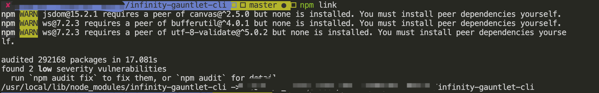
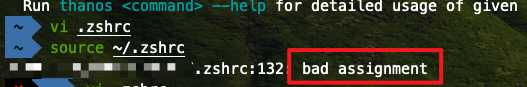

# 遇到的问题及其解决方法

## npm link 后命令行报命令找不到




### 解决办法

```sh
# zsh or bash_profile or 你的 alias 配置文件
vi ~/.zshrc

# thanos 是你定义的命令, path匹配到你bin对应的绝对路径
alias thanos=/xxxx/thanos.js

# 重新加载一下配置文件
# 每次重启电脑 or 锁屏之后都重启一个配置即可
source ~/.zshrc
```


### 引申问题

`source ~/.zsh` 是报下图错误



删除命令 `=` 前后的空格

