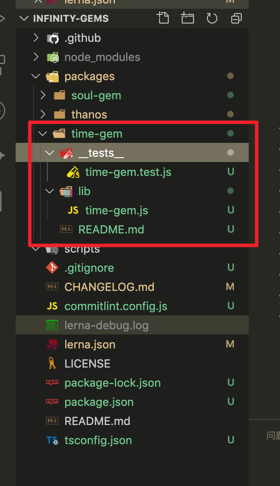

## lerna.json 配置

```json
{
  // 当前存储库的版本，当为 independent 时，开启独立模式
  "version": "independent",
  // 用于指定运行命令的特定客户端。 可更改为 yarn 或者 cnpm
  "npmClient": "npm",
  "useWorkspaces": false,
  // 用作包装位置的 glob 数组， 默认为 ["packages/*"], 也可以修改为其他目录
  "packages": ["packages/*"],
  "command": {
    // lerna publish 相关
    "publish": {
      // 忽略不必要的更改发布新版本
      "ignoreChanges": ["**/*.md", "__tests__"],
      "allowBranch": "main",
      // 当消息记录里包含 %s 将会替换为 v1.1.1, 如果是 %v 则直接替换为 1.1.1
      // 如果是 independent 模式则会独立更新每个包的版本
      // 具体请查看 [@lerna/json](https://github.com/lerna/lerna/tree/master/commands/version#--message-msg)
      "message": "chore(release): publish %s"
    },
    // lerna run 相关
    "run": {
      "stream": true
    },
    // lerna bootstrap 相关
    "bootstrap": {
      "ignorePrepublish": true,
      "hoist": true
    }
  },
  // 用作提升某些包的 glob 数组
  "hoist": ["jest", "typescript"],
  // changelog 相关配置
  "changelog": {
    "repo": "rain120/lerna-quick-start",
    "labels": {
      "PR: New Feature": ":rocket: New Features",
      "PR: Breaking Change": ":boom: Breaking Changes",
      "PR: Bug Fix": ":bug: Bug Fix",
      "PR: Documentation": ":memo: Documentation",
      "PR: Internal": ":house: Internal",
      "PR: Underlying Tools": ":hammer: Underlying Tools"
    },
    "cacheDir": ".changelog"
  }
}
```

## Lerna 全局配置

通过`lerna --help`或者官方文档可获取。

- `--loglevel <silent|error|warn|success|info|verbose|silly>`: 要报告的日志级别。失败时，所有日志都将写入当前工作目录中的`lerna-debug.log`。 默认值为 `info`

- `--concurrency`: `Lerna` 并行执行任务时要使用多少个线程（默认为逻辑 `CPU` 内核数）

- `--reject-cycles`: 循环引用立即报错

- `--no-progress`: 禁用进度条(在 `CI` 环境中，情况总是如此)。

- `--no-sort`: 默认情况下，所有任务都按照拓扑排序的顺序在程序包上执行，该选项可以禁用排序，以最大的并发性以任意顺序执行任务。

- `--max-buffer <bytes>`: 为每个基础流程调用设置最大缓冲区长度, 当 使用 `lerna import` 导入具有大量提交的存储库时，可能会出现内置缓冲区长度不足的问题，可以设置该选项解决这个问题

## Lerna 过滤器

用来过滤命令执行时的范围, 详见[`@lerna/filter-options`](https://www.npmjs.com/package/@lerna/filter-options)。通过`lerna --help`或者官方文档可获取。

| Filter                   | Description                                                  |
| ------------------------ | ------------------------------------------------------------ |
| `--scope <glob>`         | 仅包含`glob`所匹配到的`package`, 限制 `lerna` 命令执行范围   |
| `--ignore <glob>`        | 排除`glob`匹配到的`package`                                  |
| `--no-private`           | 排除私有`package`, 默认是包含的                              |
| `--since`                | 仅包括自指定`[ref]`之后已更改的软件包,如果没有传递参考, 则默认为最新标签。 |
| `--exclude-dependents`   | 运行命令时排除所有传递依赖项, 使用`--since`, 将覆盖默认的“更改”算法。 |
| `--include-dependents`   | 运行命令时包括所有传递依赖项, 无论`--scope`, `-ignore`或`--since` |
| `--include-dependencies` | 运行命令时包括所有传递依赖项, 无论`--scope`, `-ignore`或`--since` |
| `--include-merged-tags`  | 使用`--since`运行命令时, 包括来自合并分支的标签。            |

## lerna init

创建一个新的 `Lerna` 仓库或将现有的仓库升级到`Lerna`的当前版本。

### 用法实例

```sh
lerna init
```

生成的目录结构如下

```sh
lerna-repo/
  packages/
  package.json
  lerna.json
```

### 命令选项

```sh
命令选项：
  --exact            在package.json中指定lerna依赖版本而无需插入符号（^）[布尔]
  --independent, -i  独立版本包装                                    [布尔]
```

-   `independent`: 使用独立的版本控制模式, 它将会忽略`lerna.json`中定义的`version`
-   ` Fixed/Locked` `(default) `: `Fixed`模式下, 项目通过单一的版本进行控制。版本号放在项目根目录下的`lerna.json`文件的`version`这个字段。当你执行` lerna publish`, 如果有文件更新, 它将发布新的版本。


## `lerna create <name> [loc]`

创建一个新的 `lerna` 管理包

### 用法实例

```sh
lerna create soul-gem
lerna create soul-gem plugins # soul-gem包 生成到 plugins 文件中
```

### 命令选项

```sh
<name>            软件包名称（包括范围）, 必须是本地唯一的_and_公开可用[字符串] [必填]
[loc]             自定义程序包位置, 默认为第一个配置的程序包位置[字串]

命令选项：
  --access        使用范围时, 设置publishConfig.access值[选择：“公共”, “受限制”] [默认值：公共]
  --bin           程序包具有可执行文件。使用--bin自定义<executabLername> [默认值：<name>]
  --description   程序包描述[字符串]
  --dependencies  软件包依赖关系的列表[数组]
  --es-module     初始化转译的ES模块
  --homepage      软件包主页, 默认为根的子路径pkg.homepage [字符串]
  --keywords      软件包关键字列表[array]
  --license       所需的软件包许可证（SPDX标识符）[默认：ISC]
  --private       将新软件包设为私有, 从未发布
  --registry      配置软件包的publishConfig.registry [string]
  --tag           配置软件包的publishConfig.tag [string]
  --yes            跳过所有提示, 接受默认值
```




## `lerna add <package>[@version] [--dev] [--exact] [--peer]`


向匹配的软件包添加单个依赖项

### 用法实例

```sh
# 安装 react 16.8.0 到 packages 所包含的 package 中
lerna add react@16.8.0

# 软件包/前缀-*将module-1软件包添加到“ prefix-”前缀文件夹中的软件包中
lerna add module-1

# 将module-1安装到module-2
lerna add module-1 --scope = module-2

# 在devDependencies中将module-1安装到module-2
lerna add module-1 --scope = module-2 --dev

# 在peerDependencies中将module-1安装到module-2
lerna add module-1 --scope = module-2 --peer

# 在module-1以外的所有模块中安装module-1
lerna add module-1

 # 跳过自动的“ lerna bootstrap”
lerna add module-1 --no-bootstrap

# 在所有模块中安装babel-core
lerna add babel-core
```

### 命令选项

```sh
pkg    # 要添加为依赖项的程序包名称
 globs  # 匹配的可选软件包目录globs
命令选项：
  -D, --dev          保存到devDependencies
  -E, --exact        完全保存版本
  -P, --peer         保存到peerDependencies
  --registry         将指定的注册表用于所有npm客户端操作。
  --no-bootstrap     进行更改后, 不要自动链接“ lerna bootstrap”。
```

## lerna bootstrap

在当前的`Lerna`存储库中引导软件包。安装它们的所有依赖性并链接任何交叉依赖性。

**此命令至关重要, 因为它使您可以使用软件包名称, require()就好像软件包已经存在并在您的 node_modules 文件夹中可用一样。**

运行这个命令相当于运行以下命令

-   `npm install` 每个软件包的所有外部依赖项。

-   将所有 `packages` 相互依赖的 Lerna 链接在一起。

-   `npm run prepublish` 在所有 `bootstrapped` 软件包中（除非`--ignore-prepublish` 通过）。

-   `npm run prepare` 在所有 `bootstrapped` 软件包中

### 用法实例

```sh
lerna bootstrap
```

### 命令选项

```sh
--hoist 将 `glob` 匹配的所有依赖想提升至根目录，以便于所有包都可以用，如果选项存在但未给定 `glob`，则默认为 **（提升所有内容）。关于该配置的更多说明即优缺点可以查看 [hoist documentation](https://github.com/lerna/lerna/blob/master/doc/hoist.md)

--nohoist 当和 `--hoist` 同时使用是，构建过程出现异常或者警告将会停止引导

--ignore-prepublish 不要在引导程序包中运行预发布的生命周期脚本。

--ignore-scripts 不要在自举程序包中运行 _any_ 生命周期脚本

--npm-clientExecutable 使用其他源(npm, yarn, pnpm, ...)安装依赖

--registry 指定的 registry

--strict 当和 `--hoist` 同时使用是，构建过程出现异常或者警告将会停止引导。

--use-workspaces     数组中的值是 `Lerna` 将操作委托给 `yarn` 的命令

--force-local  不管版本范围匹配如何，强制本地同级链接

--contents 子目录用作任何链接的源。 必须应用于所有软件包。

```

## `lerna import <dir>`

将本地路径`<pathToRepo>`中的包导入具有提交历史记录的`package / <directory-name>`中, 将带有提交历史记录的包导入到 `monorepo` 中。

### 用法实例

```sh
lerna import ./
```

### 命令选项

```sh
dir # 外部git仓库的路径, 该仓库包含一个npm包[必需]

命令选项：
   --flatten          当导入具有合并提交的存储库时,导入命令将无法应用所有提交. 用户可以使用此标志来请求导入"flatten"历史,即每次合并提交, 作为单个合并的更改.
   --dest             指定输出目录, 默认为 packages 目录
   --preserve-commit   每个 `git` 提交都有一个作者和一个提交者，`lerna import` 从外部存储库重新创建每个提交，因此提交者将成为当前的 `git` 用户, 这是正确的，但可能是不希望的。 启用此选项将保留原始提交者（和提交日期），以避免此类问题。
   -y, --yes          跳过所有确认提示
```

## lerna publish

创建一个新版本的已更新的软件包。提示新版本并更新`git`和`npm`上的所有软件包。

### 用法实例

```sh
lerna publish
```

### 命令选项

`--npm-tag [tagname]`: 使用给定的`npm dist-tag`发布到`npm`（默认为最新）。

`--canary`/ `-c`: 创建一个`canary`版本。

`--skip-git` : 不要运行任何`git`命令。

`--force-publish [packages]`: 强制发布指定的软件包（以逗号分隔）或使用的所有软件包 `*`（跳过`git diff`检查更改的软件包）。

## `lerna version [bump]`

更改 `Lerna` 管理的包版本

`Note`: 发布版本前需要 `commit` 本地的修改。

### 用法实例

```sh
lerna version 1.2.3

lerna version [major | minor | patch | premajor | preminor | prepatch | prerelease]

lerna version // 从prompt 中选择
```

### 命令选项

```sh
--allow-branch 接受一个 glob 数组, 标记发布版本允许的分支，默认只有 master 分支

--amend 跳过自动提交

--conventional-commits 发布一个常规版本的同时 生成 CHANGELOG.md, 该提交方式是直接中版本号发生变化，不支持小版本变化

--conventional-prerelease 强制当前版本为预发布版本，而不是主版本。不添加这个参数， `--conventional-commits` 只会在当前版本是预发布版本 才会默认提交为 预发布

--conventional-graduate： 强制预发布版本，升级为发布版本

--force-publish：跳过检查 lerna checked 和 git diff, 强制发布一个版本

--git-remote 替换提交的远端地址

--ignore-changes 接受一个 glob 数组，发布版本忽略匹配的文件变动发生的更改。通过`--no-ignore-changes` 完全禁用。

--message, -m <msg> 相当于 git commit -m <msg>, 提交的内容 %s 表示带 v 的版本号， %dv 表示版本号

--no-push 不 push 内容到 git

--no-changelog 使用` --conventional-commits` 时不生成 `CHANGELOG.md` 文件。

--no-commit-hooks在提交版本更改时不要运行git commit挂钩。

--no-git-tag-version不提交或标记版本更改。

--preid 在对预发行版本进行版本控制时指定预发行标识符

--sign-git-commit 将 `--gpg-sign` 标志传递给 `git commit`。

--sign-git-tag 将 `--sign` 标志传递给 `git tag`。

--tag-version-prefix 自定义标签前缀。要完全删除，请传递一个空字符串。

-y, --yes 跳过所有确认提示。

```

## lerna changed

列出自上一个标记版本以来已更改的本地软件包。

### 用法实例

列出自上一个标记版本以来已更改的本地软件包, `lerna changed` 的输出将是下一个 `lerna version` 或者 `lerna publish` 的软件包列表

**Note: `lerna.json` 配置 `lerna publish` 和 `lerna version` 也影响 `lerna changed`，如`command.publish.ignoreChanges`**。

```sh
lerna changed
```

### 命令选项

```sh
命令选项：
  --conventional-graduate   检测当前预发布的软件包, 这些软件包将更改为非预发布版本。
  --force-publish           在检测到已更改的软件包时始终包括目标软件包, 跳过默认逻辑。
  --ignore-changes          当检测到已更改的软件包时, 忽略与glob匹配的文件中的更改。通过--no-ignore-changes完全禁用。
  --include-merged-tags     当检测到更改的软件包时, 包括来自合并分支的标签。

输出选项：
  --json            将信息显示为JSON数组
  --ndjson          以换行符分隔的JSON显示信息
  -a, --all         显示通常隐藏的私人软件包
  -l, --long        显示扩展信息
  -p, --parseable   显示可解析的输出, 而不是列视图
  --toposort        按照目录的拓扑顺序而不是按词法对包进行排序
  --graph           将依赖关系图显示为JSON格式的邻接表
```

**Note**

-   不支持[过滤器选项](https://www.npmjs.com/package/@lerna/filter-options)
-   `lerna.json`的配置影响了`lerna publish` 和 `lerna version`,同时也影响`lerna changed`

## lerna diff [package?]

自上次发行以来, 比较所有软件包或单个软件包。

### 用法实例

```sh
lerna diff soul-gem
```

### 命令选项

```sh
--ignore-changes 忽略与glob匹配的文件中的更改。
```

## lerna run [script]

在包含该脚本的每个软件包中 运行一个[npm](https://docs.npmjs.com/misc/scripts)脚本。

### 用法实例

```sh
lerna run test
```

### 命令选项

```sh
--npm-client 可执行文件，用于运行脚本（npm，yarn，pnpm等）。 默认是npm

--stream 以包为前缀的行的流输出。 [布尔]

--parallel 运行脚本，并发无限，流式输出前缀。 [布尔]

--no-bail 尽管给定软件包中的退出非零，仍继续运行脚本。 [布尔]

--no-prefix 不为流输出添加前缀。 [布尔]

--profile 配置文件脚本执行，并将性能配置文件输出到默认位置。 [布尔]

--profile-location 将性能配置文件输出到自定义位置，而不是默认项目根目录。
```

## lerna link

将所有相互依赖的包符号链接在一起

### 用法实例

```sh
lerna link
```

### 命令选项

```sh
命令：
   lerna link convert # 将本地同级版本范围替换为相对文件: 说明符

命令选项：
   --force-local 强制本地同级链接, 而不考虑版本范围是否匹配[布尔]
   --contents    用作符号链接源的子目录。 必须适用于所有包装
```

## lerna list

列出当前`Lerna`存储库中的所有公共软件包。

### 用法实例

```sh
lerna list

lerna ls
```

### 命令选项

```sh
命令选项：
  --json          将信息显示为JSON数组
  --ndjson        以换行符分隔的JSON显示信息
  -a, --all       显示通常隐藏的私人软件包
  -l, --long      显示扩展信息
  -p, --parseable 显示可解析的输出, 而不是列视图
  --toposort      按照目录的拓扑顺序而不是按词法对包进行排序
  --graph         将依赖关系图显示为JSON格式的邻接表
```

## lerna clean

从所有软件包中删除 `node_modules` 目录

### 用法实例

```sh
lerna clean -y
```

### 命令选项

```sh
-y, --yes  跳过所有确认提示
```

## lerna bootstrap

将本地软件包链接在一起, 并安装剩余的软件包依赖项

## 用法实例

```sh
lerna bootstrap
```

## 命令选项

```sh
 --hoist               安装与[glob]匹配到repo root的外部依赖项
 --nohoist             不要提升将[glob]匹配到repo root的外部依赖项
 --ignore-prepublish   不要在引导程序包中运行预发布的生命周期脚本。
 --ignore-scripts      不要在 bootstrap 程序包中运行_any_生命周期脚本
 --npm-client          可执行文件, 用于安装依赖项（npm, yarn, pnpm等）
 --registry            将指定的注册表用于所有npm客户端操作。
 --strict              提升时不允许警告, 因为它会导致更长的 bootstrap 时间和其他 issue。
 --use-workspaces      启用与Yarn工作区的集成。
 --force-local         强制本地同级链接, 而不考虑版本范围是否匹配
 --contents            用作任何链接源的子目录。必须适用于所有软件包。
```


## lerna publish

在当前项目中发布软件包。

## 用法实例

```sh
lerna publish [bump]

lerna publish --content lib ＃发布每个由Lerna管理的软件包的 `dist` 子文件夹
```

**bump: (位置)**

通过显式版本*或* semver 关键字增加版本

-   版本

    -   `major`

    -   `minor`

    -   `patch`

    -   `premajor`

    -   `preminor`

    -   `prepatch`

    -   `prerelease`

    -   `from-git`

    -   `from-package`

## 命令选项

```sh
  -c, --canary        每次成功合并后, 使用sha作为标签的一部分发布软件包。 [布尔]
  --preid             在发布预发行版本时指定预发行版本标识符。
  --contents          指定要发布的子目录，应用于所有 `Lerna` 管理的包含 `package.json` 文件的软件包，程序包生命周期仍将在原始目录中运行
  --dist-tag          使用指定的npm dist-tag发布软件包
  --legacy-auth       旧版Base64编码的用户名和密码。 [弦]
  --pre-dist-tag      使用指定的npm dist-tag发布预发行软件包。
  --git-head          打包tar包时将SHA显式设置为gitHead, 仅在'from-package'位置允许。 [弦]
  --graph-type        确定程序包层次结构时要使用的依赖项类型。 [任选值：“ all”, “ dependencies”]
  --ignore-prepublish 禁用不推荐使用的“预发布”生命周期脚本[布尔]
  --ignore-scripts    禁用所有生命周期脚本[布尔]
  --otp               提供一次性密码, 用于通过两因素身份验证进行发布。 [弦]
  --registry          将指定的注册表用于所有npm客户端操作。 [弦]
  --require-scripts   相对于软件包根目录执行./scripts/prepublish.js和./scripts/postpublish.js。 [布尔]
  --no-git-reset      发布完成后, 请勿将更改重置为工作树。 [布尔]
  --temp-tag          发布时创建一个临时标签。 [布尔]
  --no-verify-access  不验证当前npm用户的软件包读写权限。 [布尔]
  -y, --yes           跳过所有确认提示。
```

## 参考资料

[Lerna 官方文档](https://lerna.js.org/)
