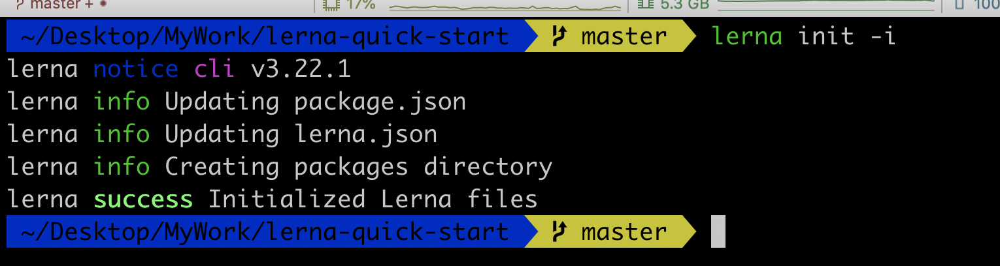
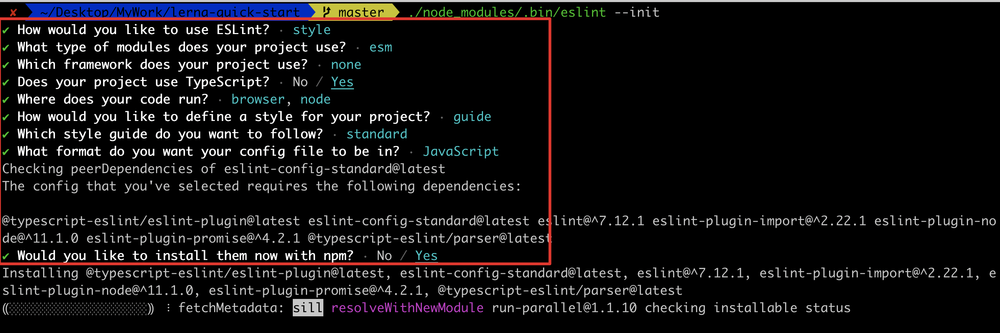
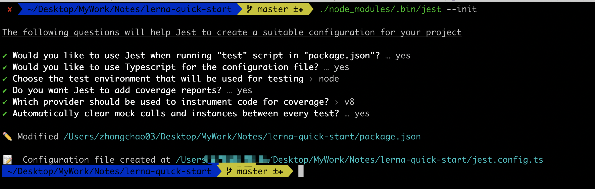

# 快速创建Lerna项目

## 创建项目

```sh
mkdir infinity-gems && cd infinity-gems

npm i lerna typescript -D

lerna init -i
```



## 代码检查 & 格式化 & 规范提交

- 代码检查

```sh
npm i eslint @typescript-eslint/eslint-plugin @typescript-eslint/parser -D

./node_modules/.bin/eslint --init
```



会根据你的选择生成一个 `eslint`相关的配置文件, 我选择的是 `js`文件

```js
module.exports = {
  env: {
    browser: true,
    es6: true,
    node: true,
  },
  extends: [
    'standard'
  ],
  globals: {
    Atomics: 'readonly',
    SharedArrayBuffer: 'readonly'
  },
  parser: '@typescript-eslint/parser',
  parserOptions: {
    ecmaVersion: 2018
  },
  plugins: [
    '@typescript-eslint',
  ],
  rules: {
    'no-var': 'error',
    'semi': ['error', 'always'],
    'indent': [ 'error', 2 ],
    'quotes': [ 'error', 'single' ],
    'no-extra-semi': 'error',
    'prettier/prettier': 'error',
    "space-before-function-paren": ["error", {
      "anonymous": "never",
      "named": "never",
      "asyncArrow": "never"
    }],
    "comma-dangle": ["error", {
      "arrays": "always-multiline",
      "exports": "always-multiline",
      "functions": "never",
      "imports": "always-multiline",
      "objects": "always-multiline",
    }]
  }
}

```

以及忽略格式化的文件 `.eslintignore `

```
packages/**/**.test.ts
node_modules/
```

配置下 `package.json`中的 `scripts`

```json
{
  "scripts": {
		"eslint": "eslint --fix --color --ext .ts packages/**"
  }
}
```

- 格式化

```sh
npm i prettier eslint-plugin-prettier -D
```

在 `eslint`配置文件中修改下 `plugins`

```js
module.exports = {
  ...,
  plugins: [
    '@typescript-eslint',
+   'prettier'
  ],
  ...,
}
```

再在根目录下配置一个 `.prettierrc`文件

```
{
  "printWidth": 120,
  "trailingComma": "all",
  "tabWidth": 2,
  "semi": true,
  "bracketSpacing": true,
  "singleQuote": true,
  "arrowParens": "avoid"
}
```

以及忽略格式化的文件 `.prettierignore `

```
packages/**/**.test.ts
node_modules/
```

配置下 `package.json`中的 `scripts`

```json
{
  "scripts": {
    "prettier": "prettier --write packages/**/**.ts"
  }
}
```

- 提交

```sh
npm i husky @commitlint/cli @commitlint/config-conventional lint-staged -D
```

配置下 `package.json`中

```json
{
  "scripts": {
    "lint-staged": "lint-staged"
  },
  "lint-staged": {
    "packages/**/**.{ts}": [
      "npm run prettier",
      "npm run eslint",
      "git add"
    ]
  },
  "husky": {
    "hooks": {
      "pre-commit": [
        "lint-staged"
      ],
      "commit-msg": "commitlint -E HUSKY_GIT_PARAMS"
    }
  },
}
```

配置 `commitlint.config.js`

```js
module.exports = {
  extends: ['@commitlint/config-conventional'],
  rules: {
    'type-enum': [
      2,
      'always',
      [
        'feat',
        'fix',
        'docs',
        'style',
        'refactor',
        'perf',
        'test',
        'build',
        'ci',
        'chore',
        'revert',
        'config'
      ]
    ],
    'subject-full-stop': [0, 'never'],
    'subject-case': [0, 'never'],
    'header-max-length': [0, 'always', 150]
  }
};

```

## Rollup 打包

```sh
npm i rollup @rollup/plugin-babel @rollup/plugin-commonjs @rollup/plugin-typescript rollup-plugin-terser --save-dev
```

## Jest

```sh
npm install -D jest @types/jest ts-jest
./node_modules/.bin/jest --init
```



## 创建`package`

```sh
lerna create thanos
```

生成目录结构

```sh
├── .npmignore
├── README.md
├── __tests__
│   └── power-gem.test.js
├── index.js
├── lib
│   ├── index.js
├── package.json
```

至此，我们的初始化工作全部完成了。

## Lerna 脚本配置

### lerna add 多依赖

```sh
npm install -D commander shelljs prompts
```


## 参考资料

[vue-cli](https://github.com/vuejs/vue-cli)

[create-react-app](https://github.com/facebook/create-react-app)

[遇到的问题及其解决方法](./build-cli/qa.md)