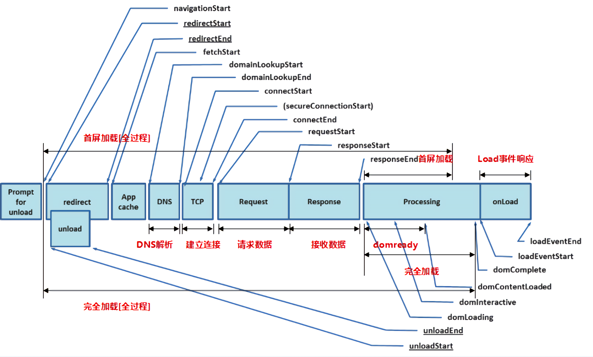

# 首屏优化

## 性能检测工具

- Network
- Performance
- [Lighthouse](https://developers.google.com/web/tools/lighthouse/)

## 首屏性能指标

- 白屏时间
从输入网址到浏览器开始渲染内容的时间
- 首屏时间
- 完全加载时间
- 可交互时间(TTI)
用户第一次可以和界面进行交互的时间

## 优化策略

- 懒加载
- 懒执行
- CDN预渲染
- DNS 预解析(prefetch)
- 页面预缓存
- 缓存策略
- SSR

## 参考资料

[🐢11s到⚡1s，性能优化之首屏加载🚀](https://juejin.cn/post/6949896020788690958)