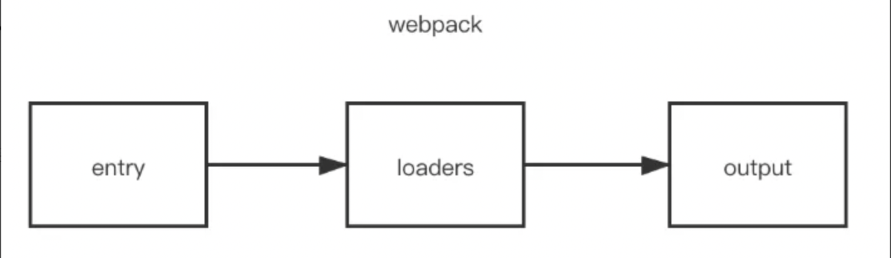

# 那些有关于Loader的知识

### 前言

使用过`webpack`的童鞋都应该知道`loader`这个概念，那么，不知道你有没有兴趣和我一起来了解他呢？

Emmm，那是什么？

对，你没看错，他来了，他来了，他正朝向我们走来，然后当面就给我们来了一个

灵魂连环问, `Loader` 是什么？有什么用？有什么特点？有哪些`Loader` ? 怎么用？怎么写一个自己的`Loader` ？

### Loader 是什么？

`Loader` 又称**加载器**, 它是类似其他构建工具中的 **任务(task)**, 提供了处理前端构建步骤的强大方法。

### Loader 有什么用？

`loader` 让 `webpack` 能够去处理那些非 `JavaScript` 文件(`webpack` 自身只理解 `JavaScript`)。`loader` 可以将所有类型的文件转换为 `webpack` 能够处理的有效模块,然后你就可以利用 `webpack` 的打包能力,对它们进行处理。

本质上, `webpack loader` 将所有类型的文件,转换为应用程序的 [**依赖图 (dependency graph)**](https://webpack.js.org/concepts/dependency-graph/) (和最终的 `bundle`)可以直接引用的模块。

### Loader 特性

- `loader` 支持链式传递，能够对资源使用流水线`(pipeline)`。
  - 一组链式的 `loader` 将按照相反的顺序执行。`loader` 链中的第一个 `loader` 返回值给下一个 `loader`。在最后一个 `loader`，返回 `webpack` 所预期的 `JavaScript`。
  - 当链式调用多个 `loader` 的时候，请记住它们会以相反的顺序执行。取决于数组写法格式，**从右向左或者从下向上**执行。
- `loader` 可以是同步的，也可以是异步的。
- `loader` 运行在 `Node.js` 中，并且能够执行任何可能的操作。
- `loader` 接收查询参数。用于对 `loader` 传递配置。
- `loader` 也能够使用 `options` 对象进行配置。
- 除了使用 `package.json` 常见的 `main` 属性，还可以将普通的 npm 模块导出为 `loader`，做法是在 `package.json` 里定义一个 `loader` 字段。
- [插件(plugin)](../plugins.md)可以为 `loader` 带来更多特性。
- `loader` 能够产生额外的任意文件。

### [Loader 配置](./config)
### [Loader 种类](./category)

### [Loader 匹配规则](./match)

### [Loader 执行](./exec)

### [如何编写一个 Loader](./implement)

### 参考资料

[Webpack Loader](https://rain120.github.io/study-notes/#/notes/webpack/mini-webpack?id=loaders-gt-官方文档-模块转换器)

[Webpack Loader 官方文档](https://www.webpackjs.com/concepts/loaders/)

[loaders api](https://webpack.docschina.org/api/loaders/)

[编写一个 loader](https://www.webpackjs.com/contribute/writing-a-loader/)

[【webpack 进阶】你真的掌握了 loader 么？- loader 十问](https://juejin.im/post/5bc1a73df265da0a8d36b74f)

[webpack 系列之四 loader 详解 1](https://segmentfault.com/a/1190000018450503)
