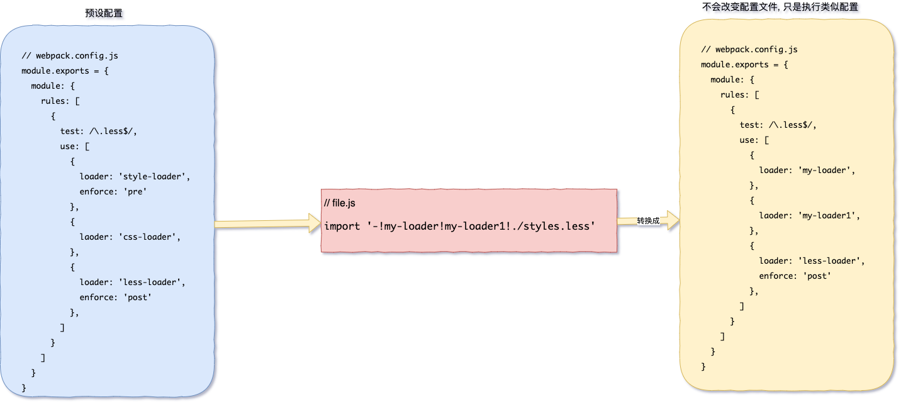
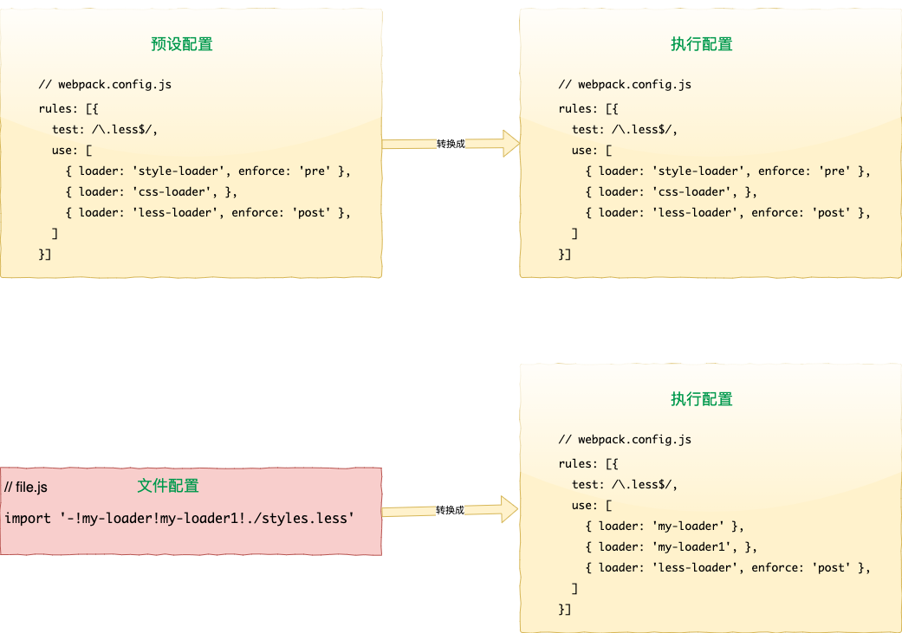

# Loader 配置

### 配置

`webpack.config.js`中 `loader`的配置如下

```javascript
// webpack.config.js
module.exports = {
  module: {
    rules: [
      {
        test: /\.css$/,
        use: [
          {
            loader: 'style-loader',
          },
          {
            loader: 'css-loader',
          },
        ],
      },
    ],
  },
};
```

### 内联配置 Loader

```javascript
import '!style-loader!css-loader!less-loader?name=Rain120!./styles.less';
```

上面内联引入模块相当于如下配置 **(内部执行转换过的rule配置)**:

```javascript
module.exports = {
  // ...
  module: {
    // ...
    rules: [
      {
        test: /\.less$/,
        use: [
          {
            loader: 'style-loader',
            options: {},
          },
          {
            laoder: 'css-loader',
            options: {},
          },
          {
            laoder: 'less-loader',
            options: '?name=Rain120',
          },
        ],
      },
    ],
  },
  // ...
};
```

再如:

```javascript
import '-!my-loader!my-loader2!./styles.css';
```

上面这个语句在执行时会被转换成右边配置进行执行。

:::warning
注意：此处并不会改变预设配置，而是在执行时转换成右边配置。
:::

<!--  -->


通过前置所有规则及使用 `!`，可以对应覆盖到配置中的任意 `loader`, 更多参数请到 [Loader 匹配规则](#Loader匹配规则) 查看。

选项可以传递查询参数，例如 `?key=value&foo=bar`，或者一个 `JSON` 对象，例如 `?{"key":"value","foo":"bar"}`。

### Cli 配置 Loader

也可以通过 `CLI` 使用 `loader`

```javascript
webpack --module-bind jade-loader --module-bind 'css=style-loader!css-loader'
```

这会对 `.jade` 文件使用 `jade-loader`，对 `.css` 文件使用 [`style-loader`](https://www.webpackjs.com/loaders/style-loader) 和 [`css-loader`](https://www.webpackjs.com/loaders/css-loader)。

[webpack 使用 Loader](https://www.webpackjs.com/concepts/loaders/#使用-loader)
