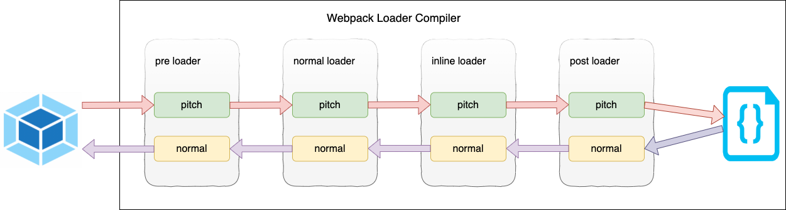

# Loader 执行

## Loader 链式执行

**数组**: 从右往左执行

```javascript
module.exports = {
  // ...
  module: {
    // ...
    rules: [
      {
        test: /\.css$/,
        // 从右往左, css-loader -> style-loader
        use: ['style-laoder', 'css-loader'],
      },
    ],
  },
};
```

**对象**: 从下往上执行

```javascript
module.exports = {
  // ...
  module: {
    // ...
    // 从下往上, css-loader -> style-loader
    rules: [
      {
        test: /\.css$/,
        use: {
          loader: 'style-loader'
        }
      },
      {
        test: /\.css$/,
        use: {
          loader: 'css-loader'
        }
      }
    ]
  },
  // ...
}
```

每个`loader`默认的执行阶段(`normal execution`)的执行顺序是从 ① ② ③ ④, 即，从后往前执行; 某些情况下，`loader` 只关心 `request` 后面的**元数据(metadata)**，并且忽略前一个 `loader` 的结果。在实际（从右到左）执行 loader 之前，会先**从左到右**调用 `loader` 上的 `pitch` 方法，`pitch` 阶段的执行顺序是 ④ ③ ② ①。对于以下 [`use`](https://webpack.docschina.org/configuration/module#rule-use) 配置:

```javascript
module.exports = {
  //...
  module: {
    rules: [
      {
        //...
        use: ['a-loader', 'b-loader', 'c-loader'],
      },
    ],
  },
  // ...
};
```

`pitch` 和`normal execution`执行结果如下

```sh
|- a-loader `pitch`
  |- b-loader `pitch`
    |- c-loader `pitch`
      |- requested module is picked up as a dependency
    |- c-loader normal execution
  |- b-loader normal execution
|- a-loader normal execution
```

正常执行



在这个过程中如果任何 `pitch` 有返回值，则 `loader` 执行链被阻断。`webpack` 会跳过后面所有的的 `pitch` 和 `loader`，直接进入上一个`loader` 的 `normal execution`。


[pitching-loader](https://webpack.js.org/api/loaders/#pitching-loader)

[Rule.enforce](https://webpack.js.org/configuration/module/#ruleenforce)
