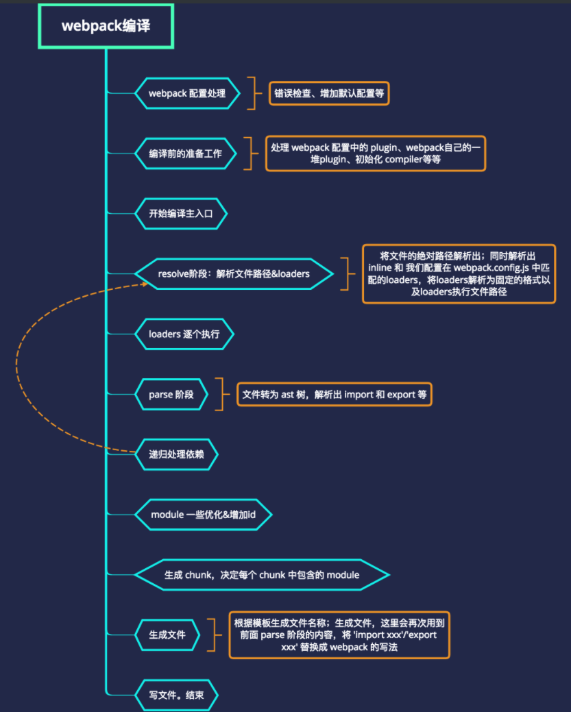

# 从零实现一个 Webpack

## 为什么要写这个？

因为之前看了 `Ronen Amiel` 的[从零实现一个 Webpack](https://www.bilibili.com/video/av53379967/), 有感而发，也想提高一下自己, 所以就尝试着写了这篇笔记。

## 什么是Webpack？

本质上，`webpack` 是一个现代 `JavaScript` 应用程序的**静态模块打包器(module bundler)**。当 `webpack` 处理应用程序时，它会递归地构建一个 **依赖关系图(dependency graph)**，其中包含应用程序需要的每个模块，然后将所有这些模块打包成一个或多个 `bundle`。

## Webpack核心概念

详见[Webpack 基础知识](./webpack-base)

## Webpack构建过程

1. **初始化参数**

   从配置文件`webpack.config.js`和 `Shell options` 中读取与合并参数，得出最终的参数`optimist`

2. **开始编译**

   用上一步得到的参数初始`Compiler`对象，加载所有配置的插件，通过执行对象的 `run`方法开始执行编译

3. **分析确定入口**

   根据配置中的 `Entry` 找出所有入口文件

4. **编译、构建模块**

   从入口文件出发，调用所有配置的 `Loader` 对模块进行编译，再找出该模块依赖的模块，再递归本步骤直到所有入口依赖的文件都经过了本步骤的处理

5. **完成模块编译**

   在经过**第4步**使用 `Loader` 翻译完所有模块后， 得到了每个模块被编译后的最终内容及它们之间的依赖关系

6. **输出资源**

   根据入口和模块之间的依赖关系，组装成一个个包含多个模块的 `Chunk`, 再将每个 `Chunk` 转换成一个单独的文件加入输出列表中，这是可以修改输出内容的最后机会

7. **输出完成**

   在确定好输出内容后，根据配置确定输出的路径和文件名，将文件的内容写入文件系统中。

## 实现代码

[Github: mini-webpack](https://github.com/Rain120/mini-webpack)

[Demo](https://rain120.github.io/mini-webpack/example/index.html)

## 参考资料

[minipack](https://github.com/ronami/minipack)

[从零实现一个 webpack - Ronen Amiel](https://www.bilibili.com/video/av53379967/)

[webpack系列之三resolve](https://juejin.im/post/6844903779712630797)

