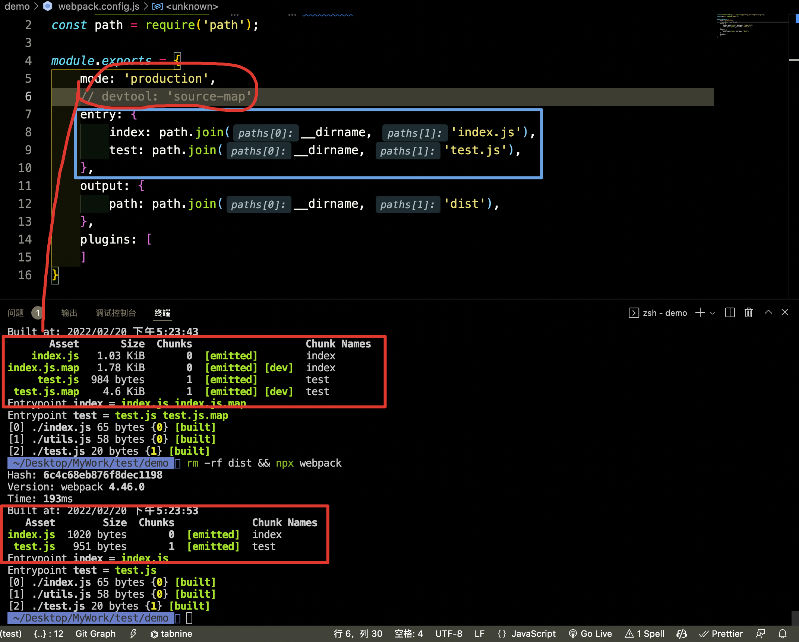
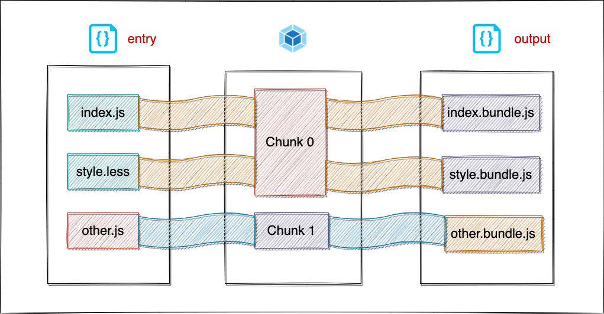

# Module Chunk Bundle 之间的区别

## Module

Module 是 Webpack 中非常重要的一个概念, Webpack 把所有资源都看成是一个单独的 Module。所有文件都会被 loader 转换成一个可以被 Webpack 读取的模块。

- ESM
- Commonjs,
- AMD
- etc...

## Chunk

在 Webpack 内部的 **打包进程中** 的代码模块; bundle 由许多 chunk 组成

### 产生途径

- entry入口
  :::warning
  1. source map的配置会影响到 Chunk 的产生。当 Webpack 配置了 source-map, 一个 chunk 对应多个 bundle
  2. 当 entry是数组, 例如 `['./src/main.js','./src/other.js']`, 这种情况下只会产生一个 chunk, 最终打包到一个 bundle 中。
  
  :::
- 异步加载模块
  ```js
  import(/* webpackPrefetch: true */ '/modules/my-module.js')
  ```
  参考 [Dynamic Imports](https://webpack.js.org/guides/code-splitting/#dynamic-imports)
- 代码分割 (code splitting)
  ```js
  {
      optimization: {
        splitChunks: {
            cacheGroups: {
                name: {
                    chunks: 'initial',
                    minChunks: 2
                },
                // xxxx
            }
        }
      }
  }
  ```
  参考 [optimization splitChunks chunks](https://webpack.docschina.org/plugins/split-chunks-plugin/#split-chunks-example-1)

模块指定名称可以使用 [魔法注释 webpackChunkName
](https://rain120.github.io/study-notes/engineering/webpack/magic-comments#webpackchunkname)
```js
import(/* webpackChunkName: "lodash-es" */ 'lodash');
// 输出新的chunk名字为lodash-es.js
```

### chunk 分类

- entry chunk
  包含了 Webpack 运行时需要的一些函数, 例如`__webpack_require__`
- normal chunk
  那些应用运行时动态加载的模块, 其结构有加载方式决定, 例如`webpackJsonp`
- initial chunk
  output.filename 对应着 initial chunk 文件
  output.chunkFilename 对应着 non-initial chunk 文件

## Bundle

构建完成后输出的的代码模块

## 过程



### 测试代码

```js
const path = require('path');

module.exports = {
    // 可注释这句尝试一下
    devtool: 'source-map',    
    entry: {
        index: path.join(__dirname, 'index.js'),
        test: path.join(__dirname, 'test.js'),
    },
    output: {
        path: path.join(__dirname, 'build'),
    },
}
```