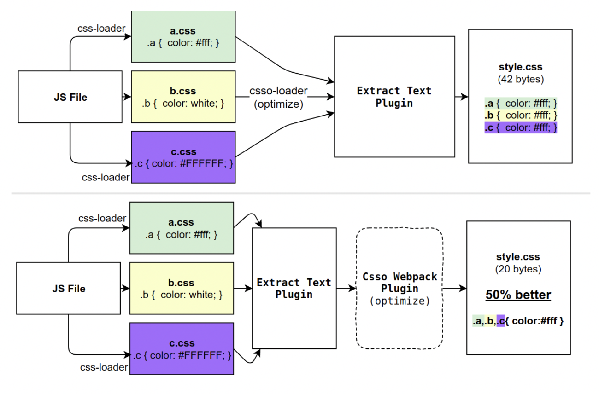

# Webpack Plugin

## 定义

plugin是一个扩展器，它丰富了webpack本身，针对是loader结束后，webpack打包的整个过程，它并不直接操作文件，而是基于事件机制工作，会监听webpack打包过程中的某些节点，执行广泛的任务。

[👆🏻图片地址](https://github.com/zoobestik/csso-webpack-plugin)

:::tip
正在学习中
:::

## 写一个Plugin

[解析webpack plugin的生命周期，书写自己的第一个plugin](https://beacelee.com/2018-01-18-%E8%A7%A3%E6%9E%90webpack%20plugin%E7%9A%84%E7%94%9F%E5%91%BD%E5%91%A8%E6%9C%9F%EF%BC%8C%E4%B9%A6%E5%86%99%E8%87%AA%E5%B7%B1%E7%9A%84%E7%AC%AC%E4%B8%80%E4%B8%AAplugin/)

## 参考资料

[Webpack Plugins](https://webpack.js.org/concepts/plugins/)

[Webpack loaders vs plugins; what's the difference?](https://stackoverflow.com/questions/37452402/webpack-loaders-vs-plugins-whats-the-difference/46176755#46176755)

[webpack 中 loader 和 plugin 的区别是什么 ](https://github.com/Advanced-Frontend/Daily-Interview-Question/issues/308)