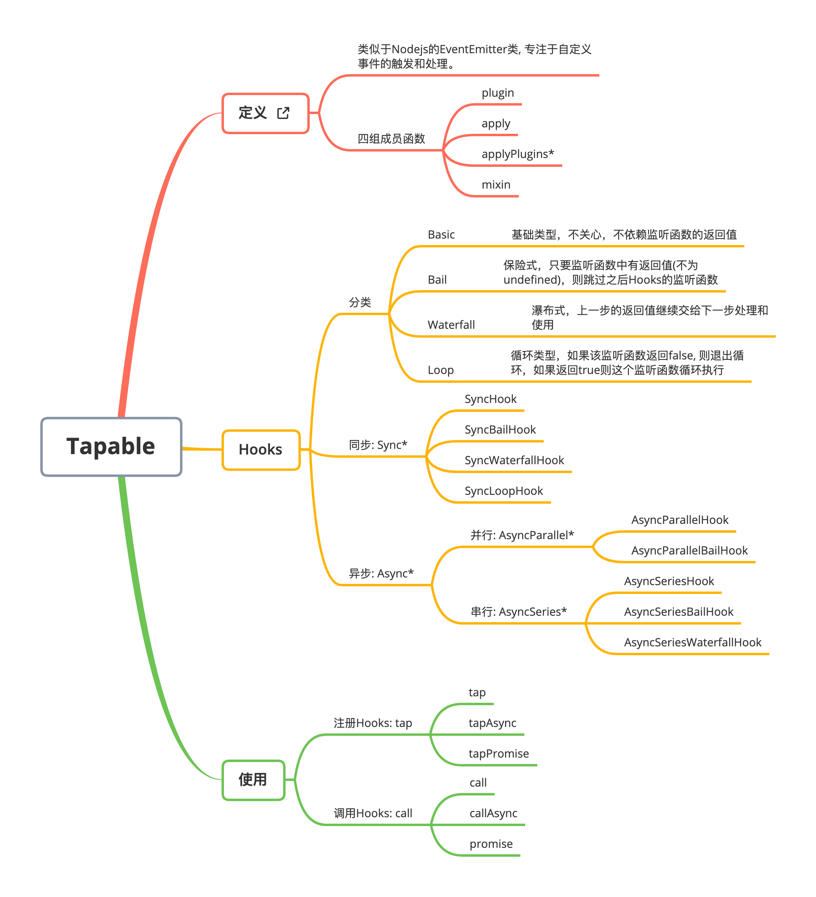

# Webpack Tapable

[Tapable](https://github.com/webpack/tapable) 是一个小型的库，允许你对一个 `Javascript` 模块添加和应用插件。它可以被继承或混入到其他模块中。类似于 `NodeJS` 的 `EventEmitter` 类，专注于自定义事件的触发和处理。除此之外，`Tapable` 还允许你通过回调函数的参数，访问事件的 触发者`(emittee)`或 提供者`(producer)`。



## 定义

类似于`Nodejs`的`EventEmitter`类, 专注于自定义事件的触发和处理。

## Hooks分类

| 类型        | 描述                                                         |
| ----------- | ------------------------------------------------------------ |
| `Basic`     | 基础类型，不关心，不依赖监听函数的返回值                     |
| `Bail`      | 保险式，只要监听函数中有返回值(不为`undefined`)，则跳过之后`Hooks`的监听函数 |
| `Waterfall` | 瀑布式，上一步的返回值继续交给下一步处理和使用               |
| `Loop`      | 循环类型，如果该监听函数返回`false`, 则退出循环，如果返回`true`则这个监听函数循环执行 |

## 参数列表

所有的`Hooks`在实例化时传入的参数都保持这个规则。

`Eg:`

```javascript
const { SyncHook } = require('tapable');

const args = ['name', 'age'];

/*
 * @description args 是一个字符串数组，它的长度与 tap 定义的回调函数的参数列表长度保持一致，与内容无关
 * @params {string[] || undefined} args
 * @example ['name']
 */

const syncHook = new SyncHook(args);

syncHook.tap('Loader', (name, age) => {
  // 回调函数的参数列表可以使用任意名字，不需要与定义的args 保持一致
  console.log(name, age);
});

syncHook.call('Rain120', 18);

// args 定义了两个参数 name age
// tap 在注册的时候使用了 name age
// call 传入了 name age
// 即: args 的长度决定了 使用 和 传入参数的长度，而 args 传入的内容不影响使用

```


## 参考资料

[Webpack Tapable](https://webpack.js.org/api/plugins/#tapable)

