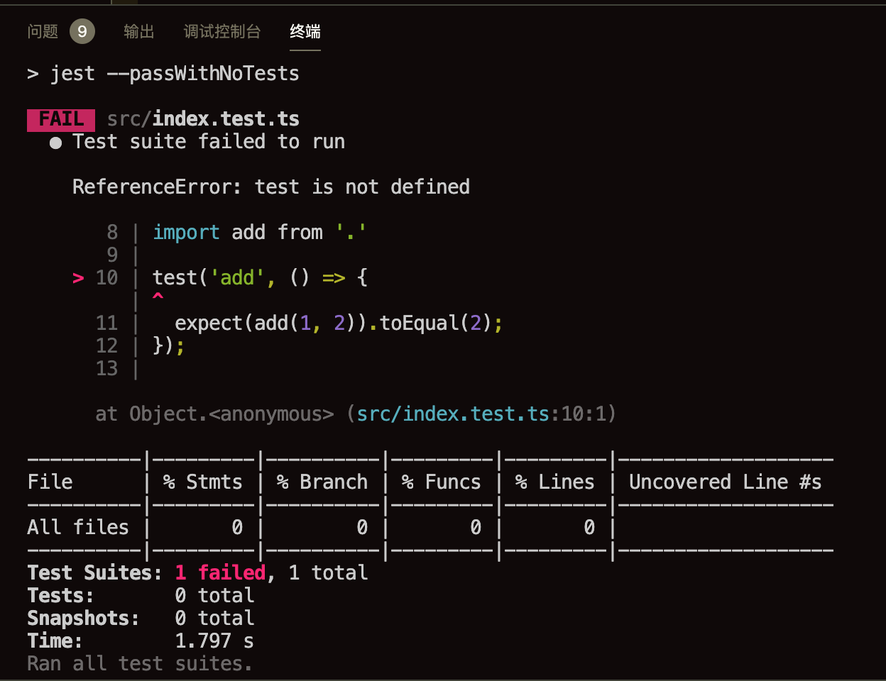
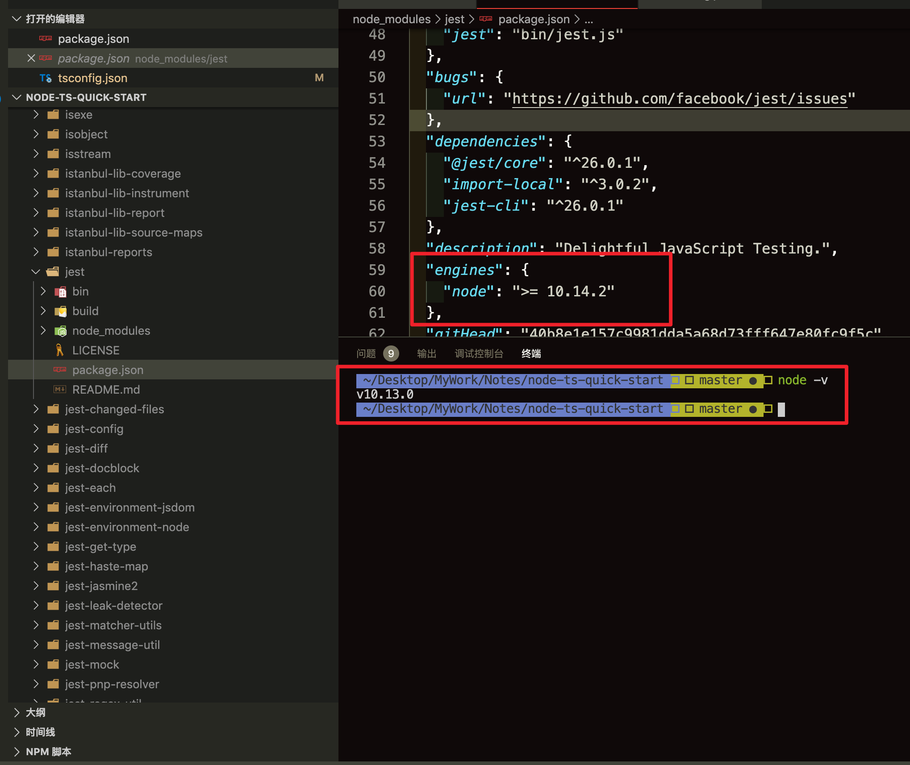

# ReferenceError: test is not defined

```javascript
// node -v: 10.13.0
{
  "devDependencies": {
    "jest": "^26.0.1",
  }
}
```



查看`jest`版本发现最低版本需要`10.13.0`



[jest issues 9538](https://github.com/facebook/jest/issues/9538)
