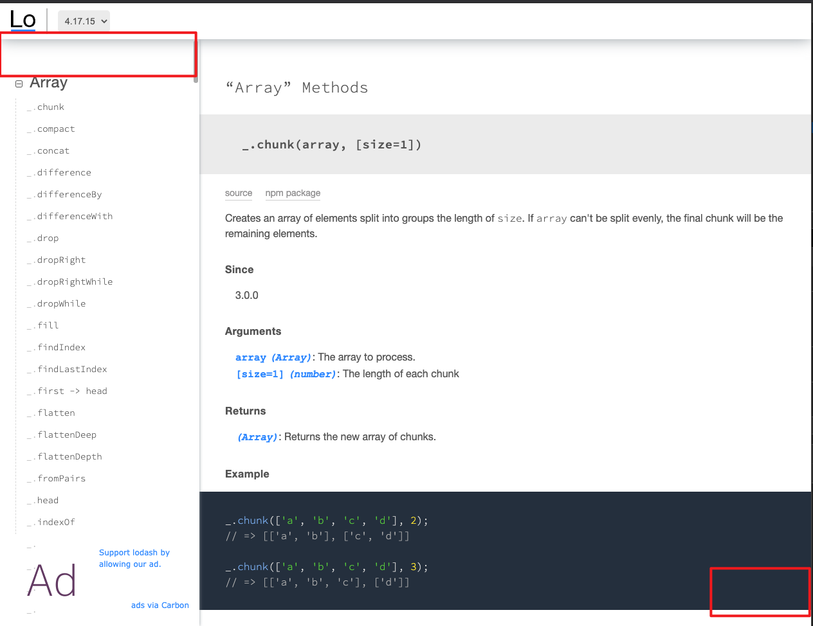
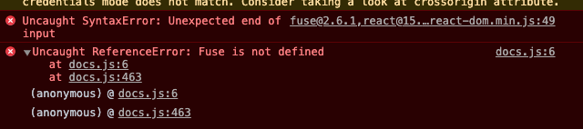
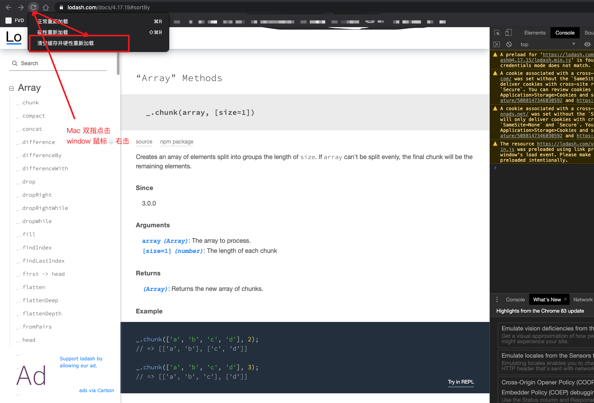

# Lodash 搜索框不见了, 怎么办

问题: `Lodash`页面的搜索和`runkit`不见了怎么办？




可能是因为新旧版本更新后缓存导致的问题, 因为我经常使用的是`https://lodash.com/docs/4.17.11#sortBy`, 而 `lodash`已经更新到`4.17.15`了。

解决办法:

```
shift + command + R
```

`or`

- 打开控制台
- 按图示下一步


