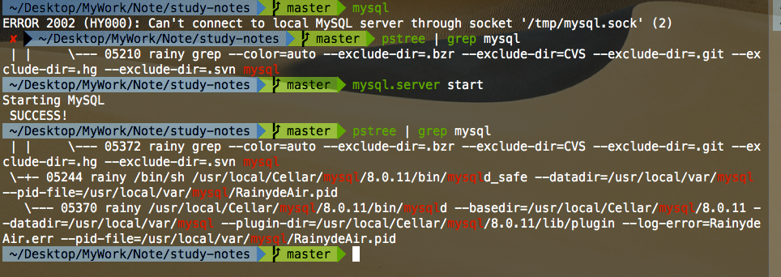
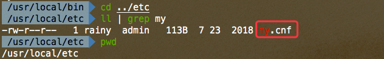

# Mysql 本地连接问题

## 问题1

:::danger
2002 - Can't connect to local MySQL server through socket '/tmp/mysql.sock' (2 "No such file or directory")
:::


:::tip
- [Stackoverflow - mysql - 2002](https://stackoverflow.com/questions/11657829/error-2002-hy000-cant-connect-to-local-mysql-server-through-socket-var-run)
:::




```sh
mysql.server start
```

## 问题2

:::danger
2003 (HY000): Can't connect to MySQL server on '127.0.0.1' (111)
:::


:::tip
- [Stackoverflow - mysql -2003](https://stackoverflow.com/questions/1673530/error-2003-hy000-cant-connect-to-mysql-server-on-127-0-0-1-111)
:::




```sh
mysql.server start
```

## 问题3

:::danger
Lost connection to MySQL server during query
:::


:::tip
- [Stackoverflow - mysql -2013](https://stackoverflow.com/questions/10563619/error-code-2013-lost-connection-to-mysql-server-during-query)
:::
