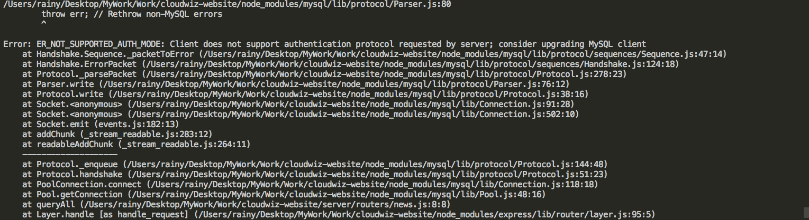

# Mysql + Node报错

## 问题



:::danger
Error: ER_NOT_SUPPORTED_AUTH_MODE: Client does not support authentication protocol requested by server; consider upgrading MySQL client
:::

:::tip

在MySQL命令行中执行，将password替换成你需要修改的密码

```sh
ALTER USER 'root'@'localhost' IDENTIFIED WITH mysql_native_password BY 'password'
```
:::

## 参考

https://stackoverflow.com/questions/50093144/mysql-8-0-client-does-not-support-authentication-protocol-requested-by-server/50961428
