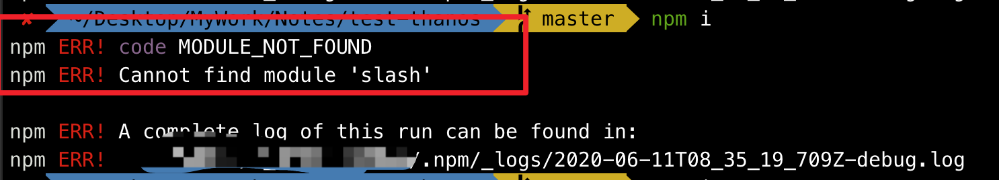

# npm Cannot find module 'slash'

```sh
npm ERR! code MODULE_NOT_FOUND
npm ERR! Cannot find module 'slash'
```



解决办法:

```sh
rm -rf /usr/local/lib/node_modules/npm


# 安装任意一个node版本(node-version)即可
sudo npx n 10.10.0
```
