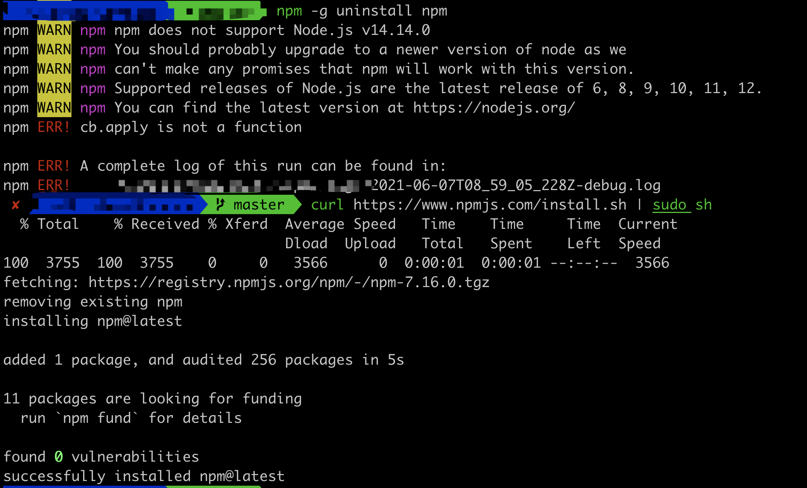

# npm WARN: npm does not support Node.js v12.4.0

问题: 安装的 `node` 中 `npm` 的版本和当前安装的 `npm` 版本不一致。

解决办法

```sh
# 清除缓存
npm cache clean -f

# 安装最新版本
curl https://www.npmjs.com/install.sh | sudo sh

# 卸载
npm -g uninstall npm

# 安装node

brew install node
```



## 参考

[npm WARN: npm does not support Node.js v12.4.0](https://stackoverflow.com/questions/56805007/npm-warn-npm-does-not-support-node-js-v12-4-0)

[npm does not support Node.js v10.15.2 #1877](https://github.com/nodejs/help/issues/1877)
