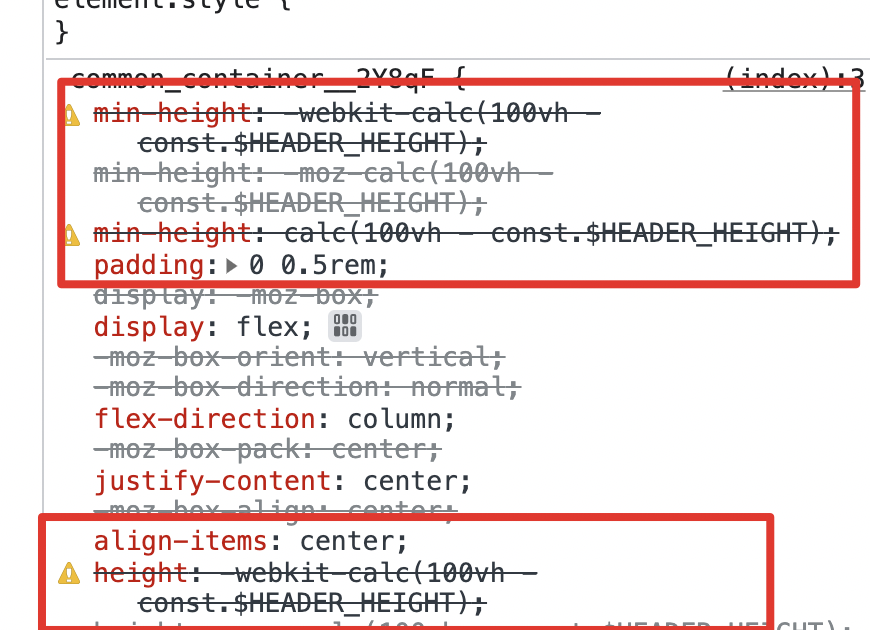
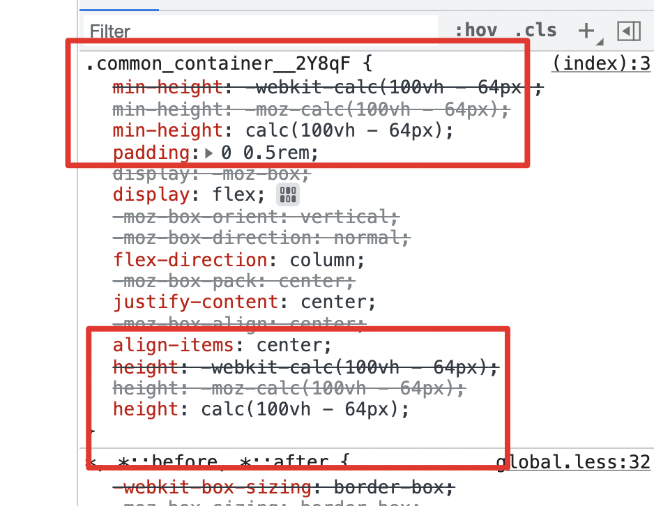

# sass calc()函数中不生效的问题

```scss
@use "./constants" as const;

.container {
  min-height: calc(100vh - const.$HEADER_HEIGHT);
  height: calc(100vh - const.$HEADER_HEIGHT);
}
```



## fixed

```scss
@use "./constants" as const;

.container {
  min-height: calc(100vh - #{const.$HEADER_HEIGHT});
  height: calc(100vh - #{const.$HEADER_HEIGHT});
}
```

