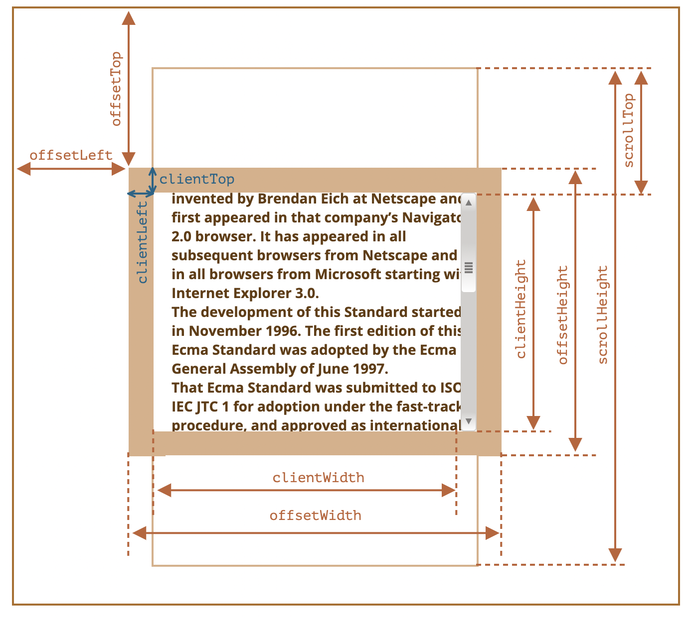

# 一次性搞懂元素大小和滚动

## offsetParent

## offsetHeight, offsetWidth

## offsetLeft, offsetTop

## clientHeight, clientWidth

## clientLeft, clientTop

## scrollHeight, scrollWidth

## scrollLeft, scrollTop

## getBoundingClientRect

## 参考资料

[元素大小和滚动](https://zh.javascript.info/size-and-scroll)
