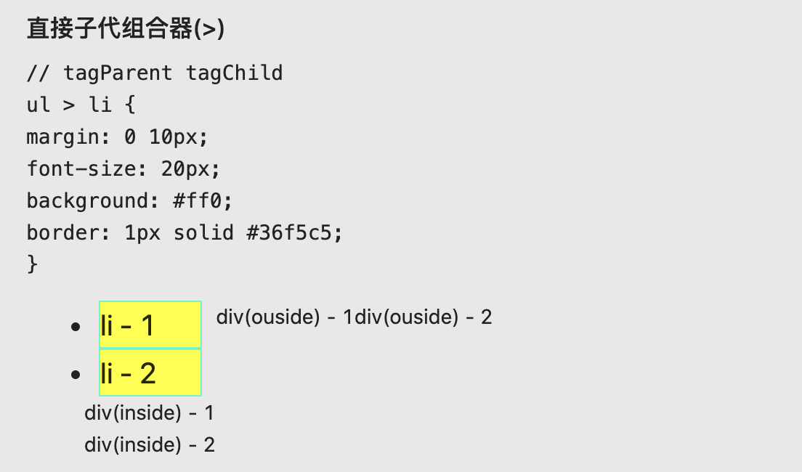
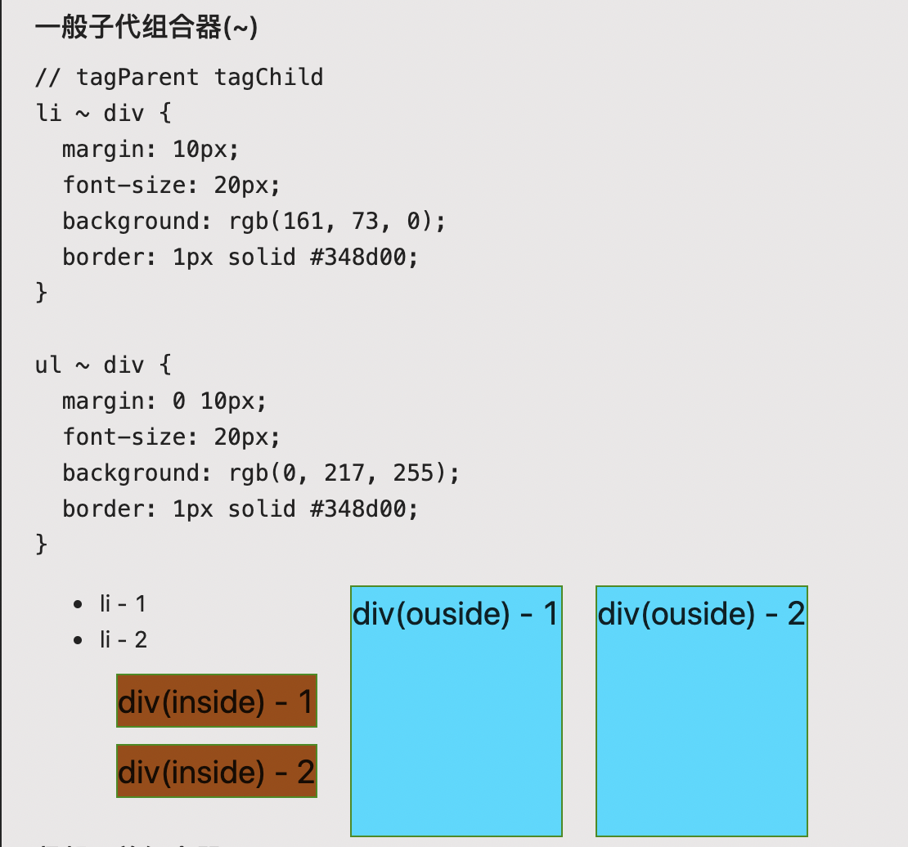
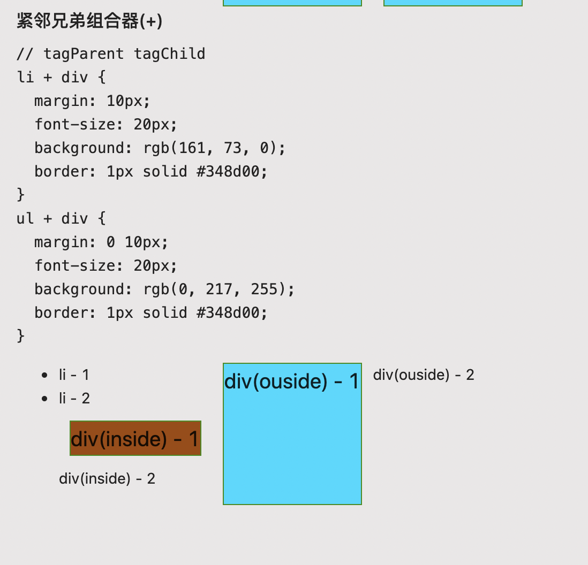

:::info
本文只讲解 **概念和简单用法**。不涉及深层次的分析和使用。
:::

## 基础选择器

### \* 通用选择器

选择所有元素。（可选）可以将其限制为特定的名称空间或所有名称空间。

### 元素选择器

按照给定的节点名称，选择所有匹配的元素。

### id 选择器

按照 `id` 属性选择一个与之匹配的元素。需要注意的是，一个文档中，每个 ID 属性都应当是唯一的。

### 类选择器

按照给定的 `class` 属性的值，选择所有匹配的元素。

### Demo

```css
* {
    padding: 10px;
    font-size: 16px;
}

p {
    border: 1px solid #ccc;
    margin: 5px 0;
}

#info {
    background: rgb(143, 238, 19);
}

p#info {
    background: (143, 238, 19);
}

.warning {
    background: #ff0;
}

p.warning {
    background: #ff0;
}

p.error {
    color: rgb(184, 0, 0);
    font-weight: bold;
}

p.warning.error {
    color: rgb(184, 0, 0);
    font-weight: bold;
}
```

## 组合选择器

### 分组选择器 `,`

将不同的选择器组合在一起的方法，它选择所有能被列表中的任意一个选择器选中的节点。

---

> 此处DOM作为 `~` `>` `+` 三种元素选择器的测试结构。

```html
<div class="general-sibling-combinator flex">
  <ul>
    <li>li - 1</li>
    <li>li - 2</li>
    <div>div(inside) - 1</div>
    <div>div(inside) - 2</div>
  </ul>
  <div>div(ouside) - 1</div>
  <div>div(ouside) - 2</div>
</div>
```

### 后代元素组合器 `空格`

组合器选择前一个元素的后代节点

### 直接子元素组合器 `>`

选择前一个元素的**直接子代**的节点**(不会再往下找节点了)**。



### 一般子代组合器 `~`

后一个节点在前一个节点后面的任意位置，并且共享同一个父节



### 紧邻元素组合器 `+`

后一个元素紧跟在前一个之后，并且共享同一个父节点。


### 列组合器 `|| `

**实验属性，暂时忽略**

### Demo

```css
/* 分组选择器 */
div,
span {
    margin: 0 10px;
    font-size: 20px;
    background: #ff0;
    border: 1px solid #36f5c5;
}

/* 后代选择器(空格) */
div span {
    margin: 0 10px;
    font-size: 20px;
    background: #ff0;
    border: 1px solid #36f5c5;
}

/* 直接子代组合器(>) */
ul > li {
    margin: 0 10px;
    font-size: 20px;
    background: #ff0;
    border: 1px solid #36f5c5;
}

/* 一般子代组合器(~) */
li ~ div {
    margin: 10px;
    font-size: 20px;
    background: rgb(161, 73, 0);
    border: 1px solid #348d00;
}

ul ~ div {
    margin: 0 10px;
    font-size: 20px;
    background: rgb(0, 217, 255);
    border: 1px solid #348d00;
}

/* 紧邻兄弟组合器(+) */
li + div {
    margin: 10px;
    font-size: 20px;
    background: rgb(161, 73, 0);
    border: 1px solid #348d00;
}
ul + div {
    margin: 0 10px;
    font-size: 20px;
    background: rgb(0, 217, 255);
    border: 1px solid #348d00;
}
```

> 接下来的 **属性选择器** 和 **伪选择器**，只讲解概念和用法，关于这两种选择器的内置选择器等知识请移步 `MDN` [属性选择器](https://developer.mozilla.org/zh-CN/docs/Web/CSS/Attribute_selectors) [伪类](https://developer.mozilla.org/zh-CN/docs/Web/CSS/Pseudo-classes), [伪元素](https://developer.mozilla.org/zh-CN/docs/Web/CSS/Pseudo-elements)

## 属性选择器

### E[att]

匹配所有具有 att 属性的 E 元素，不考虑它的值。（注意：E 在此处可以省略，比如"[cheacked]"。以下同。）

### E[att=val]

匹配所有 att 属性等于"val"的 E 元素

### E[att~=val]

匹配所有 att 属性具有多个空格分隔的值、其中一个值等于"val"的 E 元素

### E[att|=val]

匹配所有 att 属性具有多个连字号分隔（hyphen-separated）的值、其中一个值以"val"开头的 E 元素，主要用于 lang 属性，比如"en"、"en-us"、"en-gb"等等

```css
div[id^='attr2'] {
    background: #ff0;
}

div[id$='end'] {
    background: #ff0;
}

div[id*='attr'] {
    border: 1px solid #348d00;
    padding: 10px;
}
```

## 伪选择器

### 伪类 `:`

`:` 伪选择器支持按照未被包含在文档树中的状态信息来选择元素。

```css
span:nth-child(3) {
    color: #f00;
}

span:hover {
    cursor: pointer;
    color: rgb(11, 137, 211);
}

span::before {
    content: '阿达: ';
}

p::first-line {
    color: rgb(72, 88, 0);
}

span::after {
    content: 'I Do';
}
```

### 伪元素 `::`

`::` 伪选择器用于表示无法用 HTML 语义表达的实体。

```css
span::before {
    content: '阿达: ';
}

p::first-line {
    color: rgb(72, 88, 0);
}

span:nth-child(3) {
    color: #f00;
}

span::after {
    content: 'I Do';
}
```

## 参考资料

[MDN CSS Selectors](https://developer.mozilla.org/zh-CN/docs/Web/CSS/CSS_Selectors)

[CSS 2.1 selectors, Part 1](https://www.456bereastreet.com/archive/200509/css_21_selectors_part_1/)

[CSS 选择器笔记](http://www.ruanyifeng.com/blog/2009/03/css_selectors.html)
