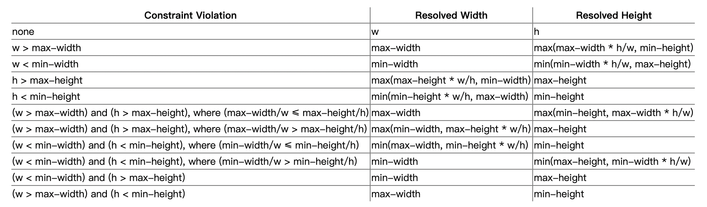

# CSS宽度高度问题
## 导语

本篇文章，我们将通过一个例子讲述 `width`, `max-width`, `min-width` (`height` 同理)的优先级

**Note:** `height` 跟 `width` 处理逻辑一致

### 下面的宽度是多少

```css
div {
  min-width: 40px;
  max-width: 20px;
  width: 30px;
}
```

#### 答案: 40px

### 解释

为什么上面的例子的结果是这个呢？我们通过真实场景来讲述总结这个知识点。

```html
<div style="display: flex; justify-content: space-between; flex-wrap: wrap;">
  <div style="margin-bottom: 10px;">
      <div style="border: 1px solid blue; padding: 5px;margin-bottom: 10px; height: 170px;">
        <h4>no min-width max-width</h4>
        width: 30px;
    </div>
    <div style="
      width: 30px;
      height: 50px;
      line-height: 50px;
      background: red;
      color: #fff;
      text-align: center;
    ">30</div>
  </div>
  <div style="margin-bottom: 10px;">
      <div style="border: 1px solid blue; padding: 5px;margin-bottom: 10px; height: 170px;">
        <h4>no width max-width</h4>
        min-width: 30px;
    </div>
    <div style="
      min-width: 30px;
      height: 50px;
      line-height: 50px;
      background: red;
      color: #fff;
      text-align: center;
    ">最小30, 没有最大限制</div>
  </div><div style="margin-bottom: 10px;">
      <div style="border: 1px solid blue; padding: 5px;margin-bottom: 10px; height: 170px;">
        <h4>no min-width width</h4>
        max-width: 30px;
        <br />
        最大30, 最小为0
    </div>
    <div style="
      max-width: 30px;
      height: 50px;
      line-height: 50px;
      background: red;
      color: #fff;
      text-align: center;
    ">占位</div>
  </div>
  <div style="margin-bottom: 10px;">
      <div style="border: 1px solid blue; padding: 5px;margin-bottom: 10px; height: 170px;">
        <h4>width < min-width</h4>
        min-width: 40px;
        <br />
        width: 30px;
    </div>
    <div style="
      min-width: 40px;
      width: 30px;
      height: 50px;
      line-height: 50px;
      background: red;
      color: #fff;
      text-align: center;
    ">40</div>
  </div>
  <div style="margin-bottom: 10px;">
      <div style="border: 1px solid blue; padding: 5px;margin-bottom: 10px; height: 170px;">
        <h4>width > min-width</h4>
        min-width: 30px;
        <br />
        width: 40px;
    </div>
    <div style="
      min-width: 30px;
      width: 40px;
      height: 50px;
      line-height: 50px;
      background: red;
      color: #fff;
      text-align: center;
    ">40</div>
  </div>
  <div style="margin-bottom: 10px;">
      <div style="border: 1px solid blue; padding: 5px;margin-bottom: 10px; height: 170px;">
        <h4>max-width < width</h4>
        max-width: 20px;
        <br />
        width: 30px;
    </div>
    <div style="
      max-width: 20px;
      width: 30px;
      height: 50px;
      line-height: 50px;
      background: red;
      color: #fff;
      text-align: center;
    ">20</div>
  </div>
  <div style="margin-bottom: 10px;">
      <div style="border: 1px solid blue; padding: 5px;margin-bottom: 10px; height: 170px;">
        <h4>max-width > width</h4>
        max-width: 30px;
        <br />
        width: 20px;
    </div>
    <div style="
      max-width: 30px;
      width: 20px;
      height: 50px;
      line-height: 50px;
      background: red;
      color: #fff;
      text-align: center;
    ">20</div>
  </div>
  <div style="margin-bottom: 10px;">
      <div style="border: 1px solid blue; padding: 5px;margin-bottom: 10px; height: 170px;">
        <h4>max-width < width < min-width</h4>
        max-width: 20px;
        <br />
        width: 30px;
        <br />
        min-width: 40px;
    </div>
    <div style="
      max-width: 20px;
      min-width: 40px;
      width: 30px;
      height: 50px;
      line-height: 50px;
      background: red;
      color: #fff;
      text-align: center;
    ">40</div>
  </div>
  <div style="margin-bottom: 10px;">
      <div style="border: 1px solid blue; padding: 5px;margin-bottom: 10px; height: 170px;">
        <h4>min-width < width < max-width</h4>
        min-width: 20px;
        <br />
        width: 30px;
        <br />
        max-width: 40px;
    </div>
    <div style="
      max-width: 40px;
      min-width: 20px;
      width: 30px;
      height: 50px;
      line-height: 50px;
      background: red;
      color: #fff;
      text-align: center;
    ">30</div>
  </div>
  <div style="margin-bottom: 10px;">
      <div style="border: 1px solid blue; padding: 5px;margin-bottom: 10px; height: 170px;">
        <h4>width < max-width < min-width</h4>
        width: 20px;
        <br />
        max-width: 30px;
        <br />
        min-width: 40px;
    </div>
    <div style="
      max-width: 30px;
      min-width: 40px;
      width: 20px;
      height: 50px;
      line-height: 50px;
      background: red;
      color: #fff;
      text-align: center;
    ">40</div>
  </div>
</div>
```

### 结论(匹配规则)

- 当设置默认值为 `width: auto`或者不设置`width`时, 内容宽度就是 `content` 内容大小。

- `no min-width, max-width 取 width`

- `width > max-width ? max-width: width`

- `width < min-width ? min-width : width`

- `min-width < width < max-width -> width`

