# 一些调试技巧

## HTML

### 浮窗类的调试方式

当你遇到 **拖拽DOM**， **Popover**，**Select** 等类似组件时，你是如何debugger?

#### 拖拽类

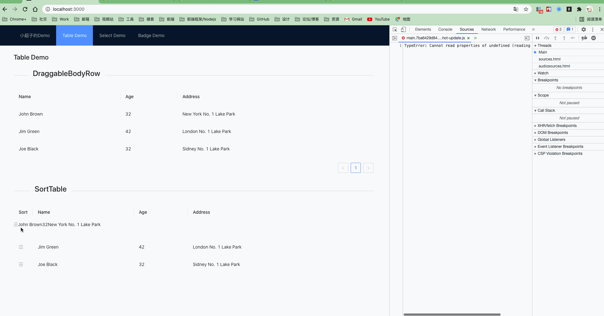

#### Select Options

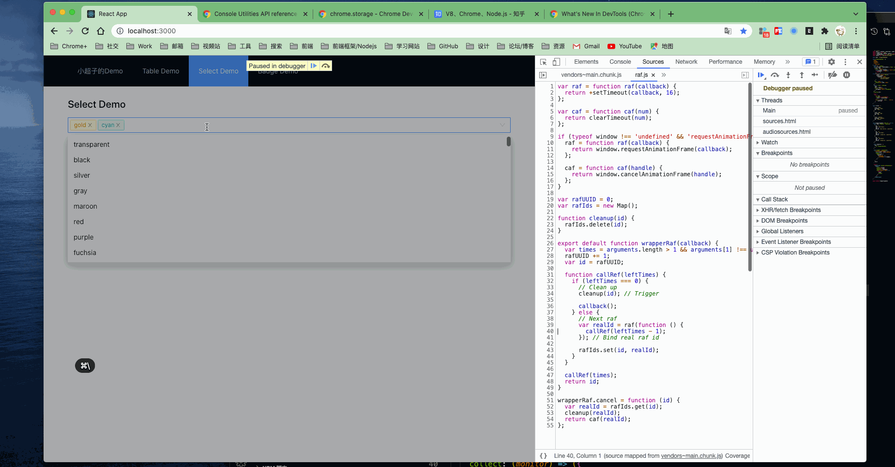

#### 修改数据测试

**contentEditable**

```js
document.body.contentEditable = true
```

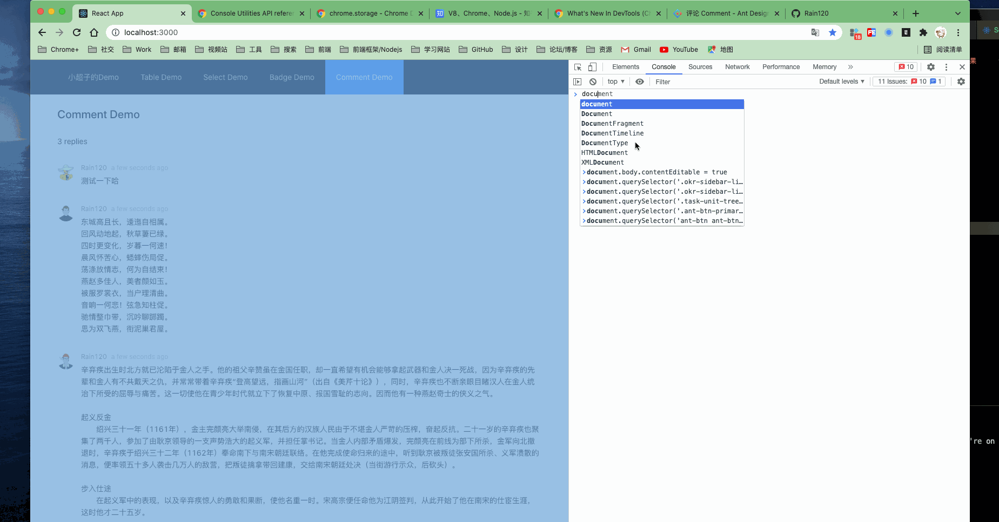

**Edit as HTML**

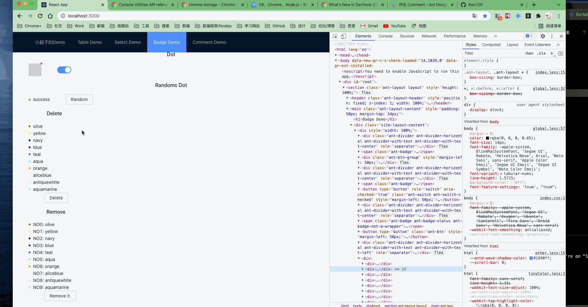

### Debugger

#### Dom

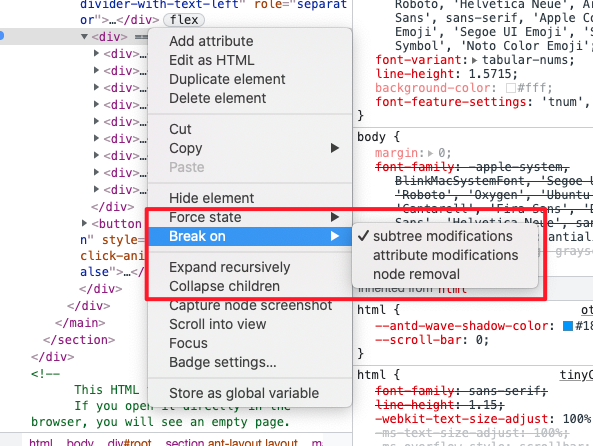

##### Attribute Modifications

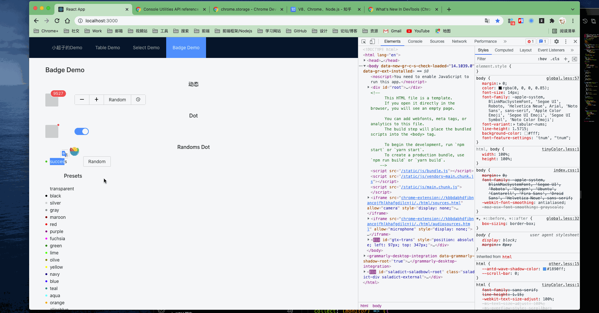

##### Subtree Modifications

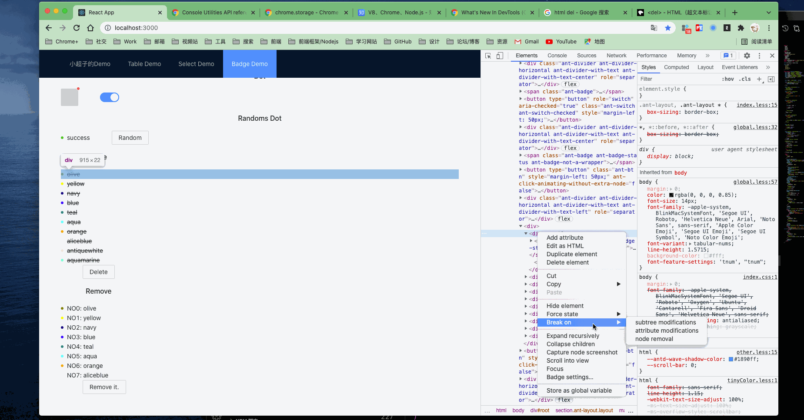

##### Node Removal

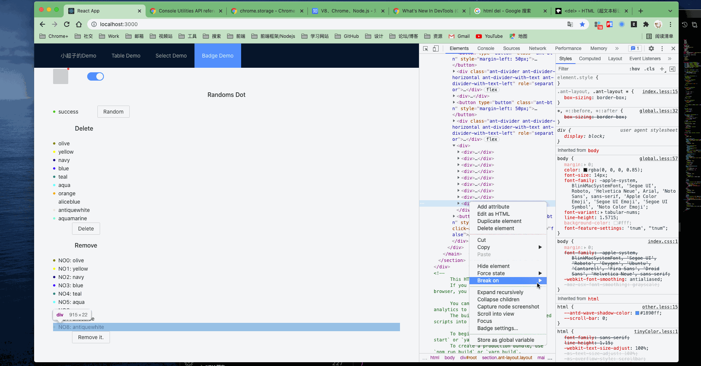

#### Javascript

#### Log

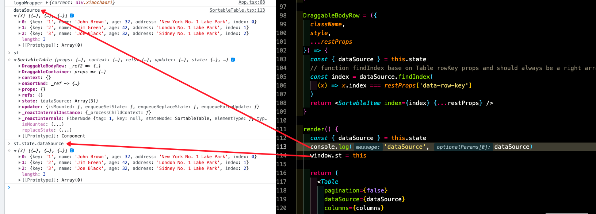

##### Code Debug

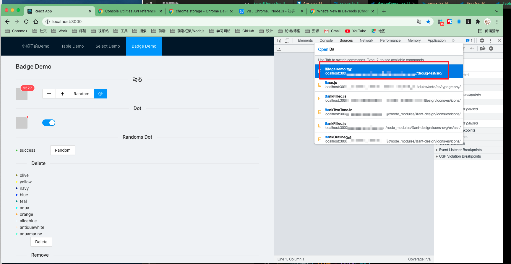

- IDE Debug

  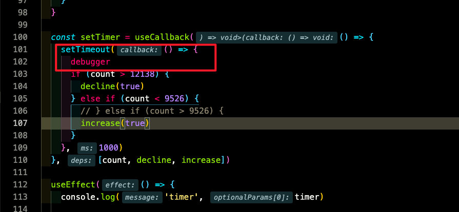

- Devtools Debug

  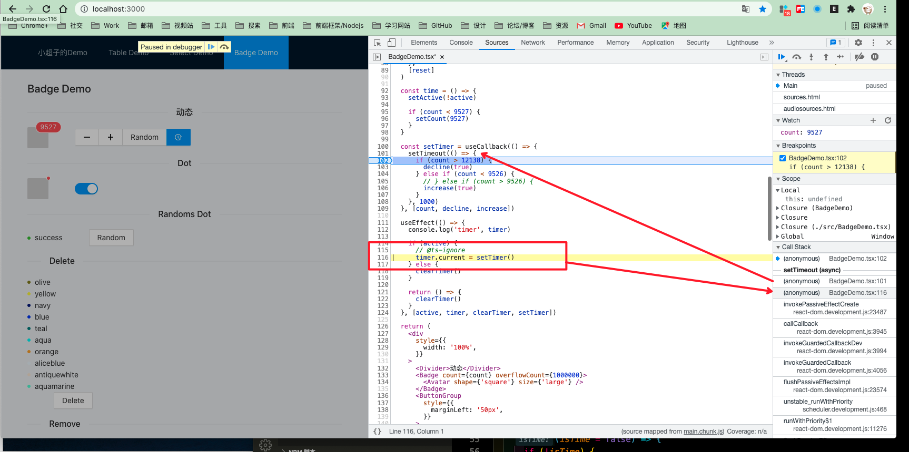

关于watch data 的相关操作

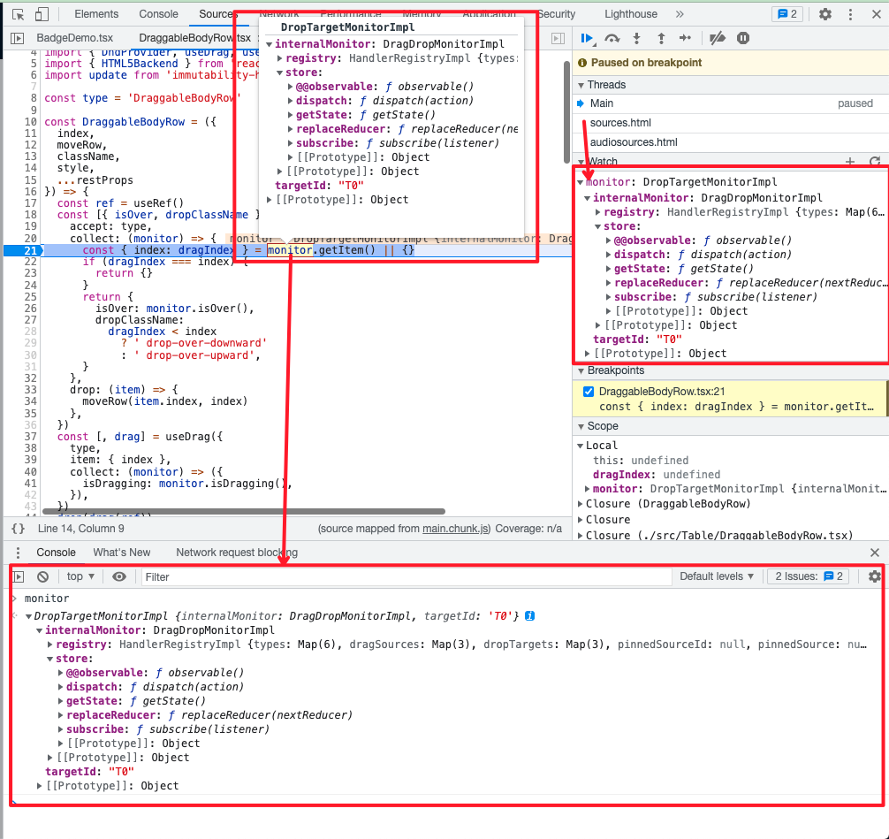

- 断点之前 hover 参数
- 右边添加 watch params
- 直接在 console 输入字段

关于 devtools breakpoint


##### Find the errors position by the throw from the console


#### 更多调试相关的资源

[How I got better at debugging](http://jvns.ca/blog/2015/11/22/how-i-got-better-at-debugging/)

[使用开发者工具进行性能检查的高级技巧](https://docs.google.com/document/d/1K-mKOqiUiSjgZTEscBLjtjd6E67oiK8H2ztOiq5tigk/pub)

